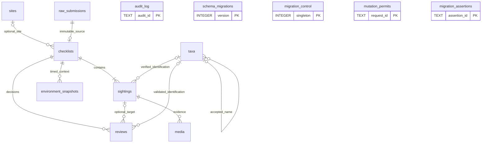

# 들뫼 전국 탐조지도 — 데이터 표준 v1.1 / Phase 1 최종 설계

상태: **설계 기준안과 미실행 SQL 초안**. 운영 적용 승인본이 아니다. 이번 결과는 Phase 2 구현의 입력이며 Phase 2를 자동으로 시작하지 않는다. 생성 파일은 자동 migration 경로 밖인 `docs/long-term-db-phase1/`에만 둔다.

문서 우선순위: 이 보고서의 v1.1 결정 → [전체 컬럼 사전](data-dictionary.md)과 동일한 SQL 정의 → [전환·정책 세부](operations-and-policy.md) → [검증 계획](verification-plan.md). SQL과 문서가 다르면 실행을 중단하고 정합화한다. 실제 실행 검증이 없으므로 “운영 적용 가능성이 입증됐다”고 해석하지 않는다.

## A. 이전 중단 작업에서 이어받은 범위

재개 시 HEAD는 `d39bf4bf2d7e147b246f867f56567f814eddd4b9`, 브랜치는 main이었다. 추적 파일 변경은 없었고, 미추적 `operations-and-policy.md`, `verification-plan.md` 두 문서가 있었다. 두 문서의 올바른 내용을 유지하고 v1.1 정책·capability·추가 필드 검증만 보완했다. SQL 7개는 메모리 초안 상태였으며 이번에 draft 경로로 저장·정적 검토했다. reset/checkout/restore/clean으로 작업물을 폐기하지 않았다.

마지막 인증 갱신 후 재개에서는 그동안 저장한 11개 초안 파일이 모두 남아 있음을 다시 확인했다. 처음부터 다시 생성하지 않고 기존 내용의 정합화와 checksum·실행 증거 보완을 이어갔다.

재개 전 원격 main을 읽기 전용으로 확인했을 때 같은 커밋이었다. 재개 초기에는 인증 만료로 HTTP 401이 발생했고, 이후 정상 인증 세션 갱신을 통해 기본 건수·상태·스키마와 Worker 배포 메타데이터를 읽기 전용 확인했다. 상세 Phase 0 수치와 이번 제한된 재확인 범위를 구분한다. 시작·종료 비교와 인증 캐시 갱신 내역은 AG 및 실행 증거에 기록한다.

## B. 현재 시스템 문제 요약

사용자가 제공한 2026-09-24 Phase 0 기준선: reports 21(승인 17/반려 4/대기 0), site 연결 16/NULL 5, 단일 종 21, 수량 1이 13/NULL 8, public 좌표 모두 NULL, approx 쌍 19/둘 다 NULL 2, 승인 중 pending_public=1이 15이다. 잘못된 site·spot 고아·좌표/날짜/동의/현재 dedupe 이상은 확인 범위에서 0이다. 현재 spot_key는 모두 NULL이다.

운영은 reports와 내부 _cf_KV뿐이며 FK·trigger·migration ledger가 없었다. 저장소에 있는 reports_site_history 인덱스가 운영에는 없었다. 공개/관리자 Worker는 같은 D1을 쓰지만 따로 배포된다. 한 행에 관찰·현재 검토상태·지도 연결·개체수·이름 동의·좌표가 모여 있어 최초 입력과 변경 이력을 구분할 수 없다.

승인 17건의 실제 좌표 공개는 현재 API의 동작이다. 새로운 유출 건수로 명명하거나 migration 과정에서 자동 비공개 처리하지 않는다. 현재 POST에는 번식 비관련 확인이 없고, 종 목록에 따른 pending 공개 보류 코드가 있으므로 확정 정책은 별도 입력 계약 전환이 필요하다.

## C. 최종 ER 모델

실선은 실제 FK 관계다. audit의 target, schema_migrations와 운영 제어표에는 FK가 없다. checklist 최소 1 sighting은 성공 transaction의 최종 assertion으로 보장한다. FK만으로 자식 최소 개수는 보장되지 않는다.

필수 도메인·이력 10개 테이블을 채택한다. 추가 업무 테이블 site_aliases/checklist_observers/observation_spots는 도입하지 않는다. 아직 이름 별칭 조회·다수 관찰자 계정 연결의 구현 필요가 없고, spot_key를 새 영구 지점 ID로 자동 재해석하면 현 의미를 바꿀 수 있기 때문이다. 실제 요구가 생기면 별도 migration으로 추가한다.

운영 전환에만 쓰는 3개 테이블은 추가한다: migration_control(공유 epoch), mutation_permits(한 batch의 허용 변경), migration_assertions(실패 시 전체 rollback). mixed-version writer 차단과 0행 CAS 실패 검출을 위한 구체적인 필요가 있다. 총 신규 테이블은 13개다.

## D. 전체 테이블·컬럼·제약

**전체 열 171개의 타입, NULL, DEFAULT, 열/복합 CHECK, UNIQUE, FK, ON DELETE는 [data-dictionary.md](data-dictionary.md)에 빠짐없이 열거했다.** 정의 원본은 [1001 core](sql/1001_core_schema.draft.sql), [1003 controls](sql/1003_writer_controls.draft.sql)이다.

| 테이블 | 목적과 보존 단위 |
|---|---|
| sites | siteData 영구 ID, 명칭·대표점, 지역/서식지/불확실성의 명시 값, 전체 출처 객체 |
| checklists | 한 번의 탐조 또는 legacy 단일 제보, effort·현재 상태·좌표·호환 22필드 |
| sightings | 원문 종명, 선택적 검증 taxon, 수량과 정확도, 이후 동정 결과 |
| taxa | 출처/버전별 불변 분류군과 parent/accepted 관계 |
| raw_submissions | 신규 최초 수락 입력 또는 명시적인 legacy 현재행 snapshot |
| reviews | 전환 이후 실제 승인·정정·반려·공개취소·재승인 사건 |
| media | 실제로 수락된 첨부의 메타데이터, 초기 0행 |
| environment_snapshots | 관찰/예보/모델 및 대상·발행·수집 시각, 초기 0행 |
| audit_log | 실제 신규 변경과 금지자료 폐기의 비민감 증빙 |
| schema_migrations | 미래 실제 적용 순번·checksum·시각·runner·manifest |
| migration_control | 두 writer의 전환 모드·epoch·guard 상태 |
| mutation_permits | 이전/이후 22필드와 연산 범위를 한 transaction 안에서 확인 |
| migration_assertions | 조건 미충족을 CHECK 오류로 바꾸어 전체 batch 취소 |

모든 실제 FK는 ON DELETE RESTRICT/ON UPDATE NO ACTION이다. 정상 API에는 hard delete가 없으며 금지자료 폐기만 명시적 순서로 삭제한다. raw/review/audit/taxa UPDATE 금지, site ID·checklist 출처·sighting 출처와 종명 원문 변경 금지 trigger를 포함한다. 다형 spot_key와 삭제 후에도 남는 audit target에는 가짜 FK를 두지 않는다.

새 자료의 필수 확인은 raw의 native CHECK로 보강한다. legacy는 confirmation·effort·complete_list·taxon·불확실성·최초 제출자/시각을 NULL로 둔다. 날짜의 정확한 형식, UUID, taxonomy 순환, 권리/동의, 단위, 원문 허용 필드는 앱 validator와 Phase 2 시험에서 추가 검증한다.

## E. 인덱스 설계

| 인덱스/제약 | 용도·선택 이유 |
|---|---|
| 모든 PK / source UNIQUE / raw request UNIQUE | 영구 식별자·출처·같은 접수 재시도 중복 방지 |
| reports_site_history | 기존 site API와 rollback 기간의 필터+전체 정렬. 1002에서 계획 |
| checklists_site_history(site_id,status,date DESC,received DESC,id DESC) | site 이력의 total/페이지/동일일 정렬 |
| checklists_approved_recent(status,date DESC,received DESC) | 승인 목록 및 상태별 최근 조회 |
| checklists_pending_public(pending_public,status) | 대기 공개 후보 추출 |
| checklists_spot_key | UUID/fixed 연결 이력 조회 및 고아 검사 |
| checklists_ip_recent / compat_dedupe UNIQUE | 기존 제출 제한/중복 계약 유지 |
| sightings UNIQUE(checklist_id,source_ordinal) | checklist 자식 조회와 원문 순서 중복 방지 |
| sightings UNIQUE(checklist_id,sighting_id) | review 동일 부모 복합 FK의 참조 키 |
| sightings_taxon(taxon_id,checklist_id) | 분류군별 관찰·역참조 |
| taxa source/version/key UNIQUE, taxonomy/name lookup | 출처 버전 식별·검증된 이름 조회. 이름 자체는 UNIQUE 아님 |
| taxa parent/accepted | 분류 계층·동의어 참조와 RESTRICT 검사 |
| reviews chronology, sighting, validated_taxon | 최근 검토·개별 관찰 검토·FK 검사 |
| media_sighting | 관찰별 첨부·폐기 |
| environment_checklist_time | 관찰별 환경 대상 시각 조회 |
| audit_target_time DESC / request-action-target UNIQUE | 변경 이력과 idempotency |
| audit_purge_tombstone partial UNIQUE | 같은 불투명 report ID의 폐기 표식 중복·재처리 방지 |
| mutation_permits report UNIQUE | 한 행의 transaction 허가 범위. 정상 종료 후 비어 있음 |

UNIQUE의 왼쪽 접두어로 이미 가능한 sightings(checklist_id), raw(source_type,source_id)는 중복 인덱스를 추가하지 않는다. 전체 날짜만으로 조회하는 새 API가 아직 없으므로 checklists(observation_date DESC) 단독 인덱스는 유예한다. 해당 조회를 출시할 때 합성 대용량과 EXPLAIN으로 다시 판단한다.

## F. reports 22개 컬럼 전체 대응

모든 필드를 legacy raw JSON에도 보존한다. raw snapshot에 없는 원래 제출 내용은 복원했다고 주장하지 않는다.

| reports 컬럼 | 신규 대응 | 규칙 |
|---|---|---|
| `id` | checklists.checklist_id / source_id; raw.source_id | UUID 그대로. source_type=legacy_reports. sighting 식별자는 legacy:<UUID>:1. |
| `status` | checklists.status; raw payload | approved/rejected/pending 그대로. 과거 review 생성 없음. |
| `species` | checklists.species_text; sightings.species_original; raw payload | 공백·기호·원문 그대로. 기존 normalizer 재적용 금지. |
| `lat` | checklists.actual_lat; raw payload | 숫자 원값 보존. 공개 좌표로 복사해 채우지 않음. |
| `lon` | checklists.actual_lon; raw payload | 숫자 원값 보존. |
| `public_lat` | checklists.public_lat; raw payload | NULL 포함 보존. 정책은 legacy_fallback으로 별도 지정. |
| `public_lon` | checklists.public_lon; raw payload | 축별 기존 fallback 재현. |
| `approx_lat` | checklists.approx_lat; raw payload | 기존 대략 좌표 보존, 재생성 금지. |
| `approx_lon` | checklists.approx_lon; raw payload | 둘 다 NULL인 자료도 유지. |
| `pending_public` | checklists.pending_public; raw payload | 승인 자료 잔류 1도 변경 없음. |
| `observed_on` | checklists.observation_date; raw payload | 날짜 문자열 그대로. 시각·노력량 추정 금지. |
| `received_at` | checklists.received_at; raw payload | 현재 알려진 접수 시각 보존. raw의 최초 제출 시각으로 과장하지 않음. |
| `decided_at` | checklists.decided_at; raw payload | 현재 결정 시각 보존. 과거 검토 사건 재구성 금지. |
| `bird_count` | checklists.shared_bird_count; sightings.count_value; raw payload | 단일 종만 직접 이전. 정확도 unknown. 여러 종이면 count_value NULL, 공유 원값은 보존. |
| `reporter` | checklists.reporter; raw payload | 비공개 기본. 동의한 공개 이력에서만 기존 규칙 사용. 계정 ID로 간주하지 않음. |
| `note` | checklists.note; raw payload | 원문 보존. 공개 API에 새로 추가하지 않음. |
| `admin_note` | checklists.admin_note; raw payload | private 현재 메모. review의 과거 reason으로 복제하지 않음. |
| `site_id` | checklists.site_id → sites.site_id; raw payload | 현재 문자열 ID 유지. NULL 5건 자동 연결 금지. |
| `name_public` | checklists.name_public; raw payload | 0/1 원값 보존. 사진 크레딧 등의 별도 동의로 확대 해석 금지. |
| `spot_key` | checklists.spot_key; raw payload | NULL/보고 UUID/fixed 키 의미 그대로. 좌표 유사성 병합 금지. |
| `ip_hash` | checklists.compat_ip_hash; raw payload | 제출 제한 호환용 private 값. salt/IP 역산·로그 출력 금지. |
| `dedupe_hash` | checklists.compat_dedupe_hash; raw payload | UNIQUE 및 기존 값 보존. 새 taxonomy/분리 종 기준으로 재계산해 교체 금지. |

## G. 기존 21건 migration 규칙

동일한 사용자 기준선을 합성 fixture로 만들면 사이트 190, legacy raw 21, checklist 21, sighting 21이 기대된다. taxa 연결·과거 reviews/audit·media/environment 생성은 0이다. 승인 17/반려 4, site NULL 5, count 1이 13/NULL 8, public NULL 쌍 21, approx NULL 쌍 2, pending_public 잔류 15를 보존한다.

각 보고 UUID는 그대로 checklist ID/source ID로 유지한다. raw ID는 legacy:<UUID>:snapshot, sighting ID는 legacy:<UUID>:1로 결정적으로 생성한다. created_at/captured_at은 실제 적재 시각이며 received_at·decided_at은 원값이다. checklist revision=1은 새 구조의 초기 버전이다.

여러 종 또는 해석 불확실 문자열이 미래 preflight에서 발견되면 원문 전체를 **한 개의 미해석 sighting**으로 보존한다. interpretation=unparsed_multiple/unknown, taxon_id/count_value=NULL, count_accuracy=unknown으로 둔다. 공유 count는 checklist와 raw에 남는다. 종별로 반복·배분·문자열 자동 분할하지 않는다. 당초 21개 단일 종 기준선과 다른 결과를 발견하면 cohort와 기대값을 갱신 승인한 후 진행한다.

## H. legacy와 신규 자료 구분

| 의미 | legacy | 신규 |
|---|---|---|
| checklist source_type | legacy_reports | native |
| record_mode | legacy_report | quick_report / complete_checklist |
| raw source_type | legacy_reports_snapshot | native_submission |
| raw schema_version | legacy-reports-row-v1 | submission-v1.1 |
| non_breeding_confirmed | NULL | 명시 확인 1 |
| complete_list/effort | NULL | 실제 입력된 값만 |
| submitted_at/submitted_by | NULL | 실제 수락 시각/알려진 불투명 계정 ID |
| source ID | 원 reports UUID | 새 접수 UUID; 호환 기간 reports에도 같은 UUID |

quick_report는 요청서의 single_species 개념을 포함하지만 현재 API의 여러 종 입력 가능성을 이름으로 잘못 금지하지 않는다. complete_checklist라는 record_mode만으로 complete_list=1을 자동 설정하지 않는다.

## I. raw와 검증 결과 분리

raw는 수락한 의미 있는 입력 필드의 정규화 전 값이며 인증 헤더·쿠키·Turnstile·원본 IP 전체를 복제하지 않는다. 기존 자료는 22열 snapshot으로 표시한다. 현재 curating 결과는 checklist/sightings에, 실제 변경의 전후값은 private audit에, 결정은 reviews에 둔다. 원래 종명은 species_original, 수정 표기는 species_identified/compat species_text와 taxon 연결로 분리한다.

raw의 source_fingerprint는 [사전](data-dictionary.md)의 canonical 논리 JSON 규약을 따른다. guard는 JSON 문자열 동등성이 아니라 22키 존재/개수와 NULL-safe 필드값을 비교한다. 키 순서 및 1/1.0 표현 차이 때문에 원값을 보정하지 않는다.

## J. 번식 관련 제보 사전 차단

화면의 기본 미선택 필수 확인과 서버의 boolean true/지원 정책 버전 검증을 모두 사용한다. 확인 없는 요청은 raw·reports·첨부·로그에 본문을 남기기 전에 거부한다. 종명·희귀/보호 등급·월·계절·AI·키워드 규칙으로 번식 가능성을 추정해 자동 거부하지 않는다. 확인값은 사용자 진술이며 생물학적 사실 인증이 아니다.

별도의 저장 후 번식 좌표 흐림 모델을 만들지 않는다. 기존 unknown 21건을 자동 재분류/삭제하지 않는다. 정책·입력·실패 흐름은 [정책 문서 1–3, 13절](operations-and-policy.md)에 명시했다.

## K. 잘못 접수된 금지자료 폐기

관리자의 실제 확인 후 즉시 양쪽 읽기 경로와 객체 접근을 차단한다. raw/reports/checklist/sightings, 민감 reviews/audit 전후값, media·EXIF·파생본, 환경 위치, 캐시·큐·로그·외부 사본을 삭제 범위로 지정한다. 정상적인 다른 관찰이 대상 spot에 연결되어 있으면 자동 unlink로 좌표를 공개하지 않고 안전하게 보류한다.

raw 불변은 정상 처리의 원칙이고 금지자료 폐기는 명시적인 예외다. tombstone은 audit_log에 action=forbidden_content_purged, target_type=report, target_id=불투명 UUID로 둔다. before_json/after_json은 모두 NULL을 CHECK로 강제한다. 처리자·시각·요청 ID·고정 사유 코드만 남긴다. 오래된 backfill/재시도/복구가 자료를 되살리지 않도록 독립 보관한 비민감 tombstone도 재검사한다.

D1 삭제로 과거 Time Travel 사본까지 즉시 물리 삭제된다고 보장하지 않는다. 별도 보존 기한과 복구 후 재삭제 절차가 필요하다. 사용자 기준선의 09:15 UTC bookmark는 모든 시점의 연속 복원 성공이나 최초 보존 경계의 증명이 아니다. 문서상 Free/Paid 보존 범위와 실제 계정 상태를 실행 전에 재확인한다. [Cloudflare Time Travel](https://developers.cloudflare.com/d1/reference/time-travel/)

## L. 좌표 저장·공개

| coordinate_policy | 승인 자료의 표시 | 적용 |
|---|---|---|
| legacy_fallback | 각 축 public ?? actual | 기존 21건. 저장값을 채우지 않고 현 API 그대로 |
| actual | actual 쌍 | 정상 신규 비번식 관찰 기본 정책 |
| explicit | 명시 public 쌍 | 기존 수동 공개 위치의 의미를 수용하는 선택지. 번식자료 보호 수단 아님 |
| withheld | 공개하지 않음 | 검토/권리/운영 중단 등의 명시적 보류. 종명만으로 설정하지 않음 |

상태·좌표 정책·pending 공개·이름 동의는 별개다. approved만 승인점에 포함하고, pending은 pending_public=1 및 approx 정상 쌍 조건을 만족할 때만 기존 황색점으로 표시한다. approved의 pending_public=1을 자동 정리하지 않는다. site 이력은 좌표를 반환하지 않는다.

호환 기간에는 legacy 어댑터가 표현할 수 있는 상태만 사용한다. reports에 표현할 수 없는 approved+withheld 같은 신규 조합을 몰래 도입하지 않는다. 당시에는 기존 unpublish 동작으로 안전하게 보류하며 새 정책 상태의 출시를 별도 단계로 미룬다.

## M. taxa와 분류 버전

taxon_id는 내부 영구키이고 taxonomy_source+taxonomy_version+source_taxon_key가 외부 출처 식별이다. source/version별 새 행을 추가하며 예전 행은 수정하지 않는다. parent/accepted는 같은 출처·버전 안에서만 연결한다. alias를 accepted 이름으로 덮어쓰지 않는다.

공식 split 1→N/merge N→1의 관계·근거는 해당 버전 source_record_json/버전 manifest에 다대다 목록으로 보존하고 실제 import 감사로 기록한다. accepted_taxon_id 하나를 다대다 변화 전체로 오용하지 않는다. 예전 sighting의 taxon_id와 원문은 유지한다. 재동정은 관리자의 실제 검토로 새 taxon에 연결하고 이전/이후 연결을 audit에 남긴다. 검증되지 않은 21건을 이름 유사성만으로 매핑하지 않는다.

## N. schema migration 관리

1001부터 새 관리 순번을 시작한다. 기존 저장소의 0002/0003 또는 과거 운영 변경이 실행됐다고 추정해 ledger에 쓰지 않는다. 현재 상태를 preflight로 확인하고 **앞으로 실행한** migration만 기록한다. schema_migrations는 사용자 정의 이력이며 Wrangler d1_migrations와 혼용하지 않는다.

checksum은 승인한 UTF-8 SQL 파일 바이트의 SHA-256이다. applied_at은 실제 성공 시각, runner_version은 실행기 코드 버전, source_manifest_checksum은 site/cohort 명세의 hash다. 현재 [SQL checksum 목록](sql/SHA256SUMS.txt)은 초안 식별용이며 적용 이력이 아니다. Phase 2에서 수정하면 새 검토·checksum을 확정한다.

1001은 bootstrap CREATE와 자신의 이력 INSERT를 같은 D1 batch로 실행하는 runner가 필요하다. 이미 ledger가 있으면 스키마/버전/파일 hash를 먼저 읽는다. 없는 ledger와 부분 생성 테이블이 섞여 있으면 복구 판단 전 중단한다. IF NOT EXISTS로 schema drift를 숨기지 않는다.

## O. 멱등성·재개

실행기는 동일 버전+동일 checksum이면 실제 구조를 대조하고 read-only skip, 같은 버전+다른 checksum이면 중단한다. 승인된 버전은 파일을 수정하지 않고 다음 버전으로 발전시킨다.

sites/legacy backfill은 결정적 키와 UNIQUE로 중복을 막는다. 이미 있는 행을 ON CONFLICT UPDATE/REPLACE로 덮어쓰지 않는다. 동일 출처 snapshot·원문·식별·현재 양쪽 투영·자식 관계를 검증한 뒤 skip한다. 초기 상태와 다른데 이유를 입증하지 못하면 중단한다. 이후 정상 review로 revision>1인 자료를 과거 snapshot으로 되돌리지 않는다.

한 legacy 행 단위로 assertion→raw snapshot→checklist→sighting→22필드/자식 검증→assertion 제거를 단일 batch로 처리한다. JSON 예상값과 현재 원행이 다르면 전체 실패 후 다시 읽는다. HTTP 응답 유실 시 같은 ID로 검증 후 재개한다. 모든 cohort ID와 검증이 끝난 뒤에만 1005 전체 완료 ledger를 기록한다. 중간 crash로 ledger가 없더라도 이미 완료한 행을 다시 만들지 않는다.

canonical JSON은 키·NULL 존재를 보존하며 수 표기만 같은 ECMAScript 직렬화 규약으로 처리한다. SQL의 JSON 텍스트 비교나 좌표 반올림으로 충돌을 판정하지 않는다. 해시가 같아도 출처 키와 중요 필드 대조를 생략하지 않는다.

실제 쓰기 재시도는 mutation 전에 requestId 완료 이력을 조회한다. 신규 접수는 raw의 requestId/정규 입력 fingerprint로, 관리자 변경은 private audit after_json의 request_fingerprint와 결과 요약으로 동일 의미 요청인지 비교한다. fingerprint 대상은 연산·대상·expected revision·허용 입력이며 Turnstile·인증 헤더 같은 전송용 값은 제외한다. 동일 요청은 저장된 성공 결과를 재사용하고 다른 의미 요청이면 409로 거부한다. 원문 해시도 금지자료 폐기 시 함께 제거하며 비민감 tombstone에는 남기지 않는다.

## P. API 입력 계약 전환

신규 capability 응답, POST contractVersion/policyVersion/nonBreedingConfirmed/requestId, HTTP 오류별 재시도 규칙은 [정책 문서 13절](operations-and-policy.md)에 고정했다. 새 capability 경로는 제안하는 미래 기능이며 이번에 구현하지 않았다.

기존 GET과 성공 POST 응답은 유지한다. 필수 확인이 없는 구화면 요청을 정책 발효 뒤 계속 수락하는 호환 우회는 두지 않는다. 구화면에는 새로고침·재확인을 요구한다. 지원 버전과 두 Worker의 준비 상태를 확인한 뒤 발효한다. 신규 invalid site 요청은 명확한 입력 오류로 처리하되 기존 NULL은 유효하다. 기존의 허용되던 비정상 spot 연결 동작을 migration 안에서 무심코 바꾸지 않고 shadow로 현 동작을 재현한 뒤 별도 운영 결정으로 강화한다.

## Q. dual-write 권고

| 방식 | 장점 | 주요 한계 |
|---|---|---|
| 앱의 독립 두 요청 | 구현이 단순해 보임 | 첫 요청 성공/둘째 실패의 부분 반영. 채택하지 않음 |
| 앱의 동일 D1 batch | 양쪽 자료·review·audit 원자성, 명시적 정책/로그/재시도 | 구 Worker·직접 SQL을 별도로 차단해야 함 |
| trigger가 모든 변환 담당 | 알려진 원행 변경을 자동 포착 | 원문/행위자/의도/새 상세 모델을 SQL로 추정하기 쉬움. 복잡한 변환과 오류 관찰 어려움 |
| **앱 atomic batch + 최소 DB guard** | 명시적 변환과 원자성, 구 writer 차단을 함께 확보 | permit/assertion·혼합 배포·예외 폐기를 Phase 2에서 반드시 구현·시험 |

마지막 방식을 권고한다. D1 batch는 문장 실패 시 전체 rollback을 제공하지만, UPDATE가 0행이었다는 것만으로는 실패가 아니다. CHECK assertion을 같은 batch에 넣어 stale epoch/revision·필드 불일치·purge 재생을 강제 실패시킨다. 수동 BEGIN/COMMIT 또는 독립 .run() 여러 개로 대체하지 않는다. [D1 batch 공식 문서](https://developers.cloudflare.com/d1/worker-api/d1-database/)

성공 batch는 permit 생성 → 필요한 legacy 첫 snapshot/신규 raw → guarded reports 변경 → checklist/sightings → 실제 reviews/audit → 같은 요청 투영·자식·epoch assertion → permit/assertion 0행 검증을 포함한다. reports AFTER trigger가 permit을 소비한다. DB credential 보유자가 일부러 permit까지 위조하는 공격을 이 구조가 막는다고 주장하지 않는다. DB 직접쓰기 권한과 worker 코드 신뢰가 별도로 필요하다.

## R. mixed-version 배포

1. core/control/seed를 추가하되 guard는 준비 상태로 둔다. 공개 조회는 기존 경로다.
2. 공개·관리자 **양쪽**에 capability와 epoch/permit을 이해하는 writer를 배포해 준비 신호를 확인한다. 아직 정책 발효·dual-write 완료를 선언하지 않는다.
3. 하나의 D1 전환 batch에서 writer_mode=pair, guard=1, epoch 증가를 함께 확정한다.
4. 구 Worker/전환 전 epoch의 쓰기는 DB guard에서 실패한다. 안전한 503/409 재시도로 돌리고 한쪽만 성공 응답하지 않는다.
5. 첫 수정되는 legacy 행은 같은 batch에서 이전 상태 snapshot과 신규 구조를 먼저 준비한다. backfill은 guard 활성화 이후에만 시작한다.
6. 부분 배포가 확인되면 gate를 열지 않는다. 정책/원자성을 만족하지 못하면 읽기는 유지하고 접수를 잠시 닫는다.

구 Worker를 모두 배포했다고 “생각하는 것”만으로 완료 판단하지 않는다. 진행 중 요청, 구 버전 URL·스크립트, 관리자 직접쓰기·자동화도 writer 목록에 포함한다. 지속 가능한 완전 무중단 쓰기를 실제 시험 없이 보장하지 않는다.

## S. shadow-read

사용자에게 기존 결과만 반환하면서 신규 결과를 같은 일관된 읽기 batch 또는 revision 경계 안에서 계산한다. approved/pending/site/status/관리자 경로의 JSON 구조·필드 생략·순서·페이지·total·좌표 선택·이름 동의를 비교한다. generatedAt 같은 시각 생성 필드만 명시 예외다.

승인 루트 marker와 fixedSpots, 연결 이력, 같은 날짜 정렬, admin species/spotKey 필터의 현재 우선순위, 캐시 TTL도 포함한다. 값 자체는 메모리에서 비교하고 로그에는 경로·필드·불일치 유형·건수·불투명 ID만 남긴다. 미설명 차이 0을 전환 gate로 둔다. Sessions만 사용했다고 독립 요청 둘이 동일 snapshot이라고 가정하지 않는다.

## T. rollback

신규 read 문제는 읽기 flag를 policy-aware reports 어댑터로 되돌린다. pair 쓰기·필수 확인·guard·purge 차단은 유지한다. 신규 테이블을 DROP하거나 원자료를 되돌리지 않는다. 실패한 쓰기는 전체 rollback 후 재시도하며 reports만 성공시키는 fallback은 금지한다.

호환 rollback 기간에는 종별 여러 개체수·effort·미디어 같은 구 reports로 손실 없이 표현 못 하는 기능을 출시하지 않는다. 상세 기능 출시 뒤에는 reports만으로 모든 최신 기능이 복원된다고 주장하지 않는다. Time Travel은 최후의 재해복구이며 실제 복원 시험·최신 접수 재생·독립 tombstone 재적용이 선행되어야 한다.

## U. 신규 빠른 제보

기존 사용자 입력 형태를 유지하고 필수 비번식 확인만 정책 발효와 함께 추가한다. 수락한 입력을 raw로, 한 quick checklist와 기본 한 sighting으로 저장한다. 현재 API가 허용하는 여러 종/공유 count는 같은 미해석 보존 규칙을 적용한다. 입력의 모호함을 사용자에게 숨기고 종별 count로 분배하지 않는다. DB 구조명은 사용자 화면에 노출하지 않는다.

## V. 전체 checklist

향후 선택 기능으로 한 탐조에 N sightings와 실제 effort를 입력한다. complete_list는 명시적 확인, unknown은 NULL이다. 시작 시간에는 시간대가 필요하며 없으면 만들어 넣지 않는다. 알려진 count와 정확도 unknown은 함께 허용한다. 멀티종·미디어·환경 확장은 legacy rollback 기간이 끝나고 각 권리/보존/단위 정책이 정해진 후 출시한다.

## W. 관리자 검토

approve/reject/unpublish/link/unlink/consent/visibility/site를 현재 계약과 대응시킨다. 매 mutation은 행의 revision과 22필드 expected before를 확인하고 양쪽 현재 상태, 실제 reviews, audit를 같은 batch로 쓴다. actor는 인증된 불투명 계정 ID이며 reporter 문자열로 대신하지 않는다.

새 제출은 실제 submitted event를 기록할 수 있다. legacy에는 과거 submitted/approved 이벤트를 만들지 않는다. 그 이후 정정은 원문을 바꾸지 않고 species_identified/taxon/count 현재값과 전후 감사로 추적한다. count/taxon 검토의 sighting은 같은 checklist에 속하도록 복합 FK를 사용한다. 금지자료 확인은 일반 rejected 보존과 구분해 K의 폐기로 종결한다.

## X. API 전환 단계

현재 읽기 유지 → 비운영 schema/정책 시험 → 두 writer 준비 → 입력 확인 정책/guard/pair 쓰기 활성화 → legacy backfill → 내부 shadow → 기존 JSON을 만드는 신규 read adapter → read rollback 연습/관찰 → canonical 신규 쓰기 및 지원기간 종료 결정 → 별도 버전 상세 checklist API 순서다. 각 단계 통과 전 다음 기능을 자동 활성화하지 않는다.

## Y. 테스트 계획

[검증 계획 V01–V20](verification-plan.md)을 사용한다. 기존 21건 조건의 합성 fixture, NULL/0/unknown, 원문·22필드, 잘못된 ID/좌표쌍/동의·시간, taxonomy split/merge, 필수 확인 누락·AI 오판 금지, 모든 관리자 동작을 시험한다.

각 batch 문장 위치의 실패 주입, 응답 유실, 같은 request ID 다른 본문, 충돌 승인, backfill과 수정/폐기 경합, 구 writer의 DML, 잘못된 permit/epoch, rollback 중 신규 접수, 복구 뒤 폐기 자료 부활을 시험한다. fakeDb의 기존 batch 구현은 D1 원자성 증명이 아니므로 비운영 D1에서 따로 확인한다.

이번에는 SQL·migration·기존 테스트를 실행하지 않는다. 정적 검토만 수행했으며 실제 통과를 주장하지 않는다. 상세 정적 검토와 제한은 실행 증거 파일에 적는다.

## Z. 전후 무결성 검증 SQL

- [1000 preflight](sql/1000_preflight.readonly.sql): sqlite_schema/전체 열·index_xinfo/FK, 내부 migration 표 존재, 상태·NULL·site/spot 고아·현재 API 범위·날짜·동의·다종 후보·수량·hash 집계.
- [1090 verify](sql/1090_verify.readonly.sql): site/cohort 집합, reports 양방향 mirror, 22필드 NULL-safe 대조, raw 출처/초기 snapshot, effort/불확실성/가짜 확인, 수량·원문·taxon, spot·좌표/동의, review 소속, leftover permits/assertions, purge 부활·ledger·인덱스.
- 엄격한 달력/시각·UUID·taxonomy 순환·canonical SHA·JSON 필드 누락/NULL·API JSON 동등성은 미래 runner/테스트에서 검사한다. SQL만으로 입증하지 않는다.
- 실제 좌표·이름·IP hash 값은 SELECT 목록/로그로 내보내지 않는다. 비교 결과는 건수만 남긴다.

SQL 1000/1090도 이번에는 실행하지 않았다. 운영 확인을 위한 별도 SELECT 두 개는 설계 SQL 적용과 구분한다.

## AA. 성능·인덱스 분석

21건에서 reports_site_history 부재의 비용은 작다. 전환 기간 기존 site API와 rollback을 계속 쓰므로 1002를 사전 추가 단계에 포함한다. 같은 이름의 인덱스가 있으면 xinfo의 열 순서/DESC/부분 조건까지 대조한다. 이미 동일하면 검증된 채택으로 기록하며 정의가 다르면 중단한다.

future EXPLAIN·rows_read·p95를 21/1만/10만의 합성 규모와 대표 필터에서 비교한다. 실험 전 “인덱스가 반드시 쓰인다”거나 성능 향상률을 주장하지 않는다. p95 기존 대비 20% 이내 악화와 24시간 shadow 관찰은 제안 gate이며 운영자가 확정한다. 대량 backfill은 한 행/작은 batch로 진행하고 오류·대기열을 관찰한다.

## AB. 개인정보·좌표·민감자료

raw/reporter/note/admin_note/IP hash와 private audit는 승인된 관리자·변환기만 접근한다. 공개에는 allowlist 직렬화를 사용한다. reporter는 name_public=1이고 값이 있을 때만 기존 history 키로 노출한다. 이름 미동의일 때 reporter:null을 새로 넣지 않고 키를 생략한다.

일반 관찰의 정확 좌표 공개 가능성과 로그에 실제 값을 남기지 않는 원칙은 구분한다. 금지자료는 공개 제어만으로 영구 보존하지 않는다. 미디어 권리·EXIF·제보자와 촬영자의 차이·동의 철회·캐시/이미 내려받은 사본의 한계를 운영 정책에 포함한다. 강한 삭제 기한을 구현할 수 있는지 D1 백업 잔존과 함께 결정한다.

## AC. SQL draft 파일과 실행 계약

| 파일 | 목적 / 선행조건 / 멱등성 / 검증 / 복귀 |
|---|---|
| 1000_preflight.readonly.sql | 미래 read-only 재측정. 현 reports와 runtime ID manifest 필요. 반복 읽기 가능. 구조·집계 확인. 변경이 없어 복귀 없음 |
| 1001_core_schema.draft.sql | 10개 core·history 생성안. schema drift 없음 확인. 동일 checksum ledger면 skip, 부분 상태면 중단. 사전/사전정의 대조. 실패 atomic rollback; 적용 후 유지 |
| 1002_legacy_history_index.draft.sql | 기존 조회 인덱스. 1001 ledger 필요. 같은 이름/정의 확인 후만 skip. xinfo/EXPLAIN. read rollback에도 유지 |
| 1003_writer_controls.draft.sql | 3개 제어표와 reports guard(처음 disabled). 1001/1002 이후. 초기 control·DDL·ledger 한 batch. epoch/혼합버전 시험. 활성 후 reader만 rollback |
| 1004_sites_seed.draft.sql | runtime siteData manifest per-site import. 1003 assertion 필요. 동일 내용만 skip, 차이는 중단. 190 ID/원객체/명칭·좌표 검증. 기존 지도 입력원은 그대로 |
| 1005_legacy_backfill.draft.sql | guard/pair 활성 및 sites 완료 뒤 한 report 단위 snapshot·이전. 이미 존재하는 출처는 검증 skip. 1090/API parity. 원 reports 유지 |
| 1090_verify.readonly.sql | 신구 구조의 무결성 집계. 필요한 schema+manifests 준비 뒤 실행. 반복 읽기 가능. 이상 0 또는 명시 심사 예외. 변경 없음 |

매개변수 :name은 **설계 template 표기**다. 미래 D1 runner는 SQL 문자열/주석을 이해하는 binding compiler로 ordered ?1… 파라미터를 만들고 prepare().bind()로 값을 전달해야 한다. 데이터 문자열 치환이나 exec()를 사용하지 않는다. 이 템플릿을 Wrangler에 파일째 전달하지 않는다. 1004/1005는 한 행 단위 batch template이며 전체 실행기 구현은 Phase 2 작업이다.

버전 1001–1005가 적용 순서다. 파일 1000/1090은 조회라 ledger 적용 migration이 아니다. gate activation은 1003 설치 직후가 아니라 두 writer 준비 이후의 별도 승인된 상태 전환이다. native 요청의 idempotency, 관리자 수정/첫 legacy bootstrap, 최종 1005 ledger 검증 batch, purge 실행기는 향후 구현해야 할 명시적인 작업이며 현재 SQL만으로 배포하지 않는다.

## AD. 로컬 생성·수정 파일 / 향후 코드 변경 예상

이번 저장소 내 산출물은 README.md, data-dictionary.md, 기존 초안 보완 2개(operations-and-policy.md/verification-plan.md), execution-evidence.md, SQL 7개와 SHA256SUMS.txt다. 전부 이 docs 폴더 안에 있으며 실제 경로 목록은 최종 실행 증거와 Git status로 확인한다. 저장소 밖에서는 정상 인증 세션 갱신으로 Wrangler 인증 캐시와 실행 로그가 변경됐다. 경로와 범위를 실행 증거에 별도 기재했다.

Phase 2 예상 변경은 reports-api의 검토 승인된 schema/migration runner·읽기 adapter·원자적 writer·입력 validator·관리자 페이지·테스트, 그리고 index.html의 필수 확인/capability UI다. 기존 test helper의 트랜잭션 한계도 보완한다. shared.js의 광범위 constraint→DUPLICATE_REPORT 변환과 종명 기반 자동 공개 보류는 정책 전환 때 분리 수정한다. 날씨·조석·자동 JSON·공유/공지/추천의 ID 체계·기존 site 좌표는 변경 대상이 아니다. 이번에는 이 코드들을 수정하지 않았다.

## AE. Phase 2 이후 구현 순서

1. 정책 발효·보존/폐기·taxonomy·성능 gate·복귀기간을 운영자가 결정한다.
2. draft SQL/runner를 로컬 합성 데이터와 비운영 D1에서 검증한다. syntax/FK/trigger/batch 실패·재개·purge 시험이 통과해야 한다.
3. 운영의 schema/버전/ID·건수·복구 가능성을 새로 읽기 확인하고 기준 manifest를 고정한다. 승인된 별도 계획에 따라 복구 리허설을 준비한다.
4. 운영 실행이 명시적으로 승인된 뒤 additive core/인덱스/control/sites를 적용한다. old API/기상/조석이 그대로 동작하는지 확인한다.
5. 양쪽 정책 인식 writer/UI를 준비하고 epoch gate/confirmation/pair를 활성화한다. guard 없는 backfill은 하지 않는다.
6. legacy 이전·shadow·회귀·부하·rollback 시험을 통과한 뒤 기존 형식의 신규 읽기를 점진 전환한다.
7. 관찰기간과 legacy 복귀 지원 종료를 승인한 뒤 상세 checklist/taxa 운영/첨부/환경 기능을 별도 출시한다. reports 폐기는 이 Phase의 대상이 아니다.

## AF. Phase 2 전 운영자 결정

확정 사항: 영구 ID·원값·NULL 보존, 13건 count=1/accuracy unknown, 번식자료 비수집, 명시 확인, legacy 자동판정 금지, 일반 관찰 실제 좌표 공개 가능, additive/원자성/보고서 유지다. 아래는 임의 확정하지 않은 운영 항목이다.

1. 입력 계약·정책 버전 문자열과 발효일, 구화면 새로고침 안내, 접수 중지 허용 시간/책임자.
2. 종과 무관한 신규 pending 공개 기본값(권고 0), explicit/withheld의 승인 권한·출시 시점.
3. 금지정보 확인/폐기 권한, 서비스 제거 기한, Time Travel 잔존 허용 범위, 독립 tombstone 보관/복구 재적용 책임.
4. 적격 raw·일반 반려·reporter·IP hash·일반 audit/로그의 보존 기간과 접근권한. 무기한 보존을 자동 결정하지 않음.
5. taxonomy 권위 출처/버전/라이선스와 동정 책임자, split/merge manifest의 근거 형식.
6. protocol 어휘, complete_list 설명, 개체수 0의 의미, 수량 정확도 UX, 시간대/지역/서식지·불확실성의 원천.
7. legacy rollback 지원 기간과 상세 checklist 출시일. 양쪽 Worker writer 목록·지원 epoch·부분 배포/재시도 절차.
8. p95·shadow 관찰기간·불일치 gate·부하 크기, 비운영 D1 검증/재해복구 시험 방식.
9. 미래 첨부 저장소/권리/EXIF/버전 삭제와 환경 공급자·단위·강수 기간·조위 기준면. 이번 단계에서 R2 등을 만들지 않음.

## AG. 운영 DB·Worker·Git 무변경 검증

[execution-evidence.md](execution-evidence.md)에 시작/종료 HEAD, 추적 파일 SHA-256, status와 파일 목록, 운영 조회 결과 또는 인증 제약, 정적 검사 결과를 기록한다. 로컬 설계 파일 작성은 승인된 변경이며 “작업 트리 전체가 깨끗하다”고 말하지 않는다.

최종 읽기 전후 reports 21/승인 17/반려 4/대기 0, sqlite_schema 해시와 두 Worker 배포 목록이 동일했다. 성공한 D1 SELECT 4개 모두 rows_written=0, changed_db=false였다. 추적 파일 462개의 내용 해시도 동일하다. 원격 main에는 외부 자동 기상·조석 JSON 갱신 5개 커밋이 있었으나 설계 대상 코드 변경은 없었다.

운영 DML/DDL, migration 실행, export/restore, Worker 배포, commit/push 및 작업물 폐기는 하지 않는다. 운영 인증으로 전후 실측을 못 하면 DB/Worker 상태 동일을 확인한 것으로 쓰지 않는다. 확인 가능한 요청 내역과 관측 한계를 구분한다. 다른 사용자의 정상 제보까지 없었다고 단정하지 않는다.

Phase 1 산출물 작성 후 중지한다. Phase 2는 사용자의 다음 지시가 있어야 시작한다.
