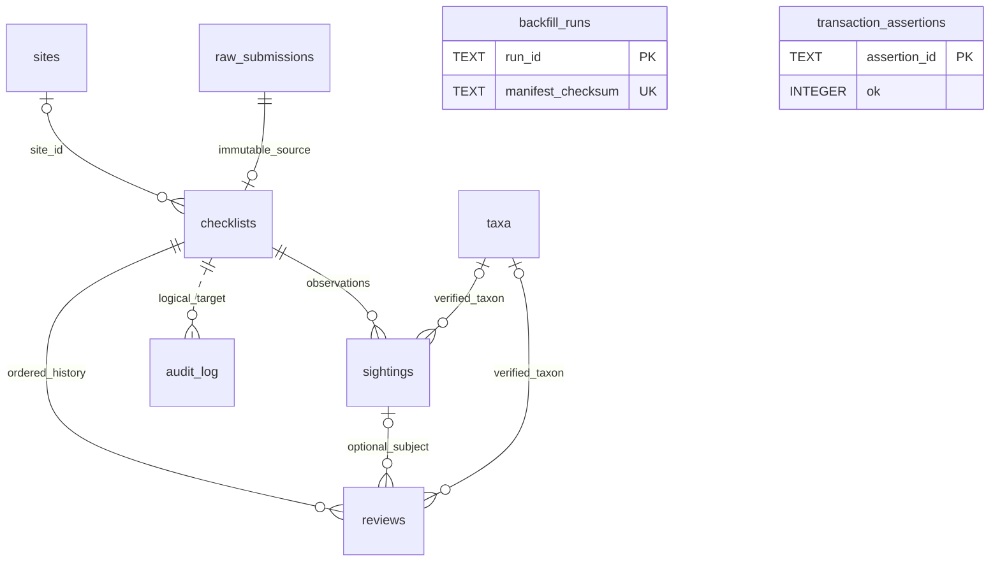

# 들뫼 전국 탐조지도 장기 관찰 DB — Phase 2A 최종 결과

**Phase 2A 완료: 설계 단순화와 로컬 D1 검증. 운영 적용본은 아니다.** 신규 설계는 **핵심 7 + 보조 2 = 9개 테이블, 114개 컬럼**이다. 기존 reports와 Wrangler 내부 이력은 별도다. 필수 시험 17개와 기존 API 시험 106개가 통과했다. 운영 DB/Worker·지도·날씨·조석 코드는 수정하지 않았다. Phase 2B는 시작하지 않는다.

이 결과의 정본은 이 문서 → [컬럼·제약 사전](data-dictionary.md) → [실제 시험한 DDL](migrations/0001_core.sql) → [실행 증거](execution-evidence.md)와 [기계 판독 결과](evidence/local-results.json) 순으로 함께 읽는다. 불일치가 발견되면 운영 적용을 중단한다. Phase 1 파일은 참고 원본으로 그대로 남겼다.

## A. Phase 1에서 유지한 설계

기존 190개 siteData.id와 reports.id를 영구 식별자로 유지한다. 승인·반려 행과 species 원문, 좌표·공개좌표의 NULL, pending_public 잔류값, site_id/spot_key, 기존 해시를 임의로 정규화하지 않는다. 원문을 raw_submissions에 보존하고 현재 관찰 projection을 checklists/sightings, 이후 검토를 reviews, 작업 메타데이터를 audit_log로 분리한다.

NULL은 미확인이고 0은 관찰/검토된 값이다. legacy 수량 1은 1/unknown, 수량 NULL은 NULL/unknown이다. complete_list·effort·최초 제출시각·번식 여부·미확인 taxon을 추정하지 않는다. 여러 종과 공유 수량이 발견되면 원문/공유 수량은 남기고 종별 숫자를 만들어 넣지 않는다.

신규 적격 제출은 저장 전에 **“이 제보는 둥지·포란·육추·번식지 등 번식 관련 관찰이 아닙니다.”**에 명시적 true 확인이 있어야 한다. 누락/false/잘못된 타입을 거부한다. 확인을 받은 뒤 숨겨 두는 수집 구조를 만들지 않는다. 종명·희귀도·보호등급·월로 번식 여부를 판정하지 않는다. 일반 비번식 승인 관찰은 실제 관찰좌표 공개 원칙을 유지한다. 기존 reports는 rollback용 현재 상태 저장소로 유지한다.

## B. 삭제·단순화한 설계와 이유

| Phase 1 | Phase 2A 결정 |
|---|---|
| 13테이블·171컬럼 | 9테이블·114컬럼. reports/플랫폼 내부 테이블 제외 기준이 동일하다. |
| migration_control, mutation_permits | 삭제. 짧은 쓰기 차단과 두 Worker의 명시적 배포·검증 순서로 대체한다. |
| 22개 reports 필드 JSON writer guard | 삭제. 유지보수 창의 frozen snapshot 및 backfill 후 동등성 검사를 사용한다. |
| 자체 schema_migrations | 삭제. 공식 d1_migrations에 DDL 이력을 맡긴다. |
| media, environment_snapshots | 장기 설계는 유지, 기능 개발 시까지 DDL 보류. 사진·환경 수집이 없는 지금 빈 테이블의 이점이 작다. |
| sites 15컬럼 | 9컬럼. 영구 ID·대표좌표·registry 원본/버전·은퇴 시각을 우선한다. 추가 서식·서식지 정규화는 보류한다. |
| taxa 13컬럼 | 9컬럼. 출처·버전·외부 키·국명/학명/계급만 우선. parent/synonym 자동 연결은 보류한다. |
| audit before/after JSON | 삭제. 대상·작업자·요청·비민감 fingerprint·review 수만 남겨 payload 복제를 막는다. |
| 복잡한 writer 제어 | 작은 transaction_assertions 1개만 유지. CAS 0행을 batch 실패로 만든 뒤 행을 지운다. |

checklists 38컬럼은 현재 API의 22필드 표현과 장기 관찰의 미확인 effort를 함께 담기 위해 유지했다. 모든 컬럼을 생태분석 정본으로 취급하지 않는다. raw/ID 불변 trigger, count/좌표 제약, 실제 FK는 필요한 무결성 보호라 유지했다. raw와 checklist 출처 일치만 검사하는 작은 INSERT trigger를 추가했다.

## C. 수정된 최종 Phase 2A ER



checklist당 sighting 최소 1개는 writer의 동일 batch로 보장하는 계약이다. SQL FK만으로 부모 생성 직후 최소 자식 수를 강제하지 않는다. raw 1개는 checklist 최대 1개에 연결된다. audit 대상은 논리 연결이며 FK가 없고, 권한 있는 미래 정책 폐기 뒤에도 최소 tombstone을 유지할 수 있다. backfill_runs와 assertion은 관찰 모델 바깥의 실행 보조다.

## D. 수정된 컬럼·제약

| 테이블 | 컬럼 수 | 책임 |
|---|---:|---|
| sites | 9 | 영구 탐조지 registry |
| taxa | 9 | 버전이 있는 검증된 분류 |
| raw_submissions | 12 | 불변 source snapshot / 적격 신규 입력 |
| checklists | 38 | 관찰 묶음·현재 상태·현재 API 호환 |
| sightings | 13 | 원종 문자열·검토 분류·종별 수량 |
| reviews | 16 | 순서 있는 불변 검토 이벤트 |
| audit_log | 9 | 민감 payload 없는 작업 기록 |
| backfill_runs | 6 | manifest·변환 버전·완료 기록 |
| transaction_assertions | 2 | 동일 batch 내 행 수 assertion |

114개 컬럼의 타입, NULL, DEFAULT, 의미와 UNIQUE/FK/trigger는 [사전](data-dictionary.md)에 전부 기재했다. PK는 명시적 NOT NULL이다. count는 음수·소수·문자 값을 거부하고, count NULL이면 unknown이다. unknown이 양의 수량을 지우지 않는다. legacy 공개/대략 좌표의 불완전 쌍은 보존하되 신규 자료에는 쌍 제약을 적용한다.

호환 수량 shared_bird_count는 입력 원값이며, 검토로 바뀐 sightings.count_value를 자동 합산해 덮어쓰지 않는다. compat 해시는 rate limit/dedupe 계약이고 생태학적 중복의 정본이 아니다. spot_key는 site_id와 다른 지점 연결이다.

## E. reviews UNIQUE 수정

다음 세 제약으로 확정했다.

```sql
PRIMARY KEY(review_id)
UNIQUE(checklist_id, sequence)
UNIQUE(request_id, event_index)
```

request_id는 한 작업의 그룹으로 반복한다. event_index는 요청 전체의 고정 순번이며 재시도에서도 바뀌지 않는다. 동일 checklist의 서로 다른 sighting 2개를 한 batch에서 검토하고 2개 review가 남는 것을 확인했다. 동일 요청 재시도는 2개로 유지된다. 같은 요청의 다른 수량, event_index 중복, checklist sequence 충돌, 다른 checklist의 sighting 참조는 거부됐다.

작업 의미 fingerprint와 저장된 이벤트 수/내용을 비교한다. INSERT OR IGNORE로 충돌을 덮지 않는다. 요청/checklist당 audit 1개에 event_count를 넣어 복수 review와 감사 UNIQUE가 충돌하지 않게 한다. 실패한 CAS/sequence 경합은 409 또는 동일 요청 결과 재조회로 처리할 Phase 2B 계약이다. 실제 동시 edge 요청 부하·재시도 처리는 아직 구현하지 않았다.

## F. 좌표 NULL 정책 수정

actual_lat/actual_lon은 쌍으로 NULL을 허용한다. 이 경우 site_id는 존재해야 하며 실제 sites FK가 유효해야 한다. 한쪽만 NULL, 실제좌표·site 모두 없음, 존재하지 않는 site는 거부한다. site 대표좌표를 실제 관찰좌표로 채우지 않는다.

현재 빠른 제보에서는 숫자형·유한·유효범위의 실제 좌표 쌍을 계속 요구한다. NULL/누락/빈 문자열/NaN/범위 밖을 저장 전에 거부하는 local proof를 통과했다. site-only 자료는 장기 DB 능력의 검증일 뿐 현재 UI에 추가하지 않았다.

기존 reports.lat/lon은 NOT NULL이다. 따라서 legacy rollback/dual-write 기간에는 site-only·complete_checklist의 신규 기능을 열지 않는다. 공개 legacy DTO도 이들을 제외한다. 일반 non-breeding 승인 자료는 actual, 기존 override는 기존 public_lat/public_lon의 축별 fallback을 유지한다. 실제 좌표값은 이 보고서에 나열하지 않는다.

## G. Wrangler migration 전략

DDL 버전은 공식 Wrangler의 d1_migrations로 관리한다. 기본 테이블명과 migrations_dir 설정을 사용하며 자체 schema_migrations를 만들지 않는다. 공식 이력 외의 checksum은 배포 아티팩트 manifest로 검증한다. Wrangler ledger만으로 SQL 파일 내용 변경을 검출한다고 가정하지 않는다. [Cloudflare D1 migrations](https://developers.cloudflare.com/d1/reference/migrations/)

이번 시험은 별도 [wrangler.local.toml](wrangler.local.toml), 합성 database ID, 독립 migrations 디렉터리, 명시적 --local만 사용했다. 0001_core.sql 첫 적용 후 이력 1행, 재적용 후 이력 1행 그대로임을 확인했다. 바인딩/API 시험은 별도의 일회성 로컬 D1에 기존 schema.sql과 신규 DDL을 올려 수행했다.

미래 운영 전환 시 기존 reports 스키마를 baseline으로 읽어 확인하고, 새로운 additive migration stream만 연결한다. 기존 reports-api/migrations/0002_pending_public.sql은 이미 있는 컬럼을 다시 추가할 수 있으므로 빈 공식 ledger에 기존 디렉터리를 무조건 연결하지 않는다. 0003의 기존 인덱스 누락 문제는 최신 실측에 따라 별도 검토한 additive migration으로 처리한다. 과거 적용을 허위로 ledger에 써 넣지 않는다.

CREATE TABLE의 IF NOT EXISTS로 부분 실패를 숨기지 않는다. 공식 이력과 실제 스키마가 어긋나면 중단한다. 파일을 적용한 뒤 수정하지 않고 후속 migration을 만든다. backfill_runs는 데이터 manifest·변환 버전·행 수를 기록할 뿐 DDL ledger를 복제하지 않는다. 21건 합성 proof에서는 backfill 전체와 완료 행이 한 batch다. 향후 데이터 증가 시 D1의 실행·SQL·batch 한도와 유지보수 시간 예산을 재검증한다.

## H. write maintenance window 절차

아래는 **미실행 운영 절차**다. 이번 작업에서 차단 설정·배포·운영 migration을 실행하지 않았다.

1. 최신 운영 schema/상태와 registry/spot manifest, 두 Worker 버전, 공개 캐시, 현재 복구 가능 bookmark를 읽어 기준선을 확정한다. export/별도 복원 리허설은 향후 명시적으로 허용된 환경에서 먼저 완료한다.
2. 차단 경로를 전수 확인한다. POST /reports, 관리자 8개 mutation뿐 아니라 workers.dev·custom domain·preview/versioned URL·내부 호출·cron/queue·직접 SQL 쓰기를 포함한다. zone 규칙이 workers.dev까지 막는다고 가정하지 않는다.
3. 외부 진입점에서 양쪽 쓰기를 막고 503 + Retry-After와 재시도 안내를 제공한다. GET approved/pending/site/status·관리자 조회는 유지한다. 외부에서 전부 막을 수 없다면 maintenance-only 버전 두 개를 먼저 100% 적용한 뒤 차단을 검증한다. 한 Worker만 막힌 상태에서 DB 전환을 시작하지 않는다.
4. 진행 중 쓰기 요청의 종료를 관측한다. 현재 Turnstile fetch에는 명시적 timeout이 없으므로 임의의 60초 대기나 안정된 행 수만으로 drain 완료를 선언하지 않는다. 종료 관측 또는 검증된 상한/중단 절차가 없으면 진행하지 않는다.
5. freeze 아래서 source schema/manifest·무결성·복구 증거를 확정하고 additive DDL → registry seed → raw/checklist/sighting backfill → FK·22필드 동등성·상태/NULL/count/ID/원문·공개응답을 검증한다. 최초 제출·과거 review 시각을 만들어 넣지 않는다.
6. 양쪽 새 Worker를 모두 쓰기 차단 상태로 준비한다. 동일 schema capability, 새 dual-write, native 확인 정책, 인증·rate limit·dedupe·각 관리자 액션을 확인한다. 구 writer에 트래픽이 남은 gradual 혼합 상태에서는 열지 않는다.
7. 두 Worker가 100% 준비되고 검증/복구 담당자가 go를 결정한 뒤 쓰기를 연다. 공개 GET이 계속 사용한 reports와 새 읽기 adapter의 응답을 비교한 뒤 읽기 전환을 별도로 진행할 수 있다.
8. 실패하면 쓰기 차단을 유지하고 기존 GET을 지속한다. additive 테이블을 자동 DROP하지 않는다. 최대 중단시간 초과 시에도 불완전한 혼합 writer로 자동 재개하지 않는다.

rollback은 우선 **읽기 경로를 reports로 되돌리는 것**이다. 새 쓰기가 시작된 뒤 이전 정책의 구 Worker로 쓰기를 되돌리면 dual-write/확인 정책이 깨지므로, 쓰기 장애 때는 다시 freeze하고 새 계약을 유지하는 rollback 버전을 사용한다. 전체 DB Time Travel은 전환 후 새 관찰까지 되돌릴 수 있어 일반 읽기 rollback과 다르며, 별도의 복구 계획·승인·자료 보존 검증이 필요하다.

## I. 최소 dual-write 설계

동일 REPORTS_DB 바인딩의 한 batch에 legacy reports와 canonical 변경, reviews, audit를 넣는다. 서로 다른 두 .run()으로 기록하지 않는다. D1 공식 batch는 문장 실패 시 전체 묶음을 rollback한다. 이번에는 실제 Miniflare D1 binding에서 중간·후반 실패 및 CAS 0행을 검증했다. [D1 batch 문서](https://developers.cloudflare.com/d1/worker-api/d1-database/)

```text
같은 DB.batch([
  checklists UPDATE ... WHERE revision = expected,
  INSERT assertion ... CASE WHEN changes()=1 THEN 1 ELSE 0 END,
  DELETE 이번 assertion,
  reports UPDATE ... WHERE id = report_id,
  직전 UPDATE 1행 assertion 및 삭제,
  필요한 sightings 변경 + reviews N개,
  audit 1개
])
```

assertion의 ok는 NOT NULL CHECK(ok=1)이다. UPDATE와 changes() 사이에 다른 DML을 넣지 않는다. revision=expected+1인 행의 존재만 검사하면 다른 요청의 성공을 내 성공으로 잘못 볼 수 있어 사용하지 않는다. 검증 결과 성공 뒤 assertion 행은 0개다.

[proof/model.mjs](proof/model.mjs)의 reviewBatch는 이 원자성·멱등성·복수 검토를 증명하는 local helper다. status/수량 일부만 다루며 reject/unpublish의 pending_public/decided_at, site/link/unlink/consent/visibility 등의 전체 행위를 구현한 것이 아니다. 상태 이벤트를 포함한 완전한 review 이력, 신규 POST request 재시도·경합 처리, 관리자 8개 액션과 호환 필드의 정확한 투영은 Phase 2B에서 구현한다. 검토된 종별 수량은 기존 shared count와 별개다.

## J. 비운영 D1 테스트 결과

최종 실행: **2026-09-25T22:09:23.654Z ~ 2026-09-25T22:10:31.080Z UTC**. 한국시간 2026-09-26 오전 7시 9분~7시 10분. Node v24.18.0, Wrangler 4.137.0, Miniflare 5.20260921.0-alpha. Wrangler에 포함된 alpha Miniflare runtime을 사용했으므로 운영용 도구 버전 확정 및 별도 staging 재검증은 남아 있다.

| 번호 | 검증 | 결과 |
|---|---|---|
| 1 | 수정 DDL 실제 로컬 실행, 공식 Wrangler 적용·재적용 | PASS |
| 2 | foreign_key_check 및 잘못된 FK 거부 | PASS, 0건 |
| 3 | 합성 21건 snapshot/ID/22필드 동등성 | PASS |
| 4 | approved 17 / rejected 4 | PASS |
| 5 | site NULL 5 | PASS |
| 6 | count 1이 13건, accuracy unknown | PASS |
| 7 | count NULL 8건, unknown; 0과 구별 | PASS |
| 8 | public 좌표 NULL 쌍 21건 원값 유지 | PASS |
| 9 | 승인 중 pending_public=1 잔류 15건 유지 | PASS |
| 10 | species 원문·공백 보존 및 원문 UPDATE 거부 | PASS |
| 11 | 같은 backfill 추가 0, 변경 manifest/부분 상태 거부 | PASS |
| 12 | batch 중간·후반 실패 / stale CAS 전체 rollback | PASS |
| 13 | 요청당 review 2건, 재시도·충돌·부모 FK | PASS |
| 14 | 실제좌표 NULL 쌍+site 허용, 부분 쌍·고아·출처 불일치 거부 | PASS |
| 15 | 빠른 제보의 실제좌표 필수 validation | PASS |
| 16 | 명시적 true 확인 전 저장 거부, 정상 적격 입력 허용 | PASS |
| 17 | 현행 public GET과 canonical DTO 비교, 기존 API suite | PASS |

운영 Cloudflare D1의 지역·권한·복제·Time Travel/restore·실제 freeze/drain·원격 동시 부하는 시험하지 않았다. 로컬 Node SQLite 대역만으로 batch 원자성을 주장하지 않았다. Miniflare getD1Database()의 D1 binding을 사용했고 기존 API unit suite는 별도 증거로 분리했다. [Miniflare D1 테스트 API](https://developers.cloudflare.com/workers/testing/miniflare/storage/d1/)

## K. 기존 21건 synthetic migration 결과

합성 fixture는 Phase 1에 기록된 **알려진 집계 조건**만 재현한다. 실제 운영 행을 읽어 복제하거나 현재 운영 건수라고 재보고한 것이 아니다. UUID·종명·제보자·관찰좌표·메모·해시는 합성값이다. 사이트는 현재 공개 registry의 ID 190개만 읽었고 좌표는 복사하지 않았다.

| 항목 | backfill 전 → 후 |
|---|---|
| reports/raw/checklists/sightings | 21 → 각각 21 |
| approved / rejected / pending | 17 / 4 / 0 유지 |
| site_id NULL | 5 유지 |
| count=1 / count=NULL | 13 / 8 유지, accuracy 모두 unknown |
| public 좌표 NULL 쌍 | 21 유지 |
| approx 쌍 / NULL 쌍 | 19 / 2, 22필드 동등성으로 확인 |
| approved + pending_public=1 | 15 유지 |
| species·ID·좌표·동의·기존 해시 | 원본 fixture와 동일 |
| legacy complete_list/effort/번식 확인 | NULL 유지 |
| 동일 manifest 재실행 | 신규 0 |
| backfill manifest SHA-256 | ef4bb1d70c393358fab839bce18a865a56c87690290c4699069a963a27286587 |

현재 21건 모형 외의 별도 corner fixture에서 다종+공유 count를 검증했다. 공유 7은 checklist/raw에 남고 각 종에 복제하지 않으며 sighting count는 NULL/unknown이다. 종 문자열을 조각내어 taxa를 추정하지 않는다. 구분자 검사는 모형의 보수적 해석 보류용이며 실제 taxonomy 판정기가 아니다.

## L. 기존 API 응답 회귀 테스트 결과

- **기존 suite 106/106 통과**: 기존 public/admin/validation/site-picker 코드 그대로 실행했다. 기존 test helper의 batch는 비원자적 대역이므로 원자성 증거로 사용하지 않았다.
- **새 읽기 DTO 비교 13경로 통과**: 같은 local D1에서 기존 reports 쿼리와 checklists→22필드 호환 projection을 현행 public handler에 전달해 HTTP status·headers·JSON을 비교했다. generatedAt만 비교에서 제외했다.
- approved: 실제/별도 공개/legacy 불완전 공개 fallback, 연결 report, fixed key, 비승인 부모, 다종 문자열, 이름 동의·빈 이름의 키 생략을 포함했다.
- pending: 허용·비허용 및 approx 누락을 포함했다. site history는 pagination·offset 초과·잘못된 site 형식, status는 승인/반려/대기/미존재를 포함했다.
- 신규 입력·관리자 dual-write 전체와 브라우저 지도 E2E·실제 네트워크 캐시를 검증한 것은 아니다. 현행 코드/지도/날씨/조석을 수정하지 않았으며 새 adapter는 proof 폴더에만 있다.

기존 공개 API의 승인 실제좌표 fallback 자체를 migration이 임의로 변경하지 않는다. 기존 POST에는 이번 정책 확인이 아직 없고, 현행 종 목록 기반 pending 보류 동작도 그대로다. 이 정책 변경을 실제 API/UI에 반영하는 것은 Phase 2B에서 수행할 후속 작업이다.

## M. Phase 2B에서 실제 코드 구현 대상

1. 양쪽 Worker의 maintenance 응답·capability·timeout/drain 관측과 안전한 배포 순서. 실제 차단 수단은 계정/라우팅 구조에 맞춰 확정한다.
2. 신규 UI 명시 확인과 서버의 저장 전 검증, raw payload 계약·요청 멱등성·날짜/좌표/동의 검증. species·계절 추정으로 확인을 대체하지 않는다.
3. 빠른 POST 및 관리자 8개 액션의 동일 batch dual-write. 상태 review, 수정 원문 보존, 순번/CAS·경합 재시도·오류 응답을 구현한다.
4. 기존 ID·site/spot·dedupe·rate limit·이름 동의·공개/대략 좌표·status 응답을 보존하는 실제 읽기 adapter. 검토 수량과 shared count의 변경 계약을 분리한다.
5. frozen 실측 manifest를 입력받는 운영용 preflight/backfill 검증기와 개별 상태 복구 절차. 이번 proof의 합성 fixture·고정 NOW를 운영에서 사용하지 않는다.
6. 원격 staging에서 timeout/경합/DB batch 한도·rollback 버전·복구 리허설 후 운영 적용 여부를 별도 판단한다.

사진·환경 snapshot, site-only UI, complete checklist UI는 자동으로 포함하지 않는다. 실제 운영 purge도 이 Phase 2A에서 구현·실행하지 않았다.

## N. 운영 적용 전에 남은 결정사항

- 실제 freeze 제공자·모든 경로 커버리지·진행 중 쓰기 종료의 객관적 확인 방법·허용 중단시간과 담당자.
- 새 정책 적용 후 유지할 rollback Worker 버전과 실패 시 GET/쓰기 재개 기준.
- 새 실측의 schema/인덱스 차이·고아/날짜/동의 이상치 처리. 원값은 보존하고 임의 수정하지 않으며 모순은 전환 차단/수동 결정으로 남긴다.
- native taxa 기준·정확도 입력 UX·신규 dedupe 계약·IP hash 보존기간. unknown 값을 편의상 채우지 않는다.
- legacy API 종료 조건과 호환 컬럼별 이관/삭제 시점, reports 보존기간. 이중 저장이 살아 있는 동안 site-only 신규 기능은 보류한다.
- Time Travel의 **그 시점 실제** 보존 창·복구 bookmark, export/별도 복구시험 허용 범위·위치·폐기·접근권한. 이번에 새로 측정하거나 export/restore하지 않았다.
- 금지 번식자료를 사후 발견한 경우 raw/reports/canonical/review·캐시·미디어·백업의 안전한 삭제 책임과 잔존기간. 감사에는 민감 payload나 그 원문 해시를 남기지 않는다. 실제 purge 절차/코드는 별도 설계·검증이 필요하다.
- Miniflare alpha 결과를 보완할 운영 도구 고정 버전 및 실제 원격 staging 리허설.

이 결정들이 남아 있으므로 “즉시 운영 migration 가능” 판정은 하지 않는다. 요청된 Phase 2A의 로컬 구현 가능성 검증은 완료했다.

## O. 생성·수정 파일 목록

모든 새 파일은 docs/long-term-db-phase2a 아래에만 있다.

| 파일 | 역할 |
|---|---|
| README.md | A–P 최종 보고 |
| data-dictionary.md | 전체 컬럼·제약 및 canonical/호환 수명 |
| execution-evidence.md | 환경·실행·보존·한계 증거 |
| migrations/0001_core.sql | 실제 로컬 적용한 additive DDL |
| wrangler.local.toml | 운영 ID가 없는 격리 로컬 설정 |
| proof/fixture.mjs | 합성 21건 및 corner fixture |
| proof/model.mjs | backfill·DTO·원자성 검증 helper |
| proof/run.mjs | 공식 migration 및 17개 시험 runner |
| evidence/local-results.json | 최종 실행 집계·소스 checksum |
| evidence/preservation.json | 저장소/Phase 1 보존 확인 |
| SHA256SUMS.txt | 전달 파일 무결성 목록 |
| .gitignore | .local/ 시험 저장소·로그 제외 |

.local/에는 시험 회차별 Wrangler local state·로그·기존 suite TAP가 있다. 과거 실패 회차도 삭제하지 않았다. Miniflare binding fixture는 휘발성 local DB다. 테스트 파일은 운영 Worker에서 import하지 않는다.

## P. 운영 DB·Worker·Git 원격 변경 여부

- 운영 D1 호출·쓰기 **0**. 운영 인증 토큰을 읽거나 갱신하지 않았다. 원격 migration/export/restore **0**.
- Worker 배포·설정 변경 **0**. 기존 reports-api·index.html·weather-proxy·날씨/조석 파일은 변경하지 않았다.
- commit/push/fetch/pull/reset/clean/restore/checkout **0**. main HEAD는 d39bf4bf2d7e147b246f867f56567f814eddd4b9 그대로다.
- 추적 파일 462개의 경로+내용 SHA-256은 시작/종료 동일: b5478e4ccadd7062d6d7a5341bbf2ac8706826528a80c514705ac0cdec692ac0.
- 기존 Phase 1 파일 14개(기존 zip 포함)의 경로+내용 SHA-256도 동일: 05832a166305ba0e5416160c5fa7f750b83067be08b4162ec4434323da917754.
- GitHub 비교는 읽기 전용 GET으로 확인했다. 종료 조회 때 원격 main은 942b194a3734e2afe54457890b9296140eb9ea22로 로컬보다 13커밋 앞섰으며, 모두 기상·조석 자동 갱신 제목이고 변경 파일은 tide_health/month/today 및 weather_today/week JSON 5개였다. 시작 비교 때는 a71e7cb3ffa3d4a703b811a83198fe4a5a3675fc, 9커밋 차이였다. 이를 DB 작업 변경으로 해석하지 않았다.
- “변경 없음”은 **이번 작업이 운영에 변경을 가하지 않았다는 확인**이다. 다른 사용자의 운영 변경까지 없었다고 주장하지 않는다. 운영 DB의 전후 데이터·배포 버전을 재조회한 결과로 표시하지 않는다.

최종 보고 후 정지한다. 운영 migration·배포·commit·push 또는 Phase 2B를 자동 시작하지 않는다.
