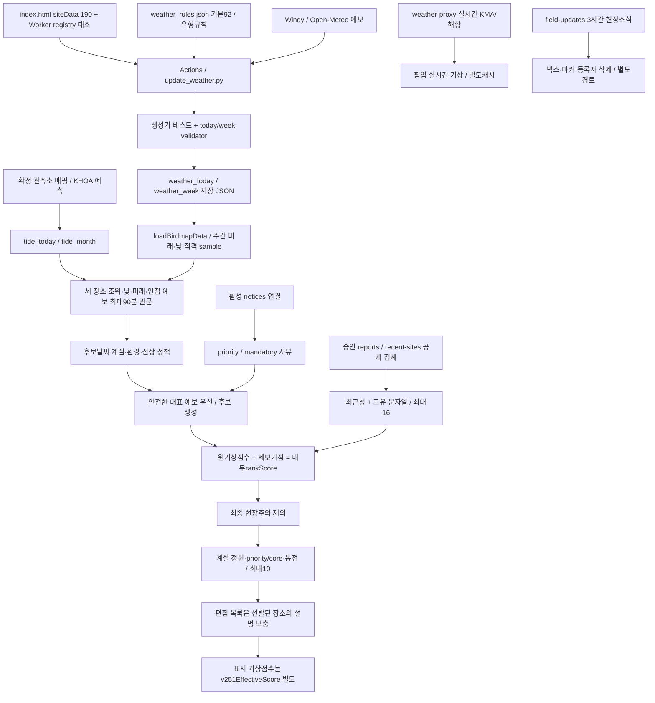

# 확인 사실과 근거

## 기준과 자료 시각

분석 코드와 저장 JSON은 `1f0b0b5ca9d3ef887fc0bd2a159ef73429466a25`의 Git object로 고정했다. P0 최종 `e0fc103`은 PR #12 merge `eb36d1e`를 통해 main에 반영됐다. [이전 P0 검증](https://github.com/wooil1964/birdmap/issues/9#issuecomment-6056552946)과 이번 실행 결과는 별도 증거다.

재개 후 확인한 main은 `35141c04d4fd152982b1f4683d5b7a6f4f7514e5`다. weather_today/week만 변경됐고 추천 코드는 동일하다. 새 자료는21:04 생성/21:08 갱신, 모든190곳 복구, 주간10640 sample이다. 이번18:10 스냅샷에 혼합하지 않았다.

HANDOVER 상단의 P0 “main 미병합” 기록은 현재 Git 이력과 불일치한다. 역사 메모로 취급하며 운영 HANDOVER는 수정하지 않았다.

|자료|고정 범위|
|---|---|
|기상|기준 SHA,18:10 생성/18:19 갱신,10/08~10/14|
|월간조석|같은 SHA,08:02 생성,10/08~11/07,예측자료|
|공개 승인 집계|GET19:32:04,11곳,14일창|
|평가시계|2026-10-08T19:30:00+09:00|
|결과|원문 함수 추출 재생, 실제 당시 브라우저 관측은 아님|

별도 취득 공개 집계와 고정 시계를 결합한 통제 재생이다. SHA 시점 DB 상태를 복원한 것이 아니다. 과거 P0의 ffd6506/10:12/옛 fixture와 이번 자료를 구분한다.

[manifest](_snapshots/input_manifest.json)는 입력16개의 Git blob/SHA256과 공개 GET 취득 정보를 기록한다. 보고 스냅샷 해시는 `af77014b5430d7b15d42dd77de8e4ec2a841e48b5151298a7013e3875c4757b6`, runtime 정규 JSON 해시는 `fd50e35a1f1ad828f425918e28bb1632c9acb2e9206806263cd64d18a8513fd8`이다. 민감 원좌표·제보자·메모를 수집하거나 추가 저장하지 않았다.

## 실제 데이터 흐름

|경로|실제 코드와 역할|
|---|---|
|기상 생성|[score_weather](https://github.com/wooil1964/birdmap/blob/1f0b0b5ca9d3ef887fc0bd2a159ef73429466a25/.github/scripts/update_weather.py#L361) → build_site_result/build_week_days → write_week_output. Windy/Open-Meteo 예보와 유형 규칙을 사용한다. 조류 존재를 학습한 모델은 아니다.|
|자동 갱신|[update-weather](https://github.com/wooil1964/birdmap/blob/1f0b0b5ca9d3ef887fc0bd2a159ef73429466a25/.github/workflows/update-weather.yml)는 테스트·validator 뒤 JSON을 commit한다. 제목은fourtimesdaily지만 cron은KST00:20/05:35/10:17/14:17/18:17의5개다.|
|저장 자료 로딩|[loadBirdmapData](https://github.com/wooil1964/birdmap/blob/1f0b0b5ca9d3ef887fc0bd2a159ef73429466a25/index.html#L4437)는10분 간격·탭 복귀 재검증, 실패시 마지막 정상 자료 유지. 주간 추천은 저장 JSON을 소비한다.|
|실시간 기상|fetchLiveWeatherForSite(2559)는 /weather?siteId 요청과15분 메모리 캐시를 사용한다. 저장 추천의rank를 갱신하지 않는다.|
|계절·대표시간|[weeklyDatePolicy](https://github.com/wooil1964/birdmap/blob/1f0b0b5ca9d3ef887fc0bd2a159ef73429466a25/index.html#L4002)는 후보 날짜의 계절·환경·선상을 평가한다. weeklySeasonalBestWeatherDay는 안전 예보를 먼저 찾는다.|
|조석|[weeklyQualifyingHighTides](https://github.com/wooil1964/birdmap/blob/1f0b0b5ca9d3ef887fc0bd2a159ef73429466a25/index.html#L3813) → weeklyTideWeather → weeklyUsableHighTides → weeklyBestMudflatTide. 월간자료는 만·간조 event이며 연속조위·노출면적·조류속은 없다.|
|공지|[weeklyIssueReason](https://github.com/wooil1964/birdmap/blob/1f0b0b5ca9d3ef887fc0bd2a159ef73429466a25/index.html#L3963)의 활성 연결공지는priority1,조석2,동풍3,일반4. 편집 목록은 자동 선발된 장소의 사유만 보충한다.|
|승인 제보|[handleRecentSites](https://github.com/wooil1964/birdmap/blob/1f0b0b5ca9d3ef887fc0bd2a159ef73429466a25/reports-api/src/public.js#L367)는 승인·site_id·관찰일창·보호 조건 뒤 siteId/latestDate/species만 제공한다.|
|현장소식|[handleList](https://github.com/wooil1964/birdmap/blob/1f0b0b5ca9d3ef887fc0bd2a159ef73429466a25/reports-api/src/field-updates.js#L197)의3시간TTL, 화면60초 갱신, 서버 소유권 확인 후 삭제. 추천 가점과 별도 경로다.|

최근집계의 latestDate는 최신 한 행의 날짜이고 species는 기간 전체의 합집합이다. 각 종이 최신일에 관찰됐다는 뜻은 아니다. 독립 관찰자·종별 날짜·관측 노력량을 이 API에서 복원할 수 없다.

canonical 스키마에 노력량 필드가 있지만 [checklistFromReport](https://github.com/wooil1964/birdmap/blob/1f0b0b5ca9d3ef887fc0bd2a159ef73429466a25/reports-api/src/canonical/data.js#L51)는 legacy/quick의 시간·거리·관찰자·완전목록을null로 매핑한다. 운영 DB의 실제 채움률은 조회하지 않았다. 필드 존재를 추천 입력 확보로 간주하지 않는다.

현장소식 확인 건수의 브라우저 capability도 독립 인간 관찰자 수를 뜻하지 않는다. 기존 제보 등록 좌표와 길안내 GPS 기능이 있으므로, P3의 “불필요한 GPS 서버 저장 금지”를 앱 전체의 위치 저장 부재로 확대하지 않는다.

## 유지할 안전·보호 계약

- 유부도710cm, 매향리·걸매리850cm 기준을 임의 변경하지 않는다.
- 만조 인접 유효 예보는 metadata와 무관하게 최대90분이다. 기상 미확인 만조는 탈락하며 다른 안전 만조를 검사한 뒤 조위·날짜 우선순위를 적용한다.
- 현장주의는 강수≥1mm 또는 파고≥2m. 선상은 필수값이 유한한 숫자이고 풍속≤6m/s·파고≤0.7m·강수0이어야 한다. 선상은safetyRaw 원자료를 우선한다.
- 일반weekly 값도 저장 단계에 반올림됐다. 상류 정밀도를 역복원할 수 없다.
- 최종선발은 안전판정false를 제외한다. 모든 일반결측null을 제외하는 전역 정책은 아니다. 이번175후보는 모두true였지만 현장 전체 안전을 보증하지 않는다.
- 위치가림·둥지·번식·보호종 보고행은 recentAPI에서 제외된다. 보호 목록과 종명 처리 변경에는 위치 보호 계약 검증이 선행해야 한다.
- 공지·제보·mandatory·편집 목록은 만조·선상·최종 위험 관문을 우회해서는 안 된다.

## 확인한 문제와 후속 조사

|우선 과제|확인 사실|의미와 남은 검증|
|---|---|---|
|P1-A|후보175중150이92, 유효 장소별 최고는92×150/100×39|대표값의 구분력이 제한된다. 분산 증가만으로 개선을 주장하지 않는다.|
|P1-B|동점 비교에stableOrder/core/id가 남음|P1-B 후속 실험에서 구성 변동 ON99.8%/OFF100% 확인. 아래 최신 결과 참고.|
|P1-C|독립 관찰자·노력량·종별 날짜 없음|제보를 개체수나 출현 확률로 해석할 수 없음.|
|P1-C|평화의공원12문자열에동박새/동박새2,울새/울새1 혼재|고유 문자열 수와 확인된 분류종 수가 다를 수 있음. 정규화 영향 조사 필요.|
|P1-A|후보59/99/133의 원점수100/100/92와 표시75가 다름|설명과 내부 순위의 일관성 검토. 이번top10 밖.|
|P4 자료품질|18:10자료는 고정19:30에 팝업reference190/표시적격0|실제 신선도 조건. 실행 원인과 갱신 계약은 별도 조사. 최신21:04자료와 구분.|
|P1-B/D|runtime190에sido중국인132/133도 포함|지역통계에서 등록190과 국내188을 분리. 운영 제외정책 미승인.|
|설명 품질|편집 사유 목록의 날짜 소비는 활성공지와 다름|설명 유효기간 감사 필요.|
|문서|HANDOVER의 과거 미병합 표기|현재 코드 사실과 과거 메모 구분.|

위는 코드·자료로 확인한 동작이다. 새 모델 효과, 특정 종 출현, 문헌상 근거 수준은 아직 검증하지 않았다.

## P1-B 후속 검증 완료

기존 P1-A 스냅샷을 보존하고 최신 main35141c0의21:04기상을 별도 고정했다. 같은22:40시계·조석·공지·190곳·기존 승인제보11곳에서 코드 변경 없이 후보175→176, 후보92점150→151로 바뀌었다. 두제보시나리오의 원래 배열top10은 유지됐고 굴업도 추천 날짜 등 핵심필드4곳만 달라졌다. [기상 비교](_results/weather_comparison_p1b_2240.json).

|새로 검증한 사실|의미와 한계|
|---|---|
|실제 추천 호출1000회×ON/OFF에서 목록변경99.8%/100%, 평균교체1.795/3.863|배열만으로 선발 경계가 달라지는 문제. 탐조 성과의 변동률은 아님|
|ON 선상7중1·other100점22중1, OFF 추가core5중3 동점경계|원점수92동점 전체가 배열효과를 만든다고 확대하지 않음|
|현재 배열은numericID 오름차순, 고유stableOrder가ID fallback보다 앞섬|A1은 배열 불변성을 확보하지만 기존낮은ID우선은 유지|
|ON/OFF 인천 평균슬롯0.307/2.415, 원래 배열1/5|특정동점군의지역구성과 초기배열영향. 후보비례공정성·조류분포와구분|
|모든원본/대안 선발축4/3/1/2, canonical mudflat 평균6.164/10|규칙군과실제 선발축의불일치. 대진항48은선상축이지만mudflat기상룰|
|세대안 모두배열 변동0, 원래 배열대비교체ON0/2/1·OFF0/5/5|불변성과다양성효과는별개. A2 ON지역종류감소, A3 ON지역종류불변|
|shuffle표시75슬롯ON94/10000·OFF189/10000|약한 강수cap과내부rank의기존의미불일치. P0위험관문우회는아님|
|독립 계산과추천순서2000개/각190개선정 빈도전부일치|단일 고정 자료의재현성 증거, 연중성능증거 아님|
|주간126/API171재실행통과,43파일전후변경0|민감 보호/안전회귀유지. 운영통합/브라우저시험아님|

지역은원문 sido범주다. 복합표기8곳과중국2곳을분리해해석했다(등록국내188/전체190, 후보국내174/전체176). 원문env/habitatType/mainBirdGroup빈도도별도집계했다. dataConfidence/dataSource/lastReviewDate가비어있는190곳에임의신뢰도·생태점수를추가하지않았다.

[전체 결과와 대안](P1_DESIGN.md)의P1-B완료절에표·장소별빈도·명령·한계를기록했다. P1-C제보가점과P1-D정원분석은아직시작하지않았다. A1은재현성개선의우선 도입 검토안이며제품 승인이아니다.

## P1-C 완료 — 최근 제보 가점과 자료 계약

2026-10-09, 체크포인트8bd44e3에서 이어받았다. 최신main4fc14b3c7ba19ad4d5b91efa305a80b3d474dc57은35141c0과 tide_health/tide_today/weather_today/weather_week 네 자동자료만 다르다. 이번 실험은 코드35141c0, 평가2026-10-08 22:40 KST,16파일 manifest,190곳,19:32 승인집계11곳과 B의 같은1000순열로 고정했다. 새 main자료를 섞지 않았다.

### 확인한 현행 산식과 집계 경로

loadRecentSiteSightings→weeklyRecentReportBonus→rankScore/weeklyRecentTieBreak 경로다. 최신 장소 관찰일의 경과일0~1/2~3/4~7/8~14일에12/9/5/2점, 고유 **문자열**2~3개/4개 이상에2/4점, 합계min(16,최근성+문자열다양성)이다. 표시 기상점수는 바뀌지 않는다.

GET /reports/recent-sites?days=14는 KST since~today 양끝 포함,approved·site_id 지정·위치가림 제외·민감 판정 제외 행을 관찰일/접수일/ID 역순으로 읽어 장소별 첫 날짜와 literal species 합집합을 반환한다.14일 창은age0..14의15개 달력날짜다. 같은 문자열의 반복 행은 고유 수를 늘리지 않는다. API 실패 시 직전 집계를 유지하고 최초 실패는 가점없이 동작한다. 종별 관찰일·독립관찰자·노력량을 사용하는 모델이 아니다.

### 동일 후보 12정책 대조

A1 안정ID가 대조군이다. 마지막 열은 현행stableOrder 선발의1000배열 구성 변동이며 A1은12정책×1000순열 모두 구성·순서변동0이다. 원문 전체190곳 파이프라인은 정책별 원래/첫/마지막3순열로 추가 대조했다. 독립 Git 원문 추출+별도 날짜/산식+tuple 선발로12×190행·점수·축과 현행12,000목록 해시를 모두 대조했다.

|정책|후보 가점 합|A1 상위10 ID 순서|cap16 대비 교체|현행 배열 구성변동|
|---|---:|---|---:|---:|
|제보OFF|0|112,7,8,10,126,14,107,48,3,5|4|100%|
|cap0|0|112,108,15,194,126,14,107,48,3,5|1|99.9%|
|cap2|22|112,108,15,194,126,14,107,48,3,5|1|99.9%|
|cap4|30|112,108,15,194,126,14,107,48,3,5|1|99.9%|
|cap8|42|108,112,15,194,126,14,107,48,195,3|0|99.8%|
|cap12|49|108,112,15,194,126,14,107,48,195,3|0|99.8%|
|cap16|53|108,112,15,194,126,14,107,48,195,3|0|99.8%|
|cap24|53|108,112,15,194,126,14,107,48,195,3|0|99.8%|
|방문일cap16|47|112,108,15,194,126,14,107,48,195,3|0|99.8%|
|최신장소일age≤7|39|108,112,7,8,126,14,107,48,195,3|2|100%|
|최근성만 가점|45|108,112,15,194,126,14,107,48,195,3|0|99.8%|
|cap0+제보tie제거|0|112,7,8,10,126,14,107,48,3,5|4|100%|

모든 정책 후보176곳, 물리후보 서명은190곳 모두 동일하다. gate true176/false0/unknown0은 현행 함수 기준이며 현장 안전 보증이 아니다. 상한8/12/16 목록은 같아도108/195의 rank는 다르다.24는 미제한 합계 자체가최대16이므로 효과0이다.8이 생태적으로 최적이라는 근거는 없다.

cap0은 제보OFF와108·15·194 세 구성원이 다르다. 최근성·문자열 수 tie를 동시에 없애야OFF와 같아진다. 방문일 기준108은age3→4,가점11→7,rank103→99로112와 순서만 바뀐다. ID10은14→15일로 가점이 사라지고 합계53→47이다. 방문일에 종이 머무는 확률은 추정하지 않았다.

age≤7은 장소최신일이7일 이내인 **전체 집계만 유지**한다. 실제days=7 API 합집합 재구성이 아니다. 최근성만 가점으로 쓰는 대조에도 종수 tie는 남는다. 목록이 같다는 것만으로 종수의 효용을 부정하지 않는다.

현행cap16 목록/표시/내부rank는 호곡리108(92/103),알뜨르112(100/100),사기리15(92/94),강당리194(92/94),해리천126(92/94),걸매리14(92/92),매향리107(92/92),대진항48(92/92),평화의공원195(92/108),굴업도3(100/100)이다. 앞숫자는표시점수,뒤숫자는내부rank다.

### 문자열·시간 계약 — 실제와 합성 증거 구분

스냅샷195의12문자열에동박새/동박새2,울새/울새1이 함께 있다. 접미수량을제거하는 진단은10개지만 확정분류종10종이라고 하지 않는다.12와10 모두4+구간이어서 이번16점은 바뀌지 않는다. 현재집계에는 종별 관찰일,독립관찰자 식별/수,노력량(시간/거리),완전목록,행별 종 소속이 없다.

실제GET handler+메모리SQLite의 합성 대조: 같은울새5행은문자열1개/+12 그대로다.14일 전4문자열은+6인데오늘울새 한행이추가되면 같은합집합4개에오늘latestDate가붙어+16이다. 이는 옛종의오늘재관찰 증거가 아니다. 실제days=1 SQL은문자열1개/+12로재집계한다. 수량표현2개/4개가문자열다양성 가점 문턱을 넘는 합성 사례도 확인했다.

### 기존 민감종 보호 표현 결함

isSensitiveReport의보호종 판정은exact 문자열이다. 합성 approved·linked·공개위치·오늘 행에서저어새1,저어새 1,흰꼬리수리1,매1이recent-sites에 남았다. 정확한저어새/혼합보호종,둥지메모,hidden,pending,unlinked,기간밖 대조는 차단됐다. 레거시구분자저어새·울새와줄바꿈정규화가합쳐진저어새울새도 한계가 있다.

**기존 입력 표현 결함이며 새 P1 가점에 의한 회귀가 아니다. 합성 자료로 실제 운영 유출을 주장하지 않는다.** 응답의 개인/원좌표 필드0,DB행 불변,외부요청 차단 상태로 검증했다. 기존보호시험 통과가모든표현변형까지보호한다는뜻은아니다.

우선 보완지시: 공개집계·가점보다앞서 보호판정을 유지하며 원문/정규종명/수량을분리한다. 허용구분자와검증된분류사전·보호종토큰인식을 명시하고 모호한표기는보수적으로제외하도록 설계한다. 모든숫자를무조건지워종을확정하거나원문을소급덮어쓰지 않는다. 구현은별도승인과API전체/공개화면 보호 회귀가필요하다.

### 검증·설계 우선순위

주간126/126, reports-api/test/*.test.mjs 동작170/170을 직접 실행했다. 별도node --test 자동발견JS227/227도보존했으며 중복시험을합산하지 않는다. B의171은helper로드1포함,이번170과범위가다르며시험증가가아니다. 옛NEXT_SESSION의local-test/*.test.mjs에는실제파일이없어 재개명령을고쳤다. Python48/조석21+1skip은이전기록이지이번실행이아니다.

P0 안전경계·대체만조·공지/mandatory/가점우회의합성음성 및 결측score계약추가결함은 별도JSON참조. 이번대안은안전관문을바꾸지 않았다. 보호 결함재현 성공을안전해결 승인으로표시하지 않는다.

설계권고: 보호입력·유효기상자료 계약→종명/수량/관찰일구조화 및안전·기상·제보근거설명→A1 재현성검토. 가점상한8/12/16과종수효과의최적값은종별날짜/노력자료·목적별평가 전확정하지 않는다. 최대16의즉시배점변경을뒷받침하는증거는없다. 다음P1-D는C완료commit/push뒤진행한다.

### P1-C 추가 결측 계약 결함 (고정 입력 미발생)

합성 weekly sample의score:null,scoreEligible:true를유효한만조/예보시각/안전기상과결합하면Number(null)→0으로후보 및최종선발에남는다. C12정책에서동일하며공지/가점이없어도발생하는기존프런트입력방어 결함이다. today fallback null은차단된다.

고정10640sample 중 scoreEligible:true이고null/빈문자열/boolean/비유한점수인항목은0개다. 실제Python validate_weather_week는합성null샘플을 eligible without a score로거절했다. 정상생성 검증이막는불일치계약이지만프런트도엄격한number/finite/eligible 확인을설계해야한다. 가점으로유효점수를만들지않도록공개추천관문에서제외하고필수파고결측을구분한다. 실제운영발생/전체안전위험을확정하지않았다. 상세p1c_null_score_contract.json의expectedExcluded:true/actualExcluded:false12건을보존했다.
