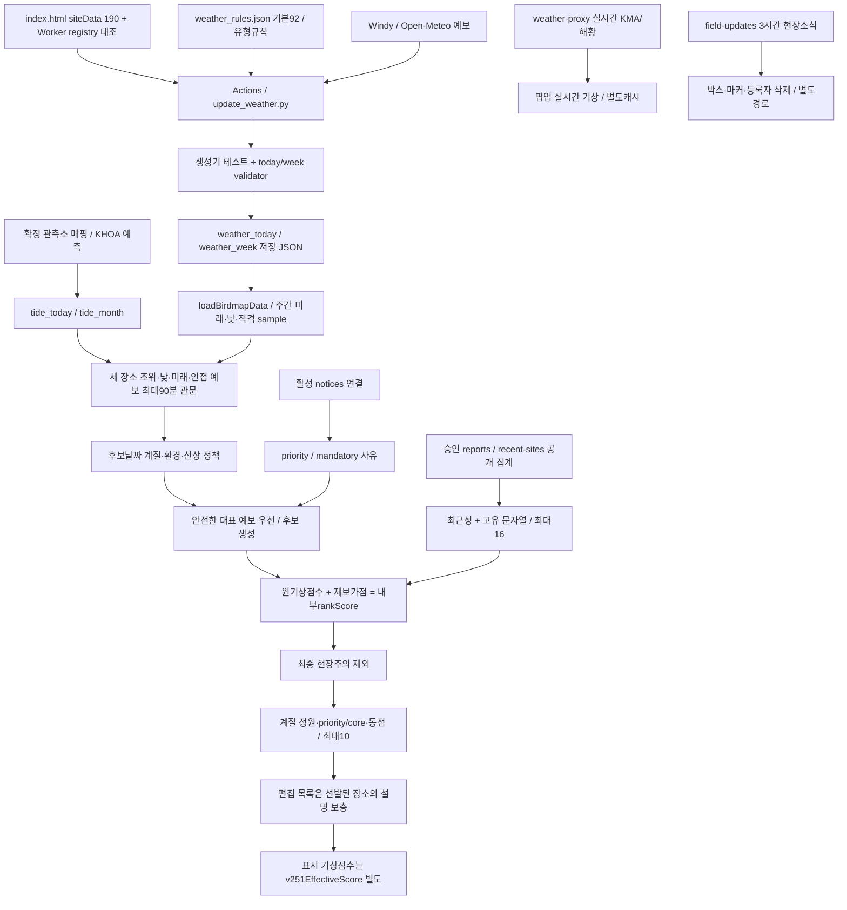

# 확인 사실과 근거

## 기준과 자료 시각

분석 코드와 저장 JSON은 `1f0b0b5ca9d3ef887fc0bd2a159ef73429466a25`의 Git object로 고정했다. P0 최종 `e0fc103`은 PR #12 merge `eb36d1e`를 통해 main에 반영됐다. [이전 P0 검증](https://github.com/wooil1964/birdmap/issues/9#issuecomment-6056552946)과 이번 실행 결과는 별도 증거다.

재개 후 확인한 main은 `35141c04d4fd152982b1f4683d5b7a6f4f7514e5`다. weather_today/week만 변경됐고 추천 코드는 동일하다. 새 자료는21:04 생성/21:08 갱신, 모든190곳 복구, 주간10640 sample이다. 이번18:10 스냅샷에 혼합하지 않았다.

HANDOVER 상단의 P0 “main 미병합” 기록은 현재 Git 이력과 불일치한다. 역사 메모로 취급하며 운영 HANDOVER는 수정하지 않았다.

|자료|고정 범위|
|---|---|
|기상|기준 SHA,18:10 생성/18:19 갱신,10/08~10/14|
|월간조석|같은 SHA,08:02 생성,10/08~11/07,예측자료|
|공개 승인 집계|GET19:32:04,11곳,14일창|
|평가시계|2026-10-08T19:30:00+09:00|
|결과|원문 함수 추출 재생, 실제 당시 브라우저 관측은 아님|

별도 취득 공개 집계와 고정 시계를 결합한 통제 재생이다. SHA 시점 DB 상태를 복원한 것이 아니다. 과거 P0의 ffd6506/10:12/옛 fixture와 이번 자료를 구분한다.

[manifest](_snapshots/input_manifest.json)는 입력16개의 Git blob/SHA256과 공개 GET 취득 정보를 기록한다. 보고 스냅샷 해시는 `af77014b5430d7b15d42dd77de8e4ec2a841e48b5151298a7013e3875c4757b6`, runtime 정규 JSON 해시는 `fd50e35a1f1ad828f425918e28bb1632c9acb2e9206806263cd64d18a8513fd8`이다. 민감 원좌표·제보자·메모를 수집하거나 추가 저장하지 않았다.

## 실제 데이터 흐름

|경로|실제 코드와 역할|
|---|---|
|기상 생성|[score_weather](https://github.com/wooil1964/birdmap/blob/1f0b0b5ca9d3ef887fc0bd2a159ef73429466a25/.github/scripts/update_weather.py#L361) → build_site_result/build_week_days → write_week_output. Windy/Open-Meteo 예보와 유형 규칙을 사용한다. 조류 존재를 학습한 모델은 아니다.|
|자동 갱신|[update-weather](https://github.com/wooil1964/birdmap/blob/1f0b0b5ca9d3ef887fc0bd2a159ef73429466a25/.github/workflows/update-weather.yml)는 테스트·validator 뒤 JSON을 commit한다. 제목은fourtimesdaily지만 cron은KST00:20/05:35/10:17/14:17/18:17의5개다.|
|저장 자료 로딩|[loadBirdmapData](https://github.com/wooil1964/birdmap/blob/1f0b0b5ca9d3ef887fc0bd2a159ef73429466a25/index.html#L4437)는10분 간격·탭 복귀 재검증, 실패시 마지막 정상 자료 유지. 주간 추천은 저장 JSON을 소비한다.|
|실시간 기상|fetchLiveWeatherForSite(2559)는 /weather?siteId 요청과15분 메모리 캐시를 사용한다. 저장 추천의rank를 갱신하지 않는다.|
|계절·대표시간|[weeklyDatePolicy](https://github.com/wooil1964/birdmap/blob/1f0b0b5ca9d3ef887fc0bd2a159ef73429466a25/index.html#L4002)는 후보 날짜의 계절·환경·선상을 평가한다. weeklySeasonalBestWeatherDay는 안전 예보를 먼저 찾는다.|
|조석|[weeklyQualifyingHighTides](https://github.com/wooil1964/birdmap/blob/1f0b0b5ca9d3ef887fc0bd2a159ef73429466a25/index.html#L3813) → weeklyTideWeather → weeklyUsableHighTides → weeklyBestMudflatTide. 월간자료는 만·간조 event이며 연속조위·노출면적·조류속은 없다.|
|공지|[weeklyIssueReason](https://github.com/wooil1964/birdmap/blob/1f0b0b5ca9d3ef887fc0bd2a159ef73429466a25/index.html#L3963)의 활성 연결공지는priority1,조석2,동풍3,일반4. 편집 목록은 자동 선발된 장소의 사유만 보충한다.|
|승인 제보|[handleRecentSites](https://github.com/wooil1964/birdmap/blob/1f0b0b5ca9d3ef887fc0bd2a159ef73429466a25/reports-api/src/public.js#L367)는 승인·site_id·관찰일창·보호 조건 뒤 siteId/latestDate/species만 제공한다.|
|현장소식|[handleList](https://github.com/wooil1964/birdmap/blob/1f0b0b5ca9d3ef887fc0bd2a159ef73429466a25/reports-api/src/field-updates.js#L197)의3시간TTL, 화면60초 갱신, 서버 소유권 확인 후 삭제. 추천 가점과 별도 경로다.|

최근집계의 latestDate는 최신 한 행의 날짜이고 species는 기간 전체의 합집합이다. 각 종이 최신일에 관찰됐다는 뜻은 아니다. 독립 관찰자·종별 날짜·관측 노력량을 이 API에서 복원할 수 없다.

canonical 스키마에 노력량 필드가 있지만 [checklistFromReport](https://github.com/wooil1964/birdmap/blob/1f0b0b5ca9d3ef887fc0bd2a159ef73429466a25/reports-api/src/canonical/data.js#L51)는 legacy/quick의 시간·거리·관찰자·완전목록을null로 매핑한다. 운영 DB의 실제 채움률은 조회하지 않았다. 필드 존재를 추천 입력 확보로 간주하지 않는다.

현장소식 확인 건수의 브라우저 capability도 독립 인간 관찰자 수를 뜻하지 않는다. 기존 제보 등록 좌표와 길안내 GPS 기능이 있으므로, P3의 “불필요한 GPS 서버 저장 금지”를 앱 전체의 위치 저장 부재로 확대하지 않는다.

## 유지할 안전·보호 계약

- 유부도710cm, 매향리·걸매리850cm 기준을 임의 변경하지 않는다.
- 만조 인접 유효 예보는 metadata와 무관하게 최대90분이다. 기상 미확인 만조는 탈락하며 다른 안전 만조를 검사한 뒤 조위·날짜 우선순위를 적용한다.
- 현장주의는 강수≥1mm 또는 파고≥2m. 선상은 필수값이 유한한 숫자이고 풍속≤6m/s·파고≤0.7m·강수0이어야 한다. 선상은safetyRaw 원자료를 우선한다.
- 일반weekly 값도 저장 단계에 반올림됐다. 상류 정밀도를 역복원할 수 없다.
- 최종선발은 안전판정false를 제외한다. 모든 일반결측null을 제외하는 전역 정책은 아니다. 이번175후보는 모두true였지만 현장 전체 안전을 보증하지 않는다.
- 위치가림·둥지·번식·보호종 보고행은 recentAPI에서 제외된다. 보호 목록과 종명 처리 변경에는 위치 보호 계약 검증이 선행해야 한다.
- 공지·제보·mandatory·편집 목록은 만조·선상·최종 위험 관문을 우회해서는 안 된다.

## 확인한 문제와 후속 조사

|우선 과제|확인 사실|의미와 남은 검증|
|---|---|---|
|P1-A|후보175중150이92, 유효 장소별 최고는92×150/100×39|대표값의 구분력이 제한된다. 분산 증가만으로 개선을 주장하지 않는다.|
|P1-B|동점 비교에stableOrder/core/id가 남음|P1-B 후속 실험에서 구성 변동 ON99.8%/OFF100% 확인. 아래 최신 결과 참고.|
|P1-C|독립 관찰자·노력량·종별 날짜 없음|제보를 개체수나 출현 확률로 해석할 수 없음.|
|P1-C|평화의공원12문자열에동박새/동박새2,울새/울새1 혼재|고유 문자열 수와 확인된 분류종 수가 다를 수 있음. 정규화 영향 조사 필요.|
|P1-A|후보59/99/133의 원점수100/100/92와 표시75가 다름|설명과 내부 순위의 일관성 검토. 이번top10 밖.|
|P4 자료품질|18:10자료는 고정19:30에 팝업reference190/표시적격0|실제 신선도 조건. 실행 원인과 갱신 계약은 별도 조사. 최신21:04자료와 구분.|
|P1-B/D|runtime190에sido중국인132/133도 포함|지역통계에서 등록190과 국내188을 분리. 운영 제외정책 미승인.|
|설명 품질|편집 사유 목록의 날짜 소비는 활성공지와 다름|설명 유효기간 감사 필요.|
|문서|HANDOVER의 과거 미병합 표기|현재 코드 사실과 과거 메모 구분.|

위는 코드·자료로 확인한 동작이다. 새 모델 효과, 특정 종 출현, 문헌상 근거 수준은 아직 검증하지 않았다.

## P1-B 후속 검증 완료

기존 P1-A 스냅샷을 보존하고 최신 main35141c0의21:04기상을 별도 고정했다. 같은22:40시계·조석·공지·190곳·기존 승인제보11곳에서 코드 변경 없이 후보175→176, 후보92점150→151로 바뀌었다. 두제보시나리오의 원래 배열top10은 유지됐고 굴업도 추천 날짜 등 핵심필드4곳만 달라졌다. [기상 비교](_results/weather_comparison_p1b_2240.json).

|새로 검증한 사실|의미와 한계|
|---|---|
|실제 추천 호출1000회×ON/OFF에서 목록변경99.8%/100%, 평균교체1.795/3.863|배열만으로 선발 경계가 달라지는 문제. 탐조 성과의 변동률은 아님|
|ON 선상7중1·other100점22중1, OFF 추가core5중3 동점경계|원점수92동점 전체가 배열효과를 만든다고 확대하지 않음|
|현재 배열은numericID 오름차순, 고유stableOrder가ID fallback보다 앞섬|A1은 배열 불변성을 확보하지만 기존낮은ID우선은 유지|
|ON/OFF 인천 평균슬롯0.307/2.415, 원래 배열1/5|특정동점군의지역구성과 초기배열영향. 후보비례공정성·조류분포와구분|
|모든원본/대안 선발축4/3/1/2, canonical mudflat 평균6.164/10|규칙군과실제 선발축의불일치. 대진항48은선상축이지만mudflat기상룰|
|세대안 모두배열 변동0, 원래 배열대비교체ON0/2/1·OFF0/5/5|불변성과다양성효과는별개. A2 ON지역종류감소, A3 ON지역종류불변|
|shuffle표시75슬롯ON94/10000·OFF189/10000|약한 강수cap과내부rank의기존의미불일치. P0위험관문우회는아님|
|독립 계산과추천순서2000개/각190개선정 빈도전부일치|단일 고정 자료의재현성 증거, 연중성능증거 아님|
|주간126/API171재실행통과,43파일전후변경0|민감 보호/안전회귀유지. 운영통합/브라우저시험아님|

지역은원문 sido범주다. 복합표기8곳과중국2곳을분리해해석했다(등록국내188/전체190, 후보국내174/전체176). 원문env/habitatType/mainBirdGroup빈도도별도집계했다. dataConfidence/dataSource/lastReviewDate가비어있는190곳에임의신뢰도·생태점수를추가하지않았다.

[전체 결과와 대안](P1_DESIGN.md)의P1-B완료절에표·장소별빈도·명령·한계를기록했다. P1-C제보가점과P1-D정원분석은아직시작하지않았다. A1은재현성개선의우선 도입 검토안이며제품 승인이아니다.
