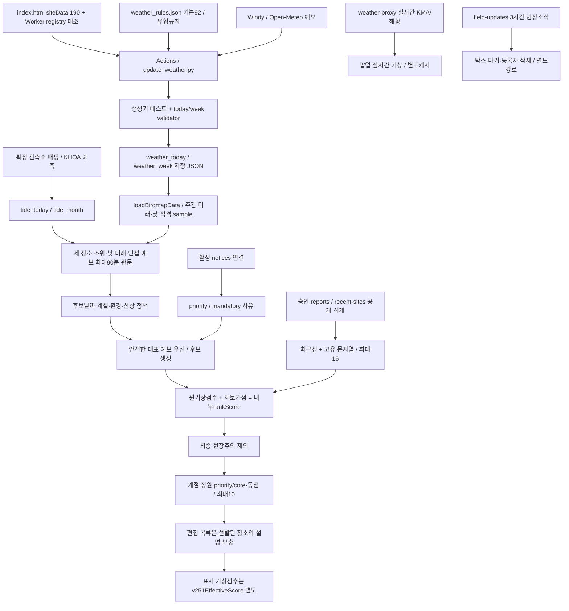

# 확인 사실과 근거

**최신 상태 (2026-10-09): P1-C/D 분석·독립 대조와 정책 우선순위 초안 완료. C7447c38 → Dfae50b2 별도 push, Issue #9 기록·조회 확인 완료. 아래 이전 단계 표는 완료 이력이며 최종 상태·후속 작업은 문서 끝과 NEXT_SESSION을 따른다. 운영 구현·최적 배점·연중성과·P2~P4는 미완료다.**

## 기준과 자료 시각

분석 코드와 저장 JSON은 `1f0b0b5ca9d3ef887fc0bd2a159ef73429466a25`의 Git object로 고정했다. P0 최종 `e0fc103`은 PR #12 merge `eb36d1e`를 통해 main에 반영됐다. [이전 P0 검증](https://github.com/wooil1964/birdmap/issues/9#issuecomment-6056552946)과 이번 실행 결과는 별도 증거다.

재개 후 확인한 main은 `35141c04d4fd152982b1f4683d5b7a6f4f7514e5`다. weather_today/week만 변경됐고 추천 코드는 동일하다. 새 자료는21:04 생성/21:08 갱신, 모든190곳 복구, 주간10640 sample이다. 이번18:10 스냅샷에 혼합하지 않았다.

HANDOVER 상단의 P0 “main 미병합” 기록은 현재 Git 이력과 불일치한다. 역사 메모로 취급하며 운영 HANDOVER는 수정하지 않았다.

|자료|고정 범위|
|---|---|
|기상|기준 SHA,18:10 생성/18:19 갱신,10/08~10/14|
|월간조석|같은 SHA,08:02 생성,10/08~11/07,예측자료|
|공개 승인 집계|GET19:32:04,11곳,14일창|
|평가시계|2026-10-08T19:30:00+09:00|
|결과|원문 함수 추출 재생, 실제 당시 브라우저 관측은 아님|

별도 취득 공개 집계와 고정 시계를 결합한 통제 재생이다. SHA 시점 DB 상태를 복원한 것이 아니다. 과거 P0의 ffd6506/10:12/옛 fixture와 이번 자료를 구분한다.

[manifest](_snapshots/input_manifest.json)는 입력16개의 Git blob/SHA256과 공개 GET 취득 정보를 기록한다. 보고 스냅샷 해시는 `af77014b5430d7b15d42dd77de8e4ec2a841e48b5151298a7013e3875c4757b6`, runtime 정규 JSON 해시는 `fd50e35a1f1ad828f425918e28bb1632c9acb2e9206806263cd64d18a8513fd8`이다. 민감 원좌표·제보자·메모를 수집하거나 추가 저장하지 않았다.

## 실제 데이터 흐름

|경로|실제 코드와 역할|
|---|---|
|기상 생성|[score_weather](https://github.com/wooil1964/birdmap/blob/1f0b0b5ca9d3ef887fc0bd2a159ef73429466a25/.github/scripts/update_weather.py#L361) → build_site_result/build_week_days → write_week_output. Windy/Open-Meteo 예보와 유형 규칙을 사용한다. 조류 존재를 학습한 모델은 아니다.|
|자동 갱신|[update-weather](https://github.com/wooil1964/birdmap/blob/1f0b0b5ca9d3ef887fc0bd2a159ef73429466a25/.github/workflows/update-weather.yml)는 테스트·validator 뒤 JSON을 commit한다. 제목은fourtimesdaily지만 cron은KST00:20/05:35/10:17/14:17/18:17의5개다.|
|저장 자료 로딩|[loadBirdmapData](https://github.com/wooil1964/birdmap/blob/1f0b0b5ca9d3ef887fc0bd2a159ef73429466a25/index.html#L4437)는10분 간격·탭 복귀 재검증, 실패시 마지막 정상 자료 유지. 주간 추천은 저장 JSON을 소비한다.|
|실시간 기상|fetchLiveWeatherForSite(2559)는 /weather?siteId 요청과15분 메모리 캐시를 사용한다. 저장 추천의rank를 갱신하지 않는다.|
|계절·대표시간|[weeklyDatePolicy](https://github.com/wooil1964/birdmap/blob/1f0b0b5ca9d3ef887fc0bd2a159ef73429466a25/index.html#L4002)는 후보 날짜의 계절·환경·선상을 평가한다. weeklySeasonalBestWeatherDay는 안전 예보를 먼저 찾는다.|
|조석|[weeklyQualifyingHighTides](https://github.com/wooil1964/birdmap/blob/1f0b0b5ca9d3ef887fc0bd2a159ef73429466a25/index.html#L3813) → weeklyTideWeather → weeklyUsableHighTides → weeklyBestMudflatTide. 월간자료는 만·간조 event이며 연속조위·노출면적·조류속은 없다.|
|공지|[weeklyIssueReason](https://github.com/wooil1964/birdmap/blob/1f0b0b5ca9d3ef887fc0bd2a159ef73429466a25/index.html#L3963)의 활성 연결공지는priority1,조석2,동풍3,일반4. 편집 목록은 자동 선발된 장소의 사유만 보충한다.|
|승인 제보|[handleRecentSites](https://github.com/wooil1964/birdmap/blob/1f0b0b5ca9d3ef887fc0bd2a159ef73429466a25/reports-api/src/public.js#L367)는 승인·site_id·관찰일창·보호 조건 뒤 siteId/latestDate/species만 제공한다.|
|현장소식|[handleList](https://github.com/wooil1964/birdmap/blob/1f0b0b5ca9d3ef887fc0bd2a159ef73429466a25/reports-api/src/field-updates.js#L197)의3시간TTL, 화면60초 갱신, 서버 소유권 확인 후 삭제. 추천 가점과 별도 경로다.|

최근집계의 latestDate는 최신 한 행의 날짜이고 species는 기간 전체의 합집합이다. 각 종이 최신일에 관찰됐다는 뜻은 아니다. 독립 관찰자·종별 날짜·관측 노력량을 이 API에서 복원할 수 없다.

canonical 스키마에 노력량 필드가 있지만 [checklistFromReport](https://github.com/wooil1964/birdmap/blob/1f0b0b5ca9d3ef887fc0bd2a159ef73429466a25/reports-api/src/canonical/data.js#L51)는 legacy/quick의 시간·거리·관찰자·완전목록을null로 매핑한다. 운영 DB의 실제 채움률은 조회하지 않았다. 필드 존재를 추천 입력 확보로 간주하지 않는다.

현장소식 확인 건수의 브라우저 capability도 독립 인간 관찰자 수를 뜻하지 않는다. 기존 제보 등록 좌표와 길안내 GPS 기능이 있으므로, P3의 “불필요한 GPS 서버 저장 금지”를 앱 전체의 위치 저장 부재로 확대하지 않는다.

## 유지할 안전·보호 계약

- 유부도710cm, 매향리·걸매리850cm 기준을 임의 변경하지 않는다.
- 만조 인접 유효 예보는 metadata와 무관하게 최대90분이다. 기상 미확인 만조는 탈락하며 다른 안전 만조를 검사한 뒤 조위·날짜 우선순위를 적용한다.
- 현장주의는 강수≥1mm 또는 파고≥2m. 선상은 필수값이 유한한 숫자이고 풍속≤6m/s·파고≤0.7m·강수0이어야 한다. 선상은safetyRaw 원자료를 우선한다.
- 일반weekly 값도 저장 단계에 반올림됐다. 상류 정밀도를 역복원할 수 없다.
- 최종선발은 안전판정false를 제외한다. 모든 일반결측null을 제외하는 전역 정책은 아니다. 이번175후보는 모두true였지만 현장 전체 안전을 보증하지 않는다.
- 위치가림·둥지·번식·보호종 보고행은 recentAPI에서 제외된다. 보호 목록과 종명 처리 변경에는 위치 보호 계약 검증이 선행해야 한다.
- 공지·제보·mandatory·편집 목록은 만조·선상·최종 위험 관문을 우회해서는 안 된다.

## 확인한 문제와 후속 조사

|우선 과제|확인 사실|의미와 남은 검증|
|---|---|---|
|P1-A|후보175중150이92, 유효 장소별 최고는92×150/100×39|대표값의 구분력이 제한된다. 분산 증가만으로 개선을 주장하지 않는다.|
|P1-B|동점 비교에stableOrder/core/id가 남음|P1-B 후속 실험에서 구성 변동 ON99.8%/OFF100% 확인. 아래 최신 결과 참고.|
|P1-C|독립 관찰자·노력량·종별 날짜 없음|제보를 개체수나 출현 확률로 해석할 수 없음.|
|P1-C|평화의공원12문자열에동박새/동박새2,울새/울새1 혼재|고유 문자열 수와 확인된 분류종 수가 다를 수 있음. 정규화 영향 조사 필요.|
|P1-A|후보59/99/133의 원점수100/100/92와 표시75가 다름|설명과 내부 순위의 일관성 검토. 이번top10 밖.|
|P4 자료품질|18:10자료는 고정19:30에 팝업reference190/표시적격0|실제 신선도 조건. 실행 원인과 갱신 계약은 별도 조사. 최신21:04자료와 구분.|
|P1-B/D|runtime190에sido중국인132/133도 포함|지역통계에서 등록190과 국내188을 분리. 운영 제외정책 미승인.|
|설명 품질|편집 사유 목록의 날짜 소비는 활성공지와 다름|설명 유효기간 감사 필요.|
|문서|HANDOVER의 과거 미병합 표기|현재 코드 사실과 과거 메모 구분.|

위는 코드·자료로 확인한 동작이다. 새 모델 효과, 특정 종 출현, 문헌상 근거 수준은 아직 검증하지 않았다.

## P1-B 후속 검증 완료

기존 P1-A 스냅샷을 보존하고 최신 main35141c0의21:04기상을 별도 고정했다. 같은22:40시계·조석·공지·190곳·기존 승인제보11곳에서 코드 변경 없이 후보175→176, 후보92점150→151로 바뀌었다. 두제보시나리오의 원래 배열top10은 유지됐고 굴업도 추천 날짜 등 핵심필드4곳만 달라졌다. [기상 비교](_results/weather_comparison_p1b_2240.json).

|새로 검증한 사실|의미와 한계|
|---|---|
|실제 추천 호출1000회×ON/OFF에서 목록변경99.8%/100%, 평균교체1.795/3.863|배열만으로 선발 경계가 달라지는 문제. 탐조 성과의 변동률은 아님|
|ON 선상7중1·other100점22중1, OFF 추가core5중3 동점경계|원점수92동점 전체가 배열효과를 만든다고 확대하지 않음|
|현재 배열은numericID 오름차순, 고유stableOrder가ID fallback보다 앞섬|A1은 배열 불변성을 확보하지만 기존낮은ID우선은 유지|
|ON/OFF 인천 평균슬롯0.307/2.415, 원래 배열1/5|특정동점군의지역구성과 초기배열영향. 후보비례공정성·조류분포와구분|
|모든원본/대안 선발축4/3/1/2, canonical mudflat 평균6.164/10|규칙군과실제 선발축의불일치. 대진항48은선상축이지만mudflat기상룰|
|세대안 모두배열 변동0, 원래 배열대비교체ON0/2/1·OFF0/5/5|불변성과다양성효과는별개. A2 ON지역종류감소, A3 ON지역종류불변|
|shuffle표시75슬롯ON94/10000·OFF189/10000|약한 강수cap과내부rank의기존의미불일치. P0위험관문우회는아님|
|독립 계산과추천순서2000개/각190개선정 빈도전부일치|단일 고정 자료의재현성 증거, 연중성능증거 아님|
|주간126/API171재실행통과,43파일전후변경0|민감 보호/안전회귀유지. 운영통합/브라우저시험아님|

지역은원문 sido범주다. 복합표기8곳과중국2곳을분리해해석했다(등록국내188/전체190, 후보국내174/전체176). 원문env/habitatType/mainBirdGroup빈도도별도집계했다. dataConfidence/dataSource/lastReviewDate가비어있는190곳에임의신뢰도·생태점수를추가하지않았다.

[전체 결과와 대안](P1_DESIGN.md)의P1-B완료절에표·장소별빈도·명령·한계를기록했다. P1-C제보가점과P1-D정원분석은아직시작하지않았다. A1은재현성개선의우선 도입 검토안이며제품 승인이아니다.

## P1-C 완료 — 최근 제보 가점과 자료 계약

P1-C는 체크포인트 8bd44e3에서 재개해 7447c38102c1832a944d5cf4281ae6ebd3b485b0로 commit/push했다. 최신 main은 4fc14b3이며, 고정 기준 35141c0 이후 변경은 기상·조석 자동 자료 네 파일뿐이다. 실험에는 새 자료를 섞지 않았다. 평가시각은 2026-10-08 22:40 KST, 승인 제보 집계는 기존 19:32 취득 11곳이다.

### 현행 산식과 집계 계약

클라이언트 경로는 loadRecentSiteSightings → weeklyRecentReportBonus → rankScore / weeklyRecentTieBreak다. 최근성 가점은 장소 최신 관찰일의 경과일에 따라 0~1일 +12, 2~3일 +9, 4~7일 +5, 8~14일 +2다. 고유 문자열 2~3개는 +2, 4개 이상은 +4이며, 합계 상한은 16이다. 표시 기상점수는 바뀌지 않는다.

API는 승인·장소 연결·공개 위치 조건과 기존 민감종 판정을 통과한 행에서 장소별 최신 날짜와 종명 문자열 합집합을 만든다. days=14는 양끝 포함으로 age 0~14의 15개 달력 날짜를 포함한다. 같은 문자열을 반복 제보해도 다양성 수는 늘지 않는다. API 실패 시 직전 집계를 유지하고, 최초 실패 시 제보 가점 없이 동작한다.

현재 집계에는 종별 관찰일, 독립 관찰자 식별·수, 노력량(시간·거리), 완전목록, 행별 종 소속이 없다. 장소의 최신일을 전체 합집합에 적용한 점수를 종별 최근성이나 출현 확률로 해석할 수 없다.

### 동일 입력의 12정책 비교

A1 영구 ID 동점을 대조군으로 사용했다. 모든 정책에서 후보 176곳과 190곳의 물리 후보 서명이 유지됐다. 아래 마지막 열은 현행 stableOrder의 배열 구성 변동이다. A1은 별도 독립 구현으로 12정책×1,000순열에서 구성·순서 변동 0을 확인했다. 현행 선발 12,000목록 해시와 12×190행도 독립 계산과 일치했다.

|정책|전체 후보 가점 합|A1 상위10 ID 순서|cap16 대비 교체|현행 배열 구성 변동|
|---|---:|---|---:|---:|
|제보 OFF|0|112,7,8,10,126,14,107,48,3,5|4|100%|
|cap0|0|112,108,15,194,126,14,107,48,3,5|1|99.9%|
|cap2|22|112,108,15,194,126,14,107,48,3,5|1|99.9%|
|cap4|30|112,108,15,194,126,14,107,48,3,5|1|99.9%|
|cap8|42|108,112,15,194,126,14,107,48,195,3|0|99.8%|
|cap12|49|108,112,15,194,126,14,107,48,195,3|0|99.8%|
|cap16|53|108,112,15,194,126,14,107,48,195,3|0|99.8%|
|cap24|53|108,112,15,194,126,14,107,48,195,3|0|99.8%|
|방문일 cap16|47|112,108,15,194,126,14,107,48,195,3|0|99.8%|
|최신 장소일 age≤7|39|108,112,7,8,126,14,107,48,195,3|2|100%|
|최근성만 가점|45|108,112,15,194,126,14,107,48,195,3|0|99.8%|
|cap0+제보 tie 제거|0|112,7,8,10,126,14,107,48,3,5|4|100%|

상한 8·12·16은 목록이 같아도 점수는 다르다. 상한 24는 현행 미제한 합계 자체가 최대 16이어서 효과가 없다. 이 결과는 8이 생태적으로 최적이라는 근거가 아니다.

cap0에서도 최근성·문자열 수 동점 우선순위가 남아 제보 OFF와 세 곳이 다르다. tie까지 제거해야 OFF와 같아진다. 방문일 기준에서는 호곡리108의 age가 3→4, 가점이 11→7, rank가 103→99로 바뀌어 알뜨르112와 순서만 교체된다. 강화도10은 age 14→15로 가점이 사라진다. 종별 잔류나 방문일 출현을 추정하지 않았다.

age≤7은 장소의 최신일 조건으로 전체 집계를 유지·제외하는 대조다. 실제 days=7 API에서 종 합집합을 다시 만든 실험은 아니다. 최근성만 가점으로 쓰는 대조에도 종수 tie는 남는다.

### 실제 스냅샷과 합성 계약 검증

평화의공원195의 12문자열에는 동박새/동박새2, 울새/울새1이 함께 있다. 수량 접미사를 제거하는 진단상 10개로 줄지만 확정된 분류종 10종이라고 할 수 없다. 두 경우 모두 4개 이상 구간이므로 이번 가점은 +16 그대로다.

실제 GET handler와 메모리 SQLite를 사용한 합성 대조에서 같은 울새 5행은 문자열 1개/+12로 유지됐다. 14일 전 4문자열은 +6인데 오늘 울새 한 행을 더하면 같은 합집합에 오늘 latestDate가 붙어 +16이 됐다. 옛 종이 오늘 다시 관찰됐다는 증거는 아니다. 실제 days=1 재집계는 문자열 1개/+12였다. 수량 표현 변형으로 문자열 수가 가점 문턱을 넘는 사례도 확인했다.

### 기존 보호·유효점수 계약 결함

보호종 판정은 exact 문자열 비교다. 합성 승인·연결·공개 위치·오늘 행의 저어새1, 저어새 1, 흰꼬리수리1, 매1이 recent-sites에 남았다. 정확한 보호종, 혼합 보호종, 둥지 메모, hidden, pending, unlinked, 기간 밖 대조는 차단됐다. 레거시 구분자와 줄바꿈을 처리한 표현에서도 한계가 확인됐다.

또 weekly sample의 score:null / scoreEligible:true를 유효한 만조·시각·안전 기상과 결합하면 Number(null)→0으로 후보와 최종 선발에 남았다. C의 12정책 모두 같았고 today fallback의 null은 차단됐다. 고정 10,640 sample에서는 모순된 적격 점수가 0건이며, Python validator는 합성 null 입력을 거절했다.

**둘 다 기존 입력 방어 결함이다. 새로운 가점 정책의 회귀나 확인된 운영 유출로 주장하지 않는다.** 보호 사례의 재현 성공과 null 계약 실패는 안전 승인과 구분해 별도 JSON에 보존했다. 실제 D1·공개 API 조회나 변경은 하지 않았다.

보완 설계는 공개·가점 처리 이전의 보호 판정, 원문/정규 종명/수량 분리, 허용 구분자·보호 토큰·모호 입력 처리 계약, 프런트의 엄격한 number/finite/eligible 확인이다. 숫자를 무조건 지워 종을 확정하거나 원문을 덮어쓰지 않는다. 구현에는 별도 승인이 필요하다.

### 실행 증거와 범위

주간 126/126, API 동작 170/170, 별도 JS 자동발견 227/227 통과. 겹치는 시험이므로 합산하지 않는다. 이전 B의 171은 helper 1개를 포함한다. 옛 NEXT_SESSION의 local-test/*.test.mjs 명령은 실제 파일이 없어 reports-api/test/*.test.mjs로 바로잡았다.

정상 안전 경계 66종은 독립 runtime 858/858, C runtime 792/792 통과했다. 90/91/120분·metadata·대체 만조·fallback·강수 1mm·선상 제한과 공지/mandatory/가점 우회를 포함한다. 별도 보호 GET 14사례, 집계 7사례, null 계약 실패 12정책을 기록했다. Python 기상48/조석21+1skip은 이전 검증 이력이며 이번 실행값이 아니다.

후보의 gate true는 기존 판정 통과를 뜻하며 현장 전체 안전 보증은 아니다. 브라우저 통합·연중 생태성과는 이번에 검증하지 않았다.

재현과 원문: [_scripts/analyze_p1c.mjs](_scripts/analyze_p1c.mjs), [_results/p1c_reports.json](_results/p1c_reports.json), [_results/p1c_independent.json](_results/p1c_independent.json), [_results/p1c_recent_species_contract.json](_results/p1c_recent_species_contract.json), [_results/p1c_aggregation_contract.json](_results/p1c_aggregation_contract.json), [_results/p1c_negative_fixtures.json](_results/p1c_negative_fixtures.json), [_results/p1c_null_score_contract.json](_results/p1c_null_score_contract.json).

## P1-D 완료 — 정원·점수·다양성 비교

C 완료 커밋을 push한 뒤 D를 시작했다. 코드35141c0, 10월8일22:40 평가시계와 모든 입력을 그대로 유지했다. 제보 ON/OFF에서 각각 실제 후보 176곳을 만들고 A1 동점으로 배열 효과를 고정했다. 모든 후보는 autumn이며 raw92점 151곳, 100점 25곳이다.

### 정책 정의와 인과 대조

현행은 field4 → mudflat3 → pelagic1 → other2 순서로 각 축의 기존 prefix를 적용한다. 복합형도 ID당 한 자리이며, 부족하면 전체 후보를 기존 rank→priority→제보tie→조위→동점 순서로 채운다. 안전 후보가 부족하면 10개 미만, 선상이 없으면 0개도 허용한다. 선상 최대 1은 유지된다.

|정책|분석 계약|
|---|---|
|current_4312|기존 prefix·4/3/1/2·fill 유지, 동점만 A1|
|global_rank|전역 rank 내림→제보tie→추천일 오름→ID, 선상≤1|
|flex_1111|기존 축별 prefix로 최소1/1/1/1, 나머지 전역 보충|
|flex_2211|기존 축별 prefix로 최소2/2/1/1, 나머지 전역 보충|
|quota_only_2211|최소2/2/1/1만 바꾸고 기존 fill 유지|

global은 정원뿐 아니라 priority/core/축별 prefix도 바꾼다. 따라서 차이 전체를 정원만의 영향으로 해석하지 않는다. quota_only는 이 구분을 위한 통제다. 최소 정원 숫자는 정책 민감도 가설이며 생태적으로 검증된 최적 정원이 아니다.

후보 생성·P0·민감 보호·대표시각·공지·원점수·제보 가점은 고정했다. selector 자체에는 안전 필터가 없으므로 모든 대안은 todayRecommendedSites의 선행 필터를 통과한 동일 pool을 사용해야 한다.

### 결과

gap은 기존 내부 rank 합의 가능한 최대값과의 차이다. 탐조 성공률 손실을 뜻하지 않는다. 선상≤1 조건의 독립 상한은 육상 상위10 또는 육상 상위9+선상 최고 두 경우를 대조했다. ON1011/1003, OFF1000/992로 최대1011/1000이다.

|제보|정책|rank합|raw합|표시합|rank 상한 gap|지역범주|기상규칙군|지역HHI|현행 대비 교체|
|---|---|---:|---:|---:|---:|---:|---:|---:|---:|
|ON|current_4312|969|936|936|42|7|3|0.18|0|
|ON|global_rank|1011|984|984|0|4|3|0.42|7|
|ON|flex_1111|997|968|968|14|5|3|0.32|5|
|ON|flex_2211|989|960|960|22|7|3|0.22|3|
|ON|quota_only_2211|989|960|960|22|7|3|0.22|3|
|OFF|current_4312|944|944|944|56|6|2|0.30|0|
|OFF|global_rank|1000|1000|1000|0|4|1|0.52|8|
|OFF|flex_1111|984|984|984|16|5|2|0.40|5|
|OFF|flex_2211|968|968|968|32|6|2|0.30|3|
|OFF|quota_only_2211|968|968|968|32|6|2|0.30|3|

|제보|정책|상위10 ID 순서|주분류 field/mudflat/pelagic/other|
|---|---|---|---|
|ON|current_4312|108,112,15,194,126,14,107,48,195,3|4/3/1/2|
|ON|global_rank|195,108,3,5,6,9,35,110,111,114|1/1/0/8|
|ON|flex_1111|108,126,48,195,3,5,6,9,35,110|1/2/1/6|
|ON|flex_2211|108,112,126,14,48,195,3,5,6,9|2/3/1/4|
|ON|quota_only_2211|108,112,126,14,48,195,3,5,6,9|2/3/1/4|
|OFF|current_4312|112,7,8,10,126,14,107,48,3,5|4/3/1/2|
|OFF|global_rank|3,5,6,9,35,110,111,114,120,156|0/1/0/9|
|OFF|flex_1111|112,126,48,3,5,6,9,35,110,111|1/2/1/6|
|OFF|flex_2211|112,7,126,14,48,3,5,6,9,35|2/3/1/4|
|OFF|quota_only_2211|112,7,126,14,48,3,5,6,9,35|2/3/1/4|

전역은 ON7/OFF8곳을 교체하고 인천에 6/10·7/10을 배정한다. 인천 후보는16/176(9.09%)이며, 지역범주는 ON7→4/OFF6→4로 줄고 HHI는0.18→0.42/0.30→0.52로 집중이 커진다. 이는 수치적 편중 진단이며 최적 지역 대표성 기준을 정한 것은 아니다.

OFF 전역은 기상규칙 island_migrant가10/10이다. 밤섬35와 임진각156도 이 규칙을 쓰므로 **실제 도서10곳이나 실제 서식환경1종을 뜻하지 않는다.** 등록 env/habitatType/mainBirdGroup도 따로 대조했다.

flex_2211은 현행보다 ON/OFF3곳을 교체하고 rank 합이 +20/+24다. 지역범주7/6은 같지만 ON 인천1→4, HHI0.18→0.22로 집중은 커진다. 기상규칙군 수도 늘지 않는다. 유연 정원의 다양성 개선을 단정할 수 없다.

정원만 바꾼 대조는 ON에서15·194·107 대신5·6·9, OFF에서8·10·107 대신6·9·35를 뽑는다. 이 장소들은 모두 안전·계절 적격 후보다. quota_only와 flex_2211의 목록·순서는 이번 입력에서 같지만 일반적인 동등성을 보장하지 않는다.

### 후보 이전 제외와 선발 단계

190곳 중 후보 제외14는 가을 원격섬 이름 정책12(id1,2,4,101,102,103,104,105,106,117,118,119), 독도52의 가을 축/등록 pelagic 정책1, 유부도19의 조석710 관문1이다. 앞13곳을 기상 결측으로 분류하지 않았다. 유부도는 정원과 무관하게 후보 이전에 제외됐다.

각 정책은 적격176 중10선발·166미선발이며 후보 제외14는 같다. 미선발166을 모두 정원 탓이라고 하지 않는다. 점수·prefix·중복·동점·선상 제한이 함께 작용한다. 실제 단계·날짜별 정책 근거는 p1d_contract_audit.json에 있다.

축 회원수 field27/mudflat32/pelagic8/other114는 중첩5곳(7,8,10,20,185)을 포함해 합181이다. 주분류는 선상→field→mudflat→other 우선으로27/27/8/114=176이다. 선발 단계의 fill은 실제 유형이 아니다. 현재 mudflat 단계 가용은 ON32/OFF29로 앞 field 중첩 선발에 따라 달라진다.

지역은 원문 sido23범주, 복합지역8곳/6표기, 국내188+중국2(후보174+2)다. 모든 정책에서 중국 선발은0이다. 추천 축·기상규칙·등록 환경·관찰종군·행정지역 대표성은 서로 다른 분류다.

### 독립 검증

5정책×ON/OFF의10목록에서 raw/display/rank/bonus/날짜/시각/선발축/주분류/지역/규칙, 환경별 합·HHI와1900후보 행이 독립 원문 추출·tuple 선발과 모두 일치했다. 후보 배열 자체를 바꾼10,000순열에서도 목록이 불변이었다. 각 정책·조건3회 전체190곳 원문 파이프라인도 대조했다.

원문 선발 계약 합성10사례(4/3/1/2, 부족 보충, 선상0/최대1, 중복ID, 복합축, mandatory, 혼합계절)가 통과했다. 원문은 다른 계절 후보를 기본 quota에서 빼지만 부족 fill에는 포함할 수 있다. 이번176곳은 모두autumn이라 이 효과는 합성 대조에서만 검증했다.

선택100슬롯의 기존 안전 판정, 선상 원문 안전 함수, 만조≤90분을 확인했다. C 회귀126/API170/broadJS227은 그대로 보존하고 합산하지 않는다. D에서는 운영 소스를 바꾸지 않아 같은 회귀를 반복하지 않고 정책·분류·계약 대조를 추가했다. 입력·좌표·운영 소스는 변경하지 않았다.

이 안정성은 동일 입력의 배열 안정성이다. 일별·계절별 안정성이나 실제 탐조 성공률을 검증한 결과가 아니다. C에서 발견한 보호 표현·null 점수 계약은 미해결 보완 설계로 남는다.

### P1 전체 우선순위

|우선|정책|설계 판단|예상 효과·한계|
|---|---|---|---|
|1|보호 입력·유효점수 계약|우선 보완, 구현 승인 필요|표현 변형과 null→0 반례 차단. 운영 발생률 미측정|
|2|안전·기상·제보·정원 근거 설명|우선 설계|표시92/rank108 및 카드 순서를 설명 가능하게 함|
|3|A1 영구ID 동점|우선 도입 검토, 미적용|배열 변동0, 현재 목록 유지. 낮은ID 편향은 남음|
|4|종명·수량·종별 관찰일 구조화|자료 계약 설계|최신 장소일과 옛 종 합집합의 혼합 구분. 원문 보존|
|5|max16·4/3/1/2|즉시 수치 변경 보류|이번 자료로 생태적 최적값을 증명할 수 없음|
|6|flex_2211·A3 동점 분산|추가 검증 대조안|목적·분류·다양성 기준 합의와 다중 시점 평가 필요|
|7|서식환경·계절·종별·노력 보정|P2 후속 조사|장기자료 없음. 새 출현확률·성공률 생성하지 않음|

전역 rank를 전국 기본 추천에 바로 적용할 근거는 없다. 현행 정원은 탐조 목적 범위를 유지하는 효과가 있다. 유형별 점수 척도의 장기 예측력이 검증되지 않았으므로 숫자 합의 gap 감소만으로 우월성을 주장하지 않는다. 무작위 추천은 기본 개선안으로 채택하지 않았다.

P1-A/B/C/D 정량 분석·동일 입력 정책 비교·우선순위 초안은 완료했다. 연중 정확도·생태 최적 배점/정원·제품 정책 확정·공개화면/운영 구현은 미검증이다. P2~P4는 미완료이며 구현·배포 승인은 없다.

재현: [_scripts/analyze_p1d.mjs](_scripts/analyze_p1d.mjs), [_results/p1d_quotas.json](_results/p1d_quotas.json), [_results/p1d_independent.json](_results/p1d_independent.json), [_results/p1d_contract_audit.json](_results/p1d_contract_audit.json).

## P1-S1 — 2026-10-09 보호 계약 감사

현재19종 exact/six keyword의 수량·줄바꿈 gap을 합성48입력/92읽기 조건으로 재현했다. 승인 후 공개와 canonical 비번식 확인은 기존 명시 정책이며 전체 read 비공개는 정책 전환으로 분리했다. hidden 자식→일반/fixed 부모 이력 연결도 합성재현. 실제 운영 유출 미확인. 독립70 fixture/정상17에서 표현보정 R 오탐0; 시험 정책P는 사전coverage11+알 의미오탐1을 보류하고 알 조사형2를 놓쳤으므로 운영채택 금지. 최신 설계는 P1_SAFETY_DESIGN.md. 기존126/API170/front57/기상48/조석21+1skip 현행 회귀통과. 운영코드·DB·배포 변경0.
