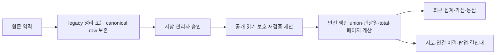

# P1-S 보호종·유효점수 계약 설계

상태: **분석·설계 및 인수 테스트 명세. 운영 구현·배포 승인 아님.**
작성일: 2026-10-09 KST. 시작 체크포인트 `bee1359`.
분석 브랜치 `analysis/recommendation-masterplan`.

## 1. 범위·증거와 결론

시작 때 확인한 원격 main은 `4fc14b3c7ba19ad4d5b91efa305a80b3d474dc57`, 최종 재확인은 `18171613923ae5cf0a72512eae805c0005037115`이다. 운영 소스와 탐조지 등록부는 P1-C/D 기준 `35141c0`과 같다. 최종 차이는 자동 기상·조석 JSON 다섯 파일이며 초기 네 파일에 tide_month.json 갱신이 추가됐다. 기존 고정 입력은 유지했다. 이번에는 P1-A~D를 다시 분석하지 않았다. 보호 감사의 10개 파일은 Git 원문 SHA와 checkout CRLF 차이를 구분해 내용 일치를 확인했다.

- **확인된 결함:** 19종 exact 보호 판정에 수량 접미사가 누락되고, LF/CRLF가 종 분리 전에 삭제된다. 최근 집계에 보호 표기 변형이 포함되는 동작을 합성 자료로 재현했다.
- **기존 정책:** 승인 이후 공개 API는 관리자 승인/공개 좌표를 신뢰한다. canonical 간편 제보는 명시적 비번식 확인을 기준으로 정확 위치 공개를 허용한다. 모든 보호종을 승인 후에도 비공개로 바꾸는 것은 별도 공개 정책 전환이다.
- **추가 위치 연결 위험:** 보호 또는 hidden 자식이 일반 부모·고정 지점의 종 목록/이력에 합쳐지면 그 지점과 연결된다. 자식의 독립 좌표만 가리는 방어로는 충분하지 않다.
- **점수 결함과 강화 계약:** JS 자료형 강제 변환과 경로마다 다른 적격 검사는 누락/모순 입력을 허용할 수 있다. 기상 없는 공지-only 후보 차단은 기존 동작을 제한하는 계약 강화로 구분한다. S2 상세는8~11절에 기록했다.

실험은 합성 입력, memory SQLite, 로컬 소스 및 읽기 전용 Git 자료만 이용했다. 실제 운영 API/제보·Worker 설정·D1을 조회하거나 변경하지 않았다. **실제 운영 유출이 있었다고 주장하지 않는다.** 합성 점수는 시험 자극이며 조류 출현 확률이나 새 생태 점수가 아니다.

## 2. S1 원인과 전체 경로



| 단계·함수 | 현재 동작 | 보완 계약·정책 여부 |
|---|---|---|
| shared.js normalizeSpecies / stripControl / splitSpecies | 숫자/공백을 허용; C0 제거 뒤 분리; slash 신규 거부; 저장 읽기는 ` · `만 분리 | LF/CRLF 먼저 토큰화는 방어 수정. slash 신규 허용은 입력 계약 확대. 저장값을 덮어쓰지 않음 |
| shared.js isSensitiveReport | 19종 exact와 둥지·번식·포란·육추·새끼·영소 substring | 기존 목록 표현 수정 S1-R. 알·산란/불확실 입력 처리 확대는 S1-P의 승인 항목 |
| public.js handleSubmit | legacy는 보호종 pending_public=0 | 새 파생 보호 판정 사용. 원문 영구보존은 별도 저장 계약 확인 |
| public.js handleCanonicalSubmit / canonical persistence | non_breeding_confirmed=true와 공개 설정, hide 요청으로 pending 좌표 결정 | 비번식 확인은 저장 적격과 분리. protected까지 read 차단은 현행 정책 변경 |
| admin-actions / canonical reviews | 승인·연결·hide/unhide와 감사 기록 | 승인 상태와 공개 가능 여부 분리. 관리자 인증·원자료·감사 유지 |
| handlePending / handleApproved / publicPayload | stored public 좌표/상태 신뢰, 읽기 때 보호 재검증 없음 | 재검증 후 공개 행만 직렬화. note는 판정용 SELECT만 하고 응답에 추가하지 않음 |
| handleSiteHistory / historyEntry / fixedSpots | siteId/종/관찰일/건수, 부모·고정 점 연결 | 보호·hidden 자식은 결합 전에 제외. 보호 부모를 이용한 위치 연결 금지. 공개 total/offset은 필터 후 계산 |
| handleRecentSites | 승인·날짜·위치가림 필터, 보호 exact 검사 뒤 site별 union | 보호/미해석 행 전체를 union/latestDate/count 전에 제외; 일반 동반종만 빼서 위치를 남기지 않음 |
| index.html loadRecentSiteSightings / weeklyRecentReportBonus / weeklyRecentTieBreak | literal 종 수와 site 최신일; 최대16, 가점0에도 동점 신호 가능 | 제외 행은 가점·동점·최근 라벨에 모두 기여하지 않음. 배점/산식 변경 없음 |
| field-updates protection / create / list / publicEntry | exact protected는 저장된 대략 좌표·hidden, 번식6단어 등록 거부; 읽기는 저장값 신뢰 | 표현 방어와 과거 row read 방어. 대략 좌표 계속 공개 여부 및 자유 메모 지명은 정책 승인 |
| marker / spotPopupHtml / fieldPublicPoint / navigation | hidden flag면 길안내 차단, flag=false는 안내 가능 | 서버 보호를 기본으로 프런트 방어. 보호 원좌표·연결 siteId가 응답 자체에 없어야 함 |
| receipt / replay / handleStatus / contributors | receipt spot 재사용; status·월간 집계는 별도 의미 | 재접수 응답도 동일 보호. status visibility와 실제 read 정책 일치. 위치 없는 월간 수량은 별도 정책 판단 |

선행 공개 정책은 `docs/long-term-db-phase2a/README.md:13`의 “종명·희귀도·보호등급·월로 번식 여부를 판정하지 않는다. 일반 비번식 승인 관찰은 실제 관찰좌표 공개 원칙을 유지한다.”이다. 승인 이후 보호 확대를 전부 단순 버그 수정으로 부르지 않는다.

canonical `raw_submissions`는 입력 species 원문을 보존하지만 legacy `reports.species`는 정리 후 문자열이다. 이미 사라진 구분자를 추측해 복원하지 않는다. D1 변경 없는 읽기 방어는 기존 자료 불변을 만족하지만, **모든 신규 legacy 원문의 영구 보존까지 보장하는 설계는 아니다.** 기존 canonical dual-write 저장 경로를 검증하거나 별도 append-only 저장 승인이 필요하다. taxa/sightings/reviews 테이블 존재는 확인했으며 운영 사전 충실도·설정은 미확인이다.

## 3. S1 재현·독립 대조

실제 GET handler + 실제 schema를 memory SQLite에 적용했다. 신규 등록 POST는 호출하지 않았고 현장소식 create 판정은 실제 pure protection 함수를 추출했다.

| 증거 | 수량·결과 | 한계 |
|---|---|---|
| 현재 공개 경로 재현 | 48입력: legacy literal48 + 정리 저장44 =92 관찰(신규 정리 거부4); 연결2/pending6/기존 현장소식3/status3 | 현재 결함을 재현하는 기대값도 통과에 포함; 운영 안전 합격 수치 아님 |
| 독립 종명 판정 | 70 합성 fixture; exact19/19 민감; 정상 반례17/17 현행 비민감 | 함수 분류 대조, API 노출 수치와 합산하지 않음 |
| S1-R 표현 방어 시제품 | 48개 중 explicit protected 표현14 판정; 일반7 오탐0 | 일반명 사전5종뿐. 운영 parser 완성품 아님 |
| 시제품 독립 오탐 대조 | 일반17의 R 오탐0; P 보류12 = 사전 누락11 + `알 수 없음` 의미 오탐1 | 정상 위치 보류와 protected 오탐을 구분 |
| 알 확장 반례 | `알을 품고 있음`, `알이 있음` 2건을 시제품이 놓침 | **시험용 알 정규식 채택 금지**. 문맥 정책·인수 조건 보완 필요 |
| 수량 경계 독립 대조 | 0/음수/100001은 review, 100000 report 허용; field 상한999 별도 | canonical 별도 birdCount=0 계약은 유지; 접미 수량과 행 전체 수량을 합산하지 않음 |

| 입력 | 현재 최근 집계 | 설계 기대 결과 |
|---|---|---|
| 저어새 | 제외 | 기존 보호 유지 |
| 저어새1 / 저어새 1 / 저어새 2마리 / 흰꼬리수리1 / 매1 | 포함 가능 | 검증된 base + 명확 수량으로 protected. 최근/동점 제외 |
| 쉼표·세미콜론·중점 혼합 | 정리 저장 뒤 정확 보호종 제외 | 토큰별 판정, 혼합 행 전체 제외 |
| LF/CRLF 혼합 | 저어새울새처럼 붙어 포함 | 분리 먼저. 과거 붙은 문자열은 unknown/review |
| slash 혼합 | 신규 거부, legacy 읽기는 포함 가능 | 읽기 보호 처리; 신규 허용은 별도 입력 계약 |
| 저어새 -1 / 1-3 / 1.5 / ? / 류 | exact 누락 또는 신규 거부 | 임의 숫자 삭제·추정 taxon 금지; 정확 위치 보류 |
| 참새(2) | 일반 처리 가능 | 괄호 문법 미승인 시 review. 허용안은 별도 경계 테스트 |
| 갈매기 / 알락오리·알락할미새 | 현행19/6 조건 밖 | 짧은 매/알 substring 오탐 금지 |
| 둥지·새끼·육추·포란·영소·번식 | 민감 | 기존 보호 완화 금지; 부정·인용 문장도 현행 보수 처리 유지 |
| 알·산란·띄어 쓴 번식 표현 | 일부 누락 | 정책 확대 후보. 아래 명세와 승인 후 적용 |

정확 저어새 approved 행과 숨긴 자식의 일반 부모/fixed 연결을 합성 재현했다. approved는 현재 관리자 공개 정책대로 좌표를 반환했고 site-history는 siteId·종·total을 반환했다. 자식 hidden이어도 부모 exact 마커의 종·이력에 합쳐졌다. 이것은 **코드상 공개/연결 경로 증거이며 실제 자료 유출 증거가 아니다.**

## 4. S1 권장 정규화·보호 계약

저장 정리, taxon 해석, 수량 유효성, 번식 여부, 공개 적격을 별도 결과로 반환한다. `speciesRaw`, `tokenRaw`, `canonicalName`, `taxonStatus`, `quantityStatus`, `sensitivity`, `publicationMode`, `policyVersion`, `catalogVersion`은 내부 판정 개념이며 공개 응답에 그대로 추가할 필요는 없다.

1. 원문은 불변으로 취급한다. 파생 NFC 정규화와 양끝 공백 정리만 기본 적용한다. 제로폭/방향 제어문자는 몰래 삭제 후 확정하지 않고 review한다.
2. LF/CRLF를 C0 제거 전에 허용 구분자로 분리한다. 쉼표·세미콜론·중점은 현행 호환; slash 허용은 버전 명세. 수량 경계 공백/NBSP 허용 범위를 명시한다.
3. **검증된 표준 국명 전체 일치가 먼저**다. 실패 때만 검증 base + 전체 접미 수량 문법을 해석한다. 숫자 일괄 삭제·substring 매·유사명 fuzzy 병합 금지.
4. 최소 수량 문법은 ASCII 정수, 선택적 공백/마리·개체 단위다. report1..100000, field1..999처럼 해당 경로 기존 제한을 적용한다. 0·음수·소수·지수·범위·상한 초과·약·물음표는 확정 수량이 아니다. 괄호·선행0 허용은 명시적으로 선택한다. 별도 canonical birdCount=0 저장 계약을 변경하지 않는다.
5. 정확 표준명이면서 현행19종이면 protected, 기존6번식 키워드면 breeding, 불완전 taxon/수량/문맥이면 review로 분리한다. unknown은 normal 확정이 아니다. “protected 종명이므로 실제 번식 중”이라고 추론하지 않는다.
6. 현행6번식 키워드를 유지한다. 알·산란은 신규 정책이다. 알락 종명, `알 수 없음`은 비번식 반례; `알 2개 확인`, `알을 품고 있음`, `알이 있음`은 보호 기대 사례로 명세한다. 조사 경계·인용·부정·띄어쓰기·자유 메모의 모호 문맥은 review가 필요하다. 이 사례들을 실패하는 현재 시험 정규식은 도입하지 않는다. 자동 판정으로 모든 한국어를 이해했다고 주장하지 않는다.
7. 보호/review 행은 S1-P 승인 시 exact 좌표뿐 아니라 siteId·spot_key·연결 rowID·종 이력·관찰일·건수·가점·동점·길안내 신호를 공개하지 않는다. 보호 행의 일반 동반종만 공개하는 우회도 금지한다.
8. 이미 알려진 190곳의 독립 탐조지 정보·기상·조석은 유지한다. 민감 제보 때문에 기존 장소 자체를 삭제하지 않는다. 해당 제보에서 유도되는 연결/점수 신호만 제거한다.

국명 근거: [국립생태원 저어새](https://www.nie.re.kr/nie/pgm/edSpecies/view.do?menuNo=200121&speciesSn=27), [흰꼬리수리](https://www.nie.re.kr/nie/pgm/edSpecies/view.do?menuNo=200121&speciesSn=34), [매](https://www.nie.re.kr/nie/pgm/edSpecies/view.do?menuNo=200121&speciesSn=25)를 직접 대조했다. [NIBR 2020년 연구 목록](https://www.nibr.go.kr/aiibook/access/ecatalogt.jsp?Dir=1007&callmode=admin&catimage=&eclang=ko&start=92&um=s)은 한국동박새/동박새를 별도 기재하므로 임의 병합 근거가 아니다. [NIBR 센서스](https://www.nibr.go.kr/aiibook/access/ecatalogt.jsp?Dir=1269&callmode=admin&catimage=&eclang=ko&start=56&um=s)의 별도 갈매기·알락 국명은 substring 오탐 반례를 뒷받침한다.

19종은 제품 정책 목록이며 법정 전체 보호종 목록이 아니다. 새매·검은머리갈매기의 정책 미포함을 법정 비보호로 해석하지 않는다. [NIBR 2026-02-09 발표](https://www.nibr.go.kr/cmn/board/SYSTEM_DEFAULT000004/67140bbsDetail.do)로 2025년 말 국가종목록 공개는 확인했지만 전체 조류 원자료·alias·ID·이용허락은 미확보다. 운영 도입 전 URL/목록 기준일/입수일/SHA/식별자/alias 근거·승인자/이용허락을 고정해야 한다. 시험 사전을 운영 사전으로 배포하지 않는다.

## 5. S1 공개 정책 선택과 대안 비교

**S1-R**은 현행19/6의 표현 방어다. **S1-P**는 모든 공개 경로에서 sensitive/review 행의 위치 연결을 보류하는 정책이다. 알·산란, unknown, approved/canonical, field 대략 좌표, 자유 note, 월간 참여자 수량, 원문 보존 계약은 각각 승인 항목으로 남긴다. R만 적용하면 P의 전체 보장은 성립하지 않는다.

| 평가 | S1-A: 공유 읽기 판정 + 모든 공개 직렬화/집계 앞 필터 | S1-B: 검증 taxon ID·구조화 관찰 + versioned 공개 projection |
|---|---|---|
| 안전 | 이미 승인된 legacy도 재검증; parent/fixed/receipt 포함 필수 | 명확한 이름·수량·근거 제공. legacy read 방어도 필요 |
| 호환 | 원자료·승인상태·좌표 불변; unknown 보류 증가 가능 | 기존 raw/review 불변, 기존 API adapter·장기 이력 연계 필요 |
| 오탐 | 사전 coverage와 문법 보류를 따로 측정; 최소 사전은 부적합 | 사전·alias 검증으로 개선 가능, 불완전 taxon은 보류 |
| 코드 범위 | shared/public/field/canonical receipt, 프런트 작은 방어 | 추가 catalog·admin taxon/review·projection·입력 UI |
| Worker·D1 | Worker 변경 필요. 즉시 read 필터는 D1 변경 불필요; 신규 legacy 원문 보존은 별도 | Worker 변경 필요. 기존 정본 테이블 활용 검증; schema/version 방식에 따라 D1 승인 필요 |
| API | key 유지 가능, 공개 total·페이지·visibility 의미 변경 | 기존 shape adapter 가능; taxon metadata 공개하면 버전 변경 |
| 시험 | memory GET, linked/mixed/pagination/replay·캐시 | append-only/migration/peer gate/parity·catalog 추가 |
| 롤백 | 보호 유지 read 정책/비공개 안전모드로 복귀 | additive projection/version 전환. raw 재작성 금지 |

**우선 권고 S1-A.** 적용 범위를 recent-sites에만 한정하지 않는다. 보호/hidden 자식은 byKey·종 union·latestDate 이전에 제외한다. site-history는 raw LIMIT/OFFSET 뒤 필터만 붙이지 않는다. 안전 행 total/offset을 계산하도록 bounded scan 또는 공개 view를 설계하고 성능·페이지 일관성을 시험한다. SQL SELECT note 추가는 내부 판정용이며 공개 응답에는 원좌표·메모를 늘리지 않는다.

field 대략 좌표 공개를 유지하려면 랜드마크 메모·시간·개체수·연결 정보로 재식별되지 않는다는 추가 계약이 필요하다. 가장 보수적 기본안은 해당 row 전체 공개 보류다. 기존 saved 대략 좌표를 매 GET 새로 흔들지 않는다. 반복 좌표 평균으로 위치가 좁혀질 수 있고 원자료를 수정할 이유도 없다.

## 6. S1 구체적 변경 대상·인수 조건

구현 승인 후 아래 파일/함수만 작은 단위로 변경한다. 분석 브랜치를 통째로 main에 병합하지 않는다.

- `reports-api/src/shared.js`: normalizeSpecies/splitSpecies/isSensitiveReport/pendingPayload/publicPayload/historyEntry. 저장용 정리와 보호용 parser 분리; structured 내부 판정 + 기존 boolean adapter.
- `reports-api/src/public.js`: handleSubmit/handleCanonicalSubmit/handlePending/handleApproved/handleSiteHistory/handleRecentSites/handleStatus. 승인 후 read 정책·receipt/replay·공개 count/페이지 일치.
- `reports-api/src/field-updates.js`: protection/handleCreate/handleList/loadEntries/publicEntry. 기존 소유자 해시·등록자 삭제·TTL/status/event/확인 제한은 유지. 공개 endpoint에서 숨겨도 소유자의 삭제 영수증/ID 접근은 유지한다.
- `reports-api/src/admin-actions.js`, `canonical/persistence.js`: 승인 인증·감사·정본 이력 유지. 승인 공개와 강제 보호 정책의 우선순위, 원문 저장 경로 명시.
- `index.html`: loadRecentSiteSightings/weeklyRecentReportBonus/weeklyRecentTieBreak, search/marker/popup, fieldPublicPoint/navigation. 서버 중심 보호, 캐시/오류 때 오래된 민감 가점·이력 부활 금지.
- `reports-api/test` 및 `.github/scripts`: 아래 재현을 실제 구현 회귀로 이식. 분석 prototype은 제품 구현과 구분한다.

| 인수 ID | 입력·상태 | 필수 결과 |
|---|---|---|
| S1-T01~06 | 저어새 exact/수량/공백/마리, 흰꼬리수리1, 매1 | 기존 보호 목록 표현 인식, recent/bonus/tie 비기여 |
| S1-T07 | comma/slash/LF/CRLF/semicolon/middot + 일반종 혼합 | 구분자 계약 일치; 보호 혼합 행 전체 보류 |
| S1-T08 | 0/음수/소수/범위/상한초과/unknown/제로폭 | 원문 불변, 임의 taxon/count 생성 없음, exact 연결 보류 |
| S1-T09 | 갈매기·알락 종·한국동박새/동박새·정상 수량 | taxonomy 분리; 오탐·사전 미포함·입력 거부 각각 측정 |
| S1-T10 | 기존6번식 + 알/조사/산란/부정·인용·알 수 없음 | 기존 보호 유지. 확장 승인 시 보호 누락·정상 의미 오탐 반례 모두 통과 |
| S1-T11 | approved/pending/rejected, legacy/canonical, confirmation true/false | 상태·인증 유지, read 재검증과 receipt/replay 동일 |
| S1-T12 | protected/hidden child→ordinary parent/fixed | 종/이력/siteId/count/날짜/검색·마커·nav 간접 신호 없음 |
| S1-T13 | history offset·limit·total·다수 제외행·캐시 | 필터 후 공개 건수·pagination 정확, private 이유 응답/로그 없음 |
| S1-T14 | field create/read/confirm/status/delete, hiddenflag/메모 지명 | 보호 read + 일반 기능 유지; 소유자만 삭제, 3시간TTL 유지 |
| S1-T15 | PC/모바일 지도·팝업/최근/추천/네트워크 실패·옛 캐시 | 보호 좌표 응답 없음, 길안내 링크 없음, 보너스 부활 없음, 일반 UI 정상 |
| S1-T16 | 월간 참여자·status visibility·owner receipt | 승인한 공개 집계 정책 준수, 소유자/관리자 원문 업무 유지 |

모바일/PC 실제 브라우저 E2E는 이번에 실행하지 않았다. 현행 순수함수/소스 기반 프런트 회귀는 별도 기록했다. 미구현 정책의 UI를 검증 완료라고 쓰지 않는다. 구현 후 로컬 합성 API만 사용한 모바일/PC E2E를 배포 전 필수 조건으로 둔다.

## 7. 현재 회귀와 단계 저장

현재 소스 회귀: 주간126/126, reports-api170/170, 관련 프런트57/57, Python 기상48/48, 조석22 중21통과/1skip. API170에는 제보/관리자 승인/현장소식 조회·등록자 삭제가 포함된다. 이 통과는 새 보호 정책·유효점수 구현을 검증한 것이 아니다. TAP은 `_results/p1s_*.tap`에 새로 저장했다.

S1 재현:
```powershell
node docs/recommendation-masterplan/_scripts/p1s1_protection_current.mjs . docs/recommendation-masterplan/_results 4fc14b3c7ba19ad4d5b91efa305a80b3d474dc57
node docs/recommendation-masterplan/_scripts/p1s1_protection_prototype.mjs docs/recommendation-masterplan/_results
node docs/recommendation-masterplan/_scripts/p1s1_taxon_current.mjs . docs/recommendation-masterplan/_results
node docs/recommendation-masterplan/_scripts/p1s1_prototype_review.mjs docs/recommendation-masterplan/_results
```
Node24 native SQLite 필요. 모든 자료는 합성/로컬이며 운영 POST/DB 없음. prototype 결과를 제품 정책 확정으로 취급하지 않는다. 공식 source와 독립 groundtruth는 새 `_snapshots/p1s_*.json`, 감사·관찰은 새 `_results/p1s*.json/md`로 보존했다.

## 8. S2 점수 흐름·원인

생성기는 `update_weather.py`의 score_weather → build_site_result/build_week_days에서 기존0..100 점수·결측 사유·scoreEligible를 만든다. Python finite_number는 bool과 문자열을 제외하지만 validator의 eligibility 분기는 truthiness를 사용한다. 프런트 수신 → sample/만조/오늘 entry → 가점 → 계절 정원·fill → 패널/팝업의 검사 강도가 일치하지 않는다.

**재현:** weekly `score:null, scoreEligible:true`가 일반/갯벌/섬 경로에서 `Number(null)=0`으로 entry가 되고 합성 제보 가점16이면 rank16으로 최종 목록에 남았다. 선상은 typeof number로 null을 차단하지만 number 범위 -1/101은 별도 검사가 없다. 일반 today는 null 숫자 변환을 직접 허용하지 않아도 공지 사유가 있으면 `score:null, safe:null` issue-only entry를 최종 목록에 넣을 수 있다. 공지가 없을 때와 갯벌 today의 null은 현행도 차단한다. 모든 null 경로를 같은 원인으로 설명하지 않는다.

| 현재 함수·파일 | 현재 차이 | 권장 적용 위치 |
|---|---|---|
| update_weather.py score_weather/build_site_result/build_week_days | 숫자·결측·wave·safetyRaw 생성 | 감점/배점/반올림 유지, schema 일치만 확인 |
| update_weather.py previous_saved | scoreEligible=false, stale=true지만 이전 score/grade 보존 | 참고 원자료 유지, 현재 추천·적합도와 분리 |
| validate_weather.py / validate_weather_week.py | score 타입/범위 엄격; eligibility truthiness, missing reason list 타입 미검사 | bool/list 타입 + true일 때 실제 필수 자료. weekly/today ineligible 계약 분리 |
| index loadWeatherToday/loadWeatherWeek | sites/stamp 중심 검사 | 선택적 valid projection; 원본 기상 객체 제거하지 않음 |
| weeklyDaylightCandidates / weeklyWeatherEntryForSite | Number 강제 변환·today unknown 적격 추정 | 공통 typed predicate + source adapter를 대표 sample 선택 전 사용 |
| weeklyTideWeather / weeklyTideNearestSample | weekly 후보 검사 공유, today 일부 타입/적격 느슨 | 만조 평가 **전에** 유효 sample 필터; 90분과 대체만조 유지 |
| weeklyPelagicSafety / weeklyRecommendationForSite | 선상 raw 범위·issue-only 모순 | 원자료 안전 제한 유지 + typed raw validity; 최종 entry도 재검증 |
| todayRecommendedSites / 4계절 balanced / fill / editorial panel | 안전 null·호출자 정상 가정 | 모든 선발·부족분·공지·mandatory 공통 valid entry 불변조건 |
| storedWeatherState/weatherScoreAllowed/todayWeatherFromWeek/v251EffectiveScore/grade/display | 표시·weekly→today/live 합성 적격 정보 차이 | provenance를 adapter로 보존; invalid 점수는 미확인/참고, 정상 기상·조석 표시 유지 |
| weather-proxy Worker | 관측/초단기 물리량, 주간 점수 산정 아님 | S2 최소안에는 Worker/D1 변경 불필요 |

## 9. S2 유효점수 계약

sourceSampleOrRawToday는 추천 candidate 자체가 아닌 원본 weekly sample 또는 raw today 객체다. 개념 조건은 `rawValid ∧ eligibilityValid ∧ requiredDataValid ∧ 기존 시각/안전/계절 관문`이다. 가점·공지·정원은 이 조건을 통과한 뒤 적용한다.

```javascript
// 계약 설명용. 제품 코드 변경이 아님.
rawValid = typeof score === 'number' && Number.isFinite(score)
           && score >= 0 && score <= 100;
eligibilityValid = Object.hasOwn(sourceSampleOrRawToday, 'scoreEligible')
                   && sourceSampleOrRawToday.scoreEligible === true;
```

| 값·조건 | 추천 적격 계약 | 표시/보존 |
|---|---|---|
| 정상 정수0..100/소수0..100 | 수치 허용; 다른 조건도 필요 | 0/100 경계 포함, 별도 최소점수 문턱 없음 |
| null/undefined/NaN/±Infinity | 거부 | 0점으로 채우지 않음 |
| 빈 문자열/숫자 문자열/bool | 거부 | score는 변환하지 않음 |
| 음수/100초과/JSON overflow | 거부 | clamp해서 오류를 숨기지 않음 |
| scoreEligible=false | 추천 거부 | today previous_saved의 이전 숫자·날씨는 참고로 보존 가능 |
| eligibility 누락/null/숫자/문자열/상속 필드 | 추천 거부 | 적격 근거 없는 자료. true로 추정 금지 |
| missingScoreFields null/누락/문자열/비어있지 않은 array | true와 모순이면 거부 | true는 명시 빈 array/list 필요 |
| 필수 기상 자료 결측·타입/범위 모순 | 거부 | 정상인 개별 기상·조석 정보는 계속 표시 |
| 비대상 내륙 wave=null | 허용 가능 | showWave/island/pelagic 필수와 구분 |
| raw92 + 기존가점16 = rank108 | raw92 적격이면 허용 | raw 범위를 내부 순위점수에 적용하거나100으로 clamp 금지 |

Python 대응은 bool 제외 int/float + finite +0..100이다. JS/Python 진리표를 공유 시험하되 code duplication을 감추지 않는다. Validator의 **문서 수용**과 추천 적격은 다른 개념이다. 정상 ineligible 문서는 계속 저장/표시할 수 있다.

weekly는 windSpeed·precipitation3h가 finite number>=0, windDirectionDeg가0<=x<360이어야 한다. wave는 현행 showWave/island/pelagic에 한해 필수 finite number>=0이다. visibility/gust/cloud 등을 새 필수로 만들지 않는다. `missingScoreFields=[]`라도 실제 결측이면 거부한다. forecastTime·date·envelope dataUnavailable·기존 freshness는 별도 시각/출처 관문에 따라 검증하며 점수 유효성으로 덮어쓰지 않는다.

today는 숫자형 windSpeed/precipitation3h가 아닌 저장 `wind/rain/wave` 문자열을 사용한다. 기존 generator 표현을 모두 명세한 adapter 또는 별도의 typed 파생 view로 검사한다. score 문자열 변환과 기상 표현 파싱을 혼동하지 않는다. 기존 today를 weekly schema로 강제하거나 시험 regex의 좁은 문법을 바로 운영에 넣지 않는다. 정상/구형 formatted 표현 목록·별칭을 확보해 오탐을 측정해야 한다.

weekly false는 기존 `score:null` + 결측 사유 계약을 유지한다. today previous_saved는 이전 유효 숫자·grade를 유지하면서 false/stale로 강등한다. **false면 모든 score를 null로 강제하는 변경은 하지 않는다.** 추천 및 현재 적합도 표시는 차단하고 참고 기상·조석을 남긴다. live 팝업의 시간 강수/관측 풍속을 임의로 주간 3시간 점수 원자료로 바꾸거나 새 score를 만들지 않는다.

기상 없는 공지-only 추천과 unknown eligibility 추천을 금지하는 것은 명시적 계약 강화다. 일반 공지 콘텐츠 자체는 별도 표시할 수 있으나 “안전한 추천 후보”로 만들지 않는다. M02처럼 unknown eligibility를 true로 기대하는 기존 시험이 변경될 경우 승인한 계약과 기대값 변경 근거를 기록한다.

## 10. S2 동일 입력·전 경로 재현

26값/metadata × 일반weekly·갯벌weekly·섬weekly·선상weekly·일반today·갯벌today = **156행** 실제 candidate→final 호출. 공지·제보도 같이 둬 우회를 검사했다. 현재 후보 계약 차이80행(각13/13/14/6/20/14)이며 **80개 운영 사고/독립 결함이 아니다.** 단순 coercion·타입·범위와 정책 강화 사례가 함께 포함된다.

설계 wrapper는 메모리 안에서 sample 선택 전·today adapter·선상 range·final candidate·4계절 selector를 감싸 실제 함수를 호출했다. 156/156 기대값과 **특별 분기32/32**가 일치했다. 일반0/100/소수, 정상필수/비대상wave null, report/notice/mandatory/fill, 계절4종, 같은날/다른날 대체만조, 표시 원자료를 포함한다. 이는 **분석 모형 통과이며 운영 구현 완료가 아니다.**

최고 만조의 score가 null이고 낮은 만조에 유효80점이 있으면 현행은 null을0으로 사용해 높은 조위를 선택할 수 있었다. wrapper는 선택 전에 invalid sample을 제외해 같은날 두 번째/다른날 안전 만조를 선택했다. 최종 목록에서만 잘못된 score를 빼면 대체 선택을 놓치므로 전치·후치 방어가 모두 필요하다.

P0 관문은 그대로다. 90/91/120분, 일반 강수0.999/1mm·파고2m, 선상 풍속6m/s·파고0.7m 경계/초과·강수양수 사례를 재현했다. 선상은 safetyRaw 우선으로 반올림에 의한 허용 확대를 막는다. 숫자0이 유효해도 기존 강수·풍속·파고·계절·만조 관문을 통과해야 한다. P0 항목을 포함한 주간 추천 회귀126건도 통과했다.

시계 분리: 추천 고정자료는2026-10-08 22:40 KST, 합성 경로는2026-10-10 08:00 및 계절별 별도 날짜, Python validator는2026-10-08 22:40이다. 최신 자료를 고정 비교에 섞지 않았다.

Python 실제 validate()를 합성1곳·임시 JSON에 28값×2=56회 실행했다. 현행 today16문서/weekly8문서를 수용했다. 두 validator는 정상0/100/92.5를 허용하고 scoreEligible=true인 조건에서 score bool/string/null/비유한/범위오류를 차단한다. eligibility1/'true'/0.5 및 missingScoreFields:null 수용은 strict type 보완 대상이다. today false/누락 분기 문서 수용을 그 자체로 추천 통과·결함이라고 세지 않는다. required formatted wind/rain/wave 검사와 참고 저장 계약을 별도 보완한다.

### 고정 정상 추천 비교 — S2만 적용

manifest `input_manifest_35141c0_2240.json`의16파일 SHA, 190곳, 승인 집계11곳(SHA af77014b5430d7b15d42dd77de8e4ec2a841e48b5151298a7013e3875c4757b6), 평가2026-10-08 22:40 유지. 후보 **176→176**. 최고 sample·만조 선택 전 guard와 최종 guard를 모두 적용해 기존/모형 전체 객체(ID/순서/raw/display/rank/bonus/추천일·시각/유형축)를 exact 비교했다. 기존 P1-C cap16 runtime과도 일치했다.

| 순서 | 탐조지(ID) | raw / 표시 | 내부 rank | 가점 | 결과 |
|---:|---|---:|---:|---:|---|
| 1 | 호곡리108 | 92 / 92 | 103 | 11 | 불변 |
| 2 | 알뜨르비행장112 | 100 / 100 | 100 | 0 | 불변 |
| 3 | 천수만 사기리15 | 92 / 92 | 94 | 2 | 불변 |
| 4 | 천수만 강당리194 | 92 / 92 | 94 | 2 | 불변 |
| 5 | 해리천습지126 | 92 / 92 | 94 | 2 | 불변 |
| 6 | 걸매리14 | 92 / 92 | 92 | 0 | 불변 |
| 7 | 매향리107 | 92 / 92 | 92 | 0 | 불변 |
| 8 | 대진항48 | 92 / 92 | 92 | 0 | 불변 |
| 9 | 평화의공원195 | 92 / 92 | 108 | 16 | 불변 |
| 10 | 굴업도3 | 100 / 100 | 100 | 0 | 불변 |

고정10,640 sample에서 `scoreEligible===true`의 raw 타입/범위 오류0개. 최신main4fc14b3의2026-10-09 05:41 기상10,136 sample도 **별도 읽기 감사**에서 해당 오류0개. 모든 필수값·metadata/운영 미래자료 안전을 보증하는 수치가 아니다.

이 불변은 **S2 점수 관문만 적용한 비교**다. S1-P를 함께 적용한 추천 영향은 원문 note/row별 날짜/hidden/연결을 가진 자료가 필요하다. 기존 recent-sites 집계11곳만으로 사후 판정·분류를 완전히 재현할 수 없으며 이번에 실제 raw 제보를 조회하지 않았다. 공개 정책 변경의 운영 추천 영향률을 임의 산출하지 않는다.

## 11. S2 구현 대안·구체적 대상

| 평가 | S2-A: 공통 typed predicate + source adapter + Python parity | S2-B: 수신 schema 검증 + raw/valid projection 분리 |
|---|---|---|
| 안전성 | 최고점/만조 선택 전과 final/fill 모두 적용해야 높음 | 모든 consumer의 invalid 격리에 강함; call-site 관문도 유지 |
| 자료 호환 | 필드 유지,0/소수/optional null/참고자료 보존 | 구형 schema adapter·provenance 불완전 시 오탐 |
| 오탐 | today formatted 문법/flag/list 기대를 정확히 확정 | 전체 문서 폐기 금지, 안전한 부분만 valid view로 사용 |
| 코드 범위 | index 관련함수·Python validator/tests | loaders·전역 consumer·schema/cache/display까지 확대 |
| Worker·D1 | 둘 다 불필요 | 브라우저 projection이면 불필요; typed today 추가는 Python generator 옵션 |
| API 계약 | public reports와 weather 필드 유지 | additive schema marker 가능, breaking replacement 회피 |
| 테스트 | 156/32·cross-runtime truth table·126회귀 | 부분격리·새로고침·schema version·cache race 추가 |
| 롤백 | 독립 방어 commit·추천 보류 모드 | consumer/schema/cache 버전 복귀까지 더 큼 |

**S2-A 우선 권고.** score는 한번도 강제변환으로 유효화하지 않는다. 여러 함수에 복사한 Number()/null 예외를 늘리는 방식은 채택하지 않는다. Python은 이미 올바른 finite_number와 점수식을 바꾸지 않고 bool/list·필수값 parity를 강화한다. S2-B는 typed today/consumer 확대가 필요할 때 후속 설계한다.

변경 대상: `index.html`의 weeklyDaylightCandidates/weeklyWeatherEntryForSite/weeklyTideWeather/weeklyTideNearestSample/weeklyPelagicSafety/weeklyRecommendationForSite, todayRecommendedSites와 4계절 balanced/fill·편집 추천, weatherScoreAllowed/storedWeatherState/todayWeatherFromWeek/v251EffectiveScore/grade/display/live merge. `.github/scripts/validate_weather.py`, `validate_weather_week.py`, `test_weather.py`, `test_weekly_recommendation.mjs`가 교차 계약 대상이다. generator 점수식·weather_rules·P0 제한·배점·정원·Worker/D1은 최소안의 변경 대상이 아니다.

| 인수 ID | 대상 | 필수 결과 |
|---|---|---|
| S2-T01 | score 전체값/eligible bool·상속/missing reason 타입 | JS/Python 같은 진리표,0/100/소수 허용 |
| S2-T02 | 실제 필수풍속·방향·강수·wave/비필수 null | metadata가 정상처럼 보여도 결측 거부, optional 유지 |
| S2-T03 | 일반/tide/대체tide/today/island/pelagic/report/notice/mandatory/4계절/fill/편집 | candidate와final 모두 invalid 제외, 정책 우회 불가 |
| S2-T04 | invalid 최고 + valid 차선 sample/같은날 두만조/다른날 | sample 선택 전 필터로 정상 대안 선택 |
| S2-T05 | gap90/91/120·강수1·wind/wave 선상 경계·safetyRaw | P0 기존 기대 완전 유지, 반올림·가점 우회 금지 |
| S2-T06 | raw0/100/92.5 + report16·rank108 | 새 최소점수/순위clamp 없음,cap16/quota4312 유지 |
| S2-T07 | current/previous_saved/todayFromWeek/live popup | provenance 적격 유지; 참고 wind/rain/wave/tide 표시, invalid 별점·점수 미확인 |
| S2-T08 | fixed manifest/fulltop176 + 새generated validator | 과거 입력 재현과 최신 자료검사를 분리 |
| S2-T09 | weekly126/Python/API170/front57/PC·모바일/cache race·오류 | 정상 기능·삭제·승인 유지, 브라우저 E2E 별도 필수 |

S2 재현:
```powershell
$env:PYTHONDONTWRITEBYTECODE='1'
$env:PYTHONIOENCODING='utf-8'
node docs/recommendation-masterplan/_scripts/p1s2_score_matrix.mjs . docs/recommendation-masterplan/_results
& <python-runtime>/python.exe docs/recommendation-masterplan/_scripts/p1s2_python_validator_matrix.py . docs/recommendation-masterplan/_results
```
결과 `_results/p1s2_score_matrix.json`, `p1s2_python_validator_matrix.json`, `p1s2_score_audit.md`와 source scripts. latest audit는 실행 시 origin/main을 읽는 별도 항목이므로 재실행 때 최신 원격상태 SHA/발행시각을 함께 기록한다.

## 12. 구현 우선순위·안전 배포/롤백 명세

아래는 승인 후 순서이며 **현재 실행하지 않는다.**

1. **우선1 S1-R + S2-A 방어:** 기존 목록 표현·줄바꿈과 typed score 불일치 해결. 공지-only/unknown eligibility 차단의 계약 강화는 별도 승인 문장으로 포함. 표현수정만으로 승인후 전체 보호가 끝났다고 보고하지 않는다.
2. **우선2 S1-P 공개 권한:** 승인후/canonical/hidden parent-link/replay/field와 uncertain 공개를 같은 read 계약으로 보호. 검증된 전체 사전 또는 기존명 호환 사전, 알/산란·자유문맥·괄호·월간집계·원문보존 정책을 먼저 확정한다. 시험용 알 regex와5종 사전은 도입 금지.
3. **후속 S1-B/S2-B:** 검증 taxon/구조화 정본·projection·typed today. 운영DB 내용·설정을 이번 분석으로 확인했다고 해석하지 않는다.
4. P1-B ID동점/max16/정원4312/92집중·생태학적 재배점은 기존 P1 설계로 유지하고 이번 안전수정에 섞지 않는다.

구현은 별도 기능 브랜치에서 R·P·S2와 테스트를 review 가능한 commit으로 나눈다. 수정전 합성 실패와 수정후 실제 함수 통과를 기록한다. 분석 wrapper 통과를 대체 증거로 쓰지 않는다. 전체 회귀 및 모바일/PC 정상 API·네트워크 실패·old cache를 local synthetic backend로 검사한다. Leaflet/CDN 환경 실패와 제품 로직 실패를 구분한다.

배포 준비: 고정 재현 → 실제generated 기상 validators → 공개 read API 인수 → 프런트 인수/캐시 교차시험 순서. S1은 서버 보호부터 반영한 뒤 프런트를 갱신한다. canonical peer/write gate·idempotent replay를 보존한다. 공개캐시60초·서비스/CDN·클라이언트의 history/approved/recent/추천 캐시와 stamp/seq guard를 확인한다. 서버 오류 때 옛 보호대상 집계·가점이 다시 살아나면 인수 실패다. 정책 버전 전환 시 안전하게 캐시를 폐기/재검증한다.

롤백은 **보호 유지 마지막 버전 또는 해당 공개 제보/추천을 보류하는 안전모드**로 전환한다. S2를 되돌릴 때 S1 보호 변경을 함께 되돌리지 않는다. 새 projection이면 schema/consumer/cache 버전 복귀도 시험한다. 이전 unsafe classifier/coercion으로 정상 공개를 재개하는 것을 안전 롤백으로 승인하지 않는다. 원자료·좌표·승인·정본·감사·자동기상JSON을 재작성하지 않는다. 배포·DB작업·최신main 병합은 별도 승인 후다.

## 13. 최종 설계 판정·미확정 사항

**P1-S 독립 분석·설계 및 인수 명세 작성 완료. 실제 구현/운영 반영은 별도 승인 대기.** 최소안은 S1-A와S2-A다. 예상 효과는 보호 표기 gap·모순 점수 후보/우회 차단, 정상 기상·조석·소유자 삭제 유지다. 운영 사고 감소율·실제 공개보류량·연중 생태 개선 효과는 이번 자료로 추정하지 않는다.

미확정: 최신 공식 전체taxonomy/alias/이용허락·coverage, 일반표본 오탐, 알/산란/자유문맥의 보호 정책, canonical/approved 정확 공개의 전환 범위, field 대략좌표·메모·기여집계, legacy 신규 원문 저장 계약, public total/페이지 성능, 운영 모드·실제 표현빈도, S1+S2 공동 추천영향, 실제 모바일/PC E2E. 이것들은 설계 누락으로 숨기지 않고 **구현 승인/배포 인수 조건**으로 유지한다.

사용자 승인 없이 parser·score guard·ID 동점·가점·정원·Worker/D1/Pages/main에 적용하지 않는다. Issue #9에는 재현 사실·설계모형·정책변경·미확인을 구분해 기록한다. 마지막 커밋/게시 영수증은 NEXT_SESSION.md에 남긴다.
## P1-S 저장·게시 영수증 — 2026-10-09

- S1 완료/push: 0a67229127306a2daba19013f895f0f95b2d4ef2.
- S2 통합 설계/push: e03f686d24d758dccf1dd640bc439139e529acf0.
- Issue #9 결과: https://github.com/wooil1964/birdmap/issues/9#issuecomment-6071356636.
- 게시 후 전체 댓글을 읽어 ID/본문6267자가 확정 원문과 정확히 일치함을 확인했다. p1s_issue_report.md/receipt.json 보존.
- S1/S2 분석·설계·게시 완료. 중복 게시·A~D 재분석은 하지 않는다. 다음 단계는 사용자 구현 승인 범위 확인이다.
- 이 게시 영수증을 포함하는 최종 체크포인트 SHA는 git log -1 --format='%H %s'로 확인한다.
- 운영 코드/main/자동JSON/Worker/D1/Pages/raw/배점·정원·P0 변경 없음. 최종 확인main1817161, 원래checkout e0fc103 유지.