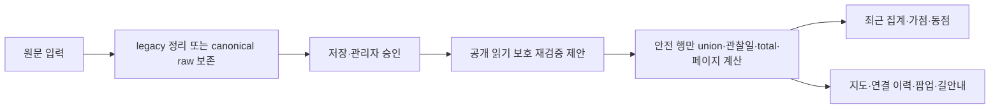

# P1-S 보호종·유효점수 계약 설계

상태: **분석·설계 및 인수 테스트 명세. 운영 구현·배포 승인 아님.**
작성일: 2026-10-09 KST. 시작 체크포인트 `bee1359`.
분석 브랜치 `analysis/recommendation-masterplan`.

## 1. 범위·증거와 결론

최신 확인 원격 main은 `4fc14b3c7ba19ad4d5b91efa305a80b3d474dc57`이다. 운영 소스와 탐조지 등록부는 P1-C/D 기준 `35141c0`과 같고 변경은 자동 기상·조석 JSON 네 파일이다. 이번에는 P1-A~D를 다시 분석하지 않았다. 보호 감사의 10개 파일은 Git 원문 SHA와 checkout CRLF 차이를 구분해 내용 일치를 확인했다.

- **확인된 결함:** 19종 exact 보호 판정에 수량 접미사가 누락되고, LF/CRLF가 종 분리 전에 삭제된다. 최근 집계에 보호 표기 변형이 포함되는 동작을 합성 자료로 재현했다.
- **기존 정책:** 승인 이후 공개 API는 관리자 승인/공개 좌표를 신뢰한다. canonical 간편 제보는 명시적 비번식 확인을 기준으로 정확 위치 공개를 허용한다. 모든 보호종을 승인 후에도 비공개로 바꾸는 것은 별도 공개 정책 전환이다.
- **추가 위치 연결 위험:** 보호 또는 hidden 자식이 일반 부모·고정 지점의 종 목록/이력에 합쳐지면 그 지점과 연결된다. 자식의 독립 좌표만 가리는 방어로는 충분하지 않다.
- **점수 결함과 강화 계약:** JS 자료형 강제 변환과 경로마다 다른 적격 검사는 누락/모순 입력을 허용할 수 있다. 기상 없는 공지-only 후보 차단은 기존 동작을 제한하는 계약 강화로 구분한다. S2 상세는 다음 단위에서 추가한다.

실험은 합성 입력, memory SQLite, 로컬 소스 및 읽기 전용 Git 자료만 이용했다. 실제 운영 API/제보·Worker 설정·D1을 조회하거나 변경하지 않았다. **실제 운영 유출이 있었다고 주장하지 않는다.** 합성 점수는 시험 자극이며 조류 출현 확률이나 새 생태 점수가 아니다.

## 2. S1 원인과 전체 경로



| 단계·함수 | 현재 동작 | 보완 계약·정책 여부 |
|---|---|---|
| shared.js normalizeSpecies / stripControl / splitSpecies | 숫자/공백을 허용; C0 제거 뒤 분리; slash 신규 거부; 저장 읽기는 ` · `만 분리 | LF/CRLF 먼저 토큰화는 방어 수정. slash 신규 허용은 입력 계약 확대. 저장값을 덮어쓰지 않음 |
| shared.js isSensitiveReport | 19종 exact와 둥지·번식·포란·육추·새끼·영소 substring | 기존 목록 표현 수정 S1-R. 알·산란/불확실 입력 처리 확대는 S1-P의 승인 항목 |
| public.js handleSubmit | legacy는 보호종 pending_public=0 | 새 파생 보호 판정 사용. 원문 영구보존은 별도 저장 계약 확인 |
| public.js handleCanonicalQuickSubmit / canonical persistence | non_breeding_confirmed=true와 공개 설정, hide 요청으로 pending 좌표 결정 | 비번식 확인은 저장 적격과 분리. protected까지 read 차단은 현행 정책 변경 |
| admin-actions / canonical reviews | 승인·연결·hide/unhide와 감사 기록 | 승인 상태와 공개 가능 여부 분리. 관리자 인증·원자료·감사 유지 |
| handlePending / handleApproved / publicPayload | stored public 좌표/상태 신뢰, 읽기 때 보호 재검증 없음 | 재검증 후 공개 행만 직렬화. note는 판정용 SELECT만 하고 응답에 추가하지 않음 |
| handleSiteHistory / historyEntry / fixedSpots | siteId/종/관찰일/건수, 부모·고정 점 연결 | 보호·hidden 자식은 결합 전에 제외. 보호 부모를 이용한 위치 연결 금지. 공개 total/offset은 필터 후 계산 |
| handleRecentSites | 승인·날짜·위치가림 필터, 보호 exact 검사 뒤 site별 union | 보호/미해석 행 전체를 union/latestDate/count 전에 제외; 일반 동반종만 빼서 위치를 남기지 않음 |
| index.html loadRecentSiteSightings / weeklyRecentReportBonus / weeklyRecentTieBreak | literal 종 수와 site 최신일; 최대16, 가점0에도 동점 신호 가능 | 제외 행은 가점·동점·최근 라벨에 모두 기여하지 않음. 배점/산식 변경 없음 |
| field-updates protection / create / list / publicEntry | exact protected는 저장된 대략 좌표·hidden, 번식6단어 등록 거부; 읽기는 저장값 신뢰 | 표현 방어와 과거 row read 방어. 대략 좌표 계속 공개 여부 및 자유 메모 지명은 정책 승인 |
| marker / spotPopupHtml / fieldPublicPoint / navigation | hidden flag면 길안내 차단, flag=false는 안내 가능 | 서버 보호를 기본으로 프런트 방어. 보호 원좌표·연결 siteId가 응답 자체에 없어야 함 |
| receipt / replay / handleStatus / contributors | receipt spot 재사용; status·월간 집계는 별도 의미 | 재접수 응답도 동일 보호. status visibility와 실제 read 정책 일치. 위치 없는 월간 수량은 별도 정책 판단 |

선행 공개 정책은 `docs/long-term-db-phase2a/README.md:13`의 “종명·희귀도·보호등급·월로 번식 여부를 판정하지 않는다. 일반 비번식 승인 관찰은 실제 관찰좌표 공개 원칙을 유지한다.”이다. 승인 이후 보호 확대를 전부 단순 버그 수정으로 부르지 않는다.

canonical `raw_submissions`는 입력 species 원문을 보존하지만 legacy `reports.species`는 정리 후 문자열이다. 이미 사라진 구분자를 추측해 복원하지 않는다. D1 변경 없는 읽기 방어는 기존 자료 불변을 만족하지만, **모든 신규 legacy 원문의 영구 보존까지 보장하는 설계는 아니다.** 기존 canonical dual-write 저장 경로를 검증하거나 별도 append-only 저장 승인이 필요하다. taxa/sightings/reviews 테이블 존재는 확인했으며 운영 사전 충실도·설정은 미확인이다.

## 3. S1 재현·독립 대조

실제 GET handler + 실제 schema를 memory SQLite에 적용했다. 신규 등록 POST는 호출하지 않았고 현장소식 create 판정은 실제 pure protection 함수를 추출했다.

| 증거 | 수량·결과 | 한계 |
|---|---|---|
| 현재 공개 경로 재현 | 48입력 × legacy literal/정리 저장 조건 = 92 관찰; 연결2/pending6/기존 현장소식3/status3 | 현재 결함을 재현하는 기대값도 통과에 포함; 운영 안전 합격 수치 아님 |
| 독립 종명 판정 | 70 합성 fixture; exact19/19 민감; 정상 반례17/17 현행 비민감 | 함수 분류 대조, API 노출 수치와 합산하지 않음 |
| S1-R 표현 방어 시제품 | 48개 중 explicit protected 표현14 판정; 일반7 오탐0 | 일반명 사전5종뿐. 운영 parser 완성품 아님 |
| 시제품 독립 오탐 대조 | 일반17의 R 오탐0; P 보류12 = 사전 누락11 + `알 수 없음` 의미 오탐1 | 정상 위치 보류와 protected 오탐을 구분 |
| 알 확장 반례 | `알을 품고 있음`, `알이 있음` 2건을 시제품이 놓침 | **시험용 알 정규식 채택 금지**. 문맥 정책·인수 조건 보완 필요 |
| 수량 경계 독립 대조 | 0/음수/100001은 review, 100000 report 허용; field 상한999 별도 | canonical 별도 birdCount=0 계약은 유지; 접미 수량과 행 전체 수량을 합산하지 않음 |

| 입력 | 현재 최근 집계 | 설계 기대 결과 |
|---|---|---|
| 저어새 | 제외 | 기존 보호 유지 |
| 저어새1 / 저어새 1 / 저어새 2마리 / 흰꼬리수리1 / 매1 | 포함 가능 | 검증된 base + 명확 수량으로 protected. 최근/동점 제외 |
| 쉼표·세미콜론·중점 혼합 | 정리 저장 뒤 정확 보호종 제외 | 토큰별 판정, 혼합 행 전체 제외 |
| LF/CRLF 혼합 | 저어새울새처럼 붙어 포함 | 분리 먼저. 과거 붙은 문자열은 unknown/review |
| slash 혼합 | 신규 거부, legacy 읽기는 포함 가능 | 읽기 보호 처리; 신규 허용은 별도 입력 계약 |
| 저어새 -1 / 1-3 / 1.5 / ? / 류 | exact 누락 또는 신규 거부 | 임의 숫자 삭제·추정 taxon 금지; 정확 위치 보류 |
| 참새(2) | 일반 처리 가능 | 괄호 문법 미승인 시 review. 허용안은 별도 경계 테스트 |
| 갈매기 / 알락오리·알락할미새 | 현행19/6 조건 밖 | 짧은 매/알 substring 오탐 금지 |
| 둥지·새끼·육추·포란·영소·번식 | 민감 | 기존 보호 완화 금지; 부정·인용 문장도 현행 보수 처리 유지 |
| 알·산란·띄어 쓴 번식 표현 | 일부 누락 | 정책 확대 후보. 아래 명세와 승인 후 적용 |

정확 저어새 approved 행과 숨긴 자식의 일반 부모/fixed 연결을 합성 재현했다. approved는 현재 관리자 공개 정책대로 좌표를 반환했고 site-history는 siteId·종·total을 반환했다. 자식 hidden이어도 부모 exact 마커의 종·이력에 합쳐졌다. 이것은 **코드상 공개/연결 경로 증거이며 실제 자료 유출 증거가 아니다.**

## 4. S1 권장 정규화·보호 계약

저장 정리, taxon 해석, 수량 유효성, 번식 여부, 공개 적격을 별도 결과로 반환한다. `speciesRaw`, `tokenRaw`, `canonicalName`, `taxonStatus`, `quantityStatus`, `sensitivity`, `publicationMode`, `policyVersion`, `catalogVersion`은 내부 판정 개념이며 공개 응답에 그대로 추가할 필요는 없다.

1. 원문은 불변으로 취급한다. 파생 NFC 정규화와 양끝 공백 정리만 기본 적용한다. 제로폭/방향 제어문자는 몰래 삭제 후 확정하지 않고 review한다.
2. LF/CRLF를 C0 제거 전에 허용 구분자로 분리한다. 쉼표·세미콜론·중점은 현행 호환; slash 허용은 버전 명세. 수량 경계 공백/NBSP 허용 범위를 명시한다.
3. **검증된 표준 국명 전체 일치가 먼저**다. 실패 때만 검증 base + 전체 접미 수량 문법을 해석한다. 숫자 일괄 삭제·substring 매·유사명 fuzzy 병합 금지.
4. 최소 수량 문법은 ASCII 정수, 선택적 공백/마리·개체 단위다. report1..100000, field1..999처럼 해당 경로 기존 제한을 적용한다. 0·음수·소수·지수·범위·상한 초과·약·물음표는 확정 수량이 아니다. 괄호·선행0 허용은 명시적으로 선택한다. 별도 canonical birdCount=0 저장 계약을 변경하지 않는다.
5. 정확 표준명이면서 현행19종이면 protected, 기존6번식 키워드면 breeding, 불완전 taxon/수량/문맥이면 review로 분리한다. unknown은 normal 확정이 아니다. “protected 종명이므로 실제 번식 중”이라고 추론하지 않는다.
6. 현행6번식 키워드를 유지한다. 알·산란은 신규 정책이다. 알락 종명, `알 수 없음`은 비번식 반례; `알 2개 확인`, `알을 품고 있음`, `알이 있음`은 보호 기대 사례로 명세한다. 조사 경계·인용·부정·띄어쓰기·자유 메모의 모호 문맥은 review가 필요하다. 이 사례들을 실패하는 현재 시험 정규식은 도입하지 않는다. 자동 판정으로 모든 한국어를 이해했다고 주장하지 않는다.
7. 보호/review 행은 S1-P 승인 시 exact 좌표뿐 아니라 siteId·spot_key·연결 rowID·종 이력·관찰일·건수·가점·동점·길안내 신호를 공개하지 않는다. 보호 행의 일반 동반종만 공개하는 우회도 금지한다.
8. 이미 알려진 190곳의 독립 탐조지 정보·기상·조석은 유지한다. 민감 제보 때문에 기존 장소 자체를 삭제하지 않는다. 해당 제보에서 유도되는 연결/점수 신호만 제거한다.

국명 근거: [국립생태원 저어새](https://www.nie.re.kr/nie/pgm/edSpecies/view.do?menuNo=200121&speciesSn=27), [흰꼬리수리](https://www.nie.re.kr/nie/pgm/edSpecies/view.do?menuNo=200121&speciesSn=34), [매](https://www.nie.re.kr/nie/pgm/edSpecies/view.do?menuNo=200121&speciesSn=25)를 직접 대조했다. [NIBR 2020년 연구 목록](https://www.nibr.go.kr/aiibook/access/ecatalogt.jsp?Dir=1007&callmode=admin&catimage=&eclang=ko&start=92&um=s)은 한국동박새/동박새를 별도 기재하므로 임의 병합 근거가 아니다. [NIBR 센서스](https://www.nibr.go.kr/aiibook/access/ecatalogt.jsp?Dir=1269&callmode=admin&catimage=&eclang=ko&start=56&um=s)의 별도 갈매기·알락 국명은 substring 오탐 반례를 뒷받침한다.

19종은 제품 정책 목록이며 법정 전체 보호종 목록이 아니다. 새매·검은머리갈매기의 정책 미포함을 법정 비보호로 해석하지 않는다. [NIBR 2026-02-09 발표](https://www.nibr.go.kr/cmn/board/SYSTEM_DEFAULT000004/67140bbsDetail.do)로 2025년 말 국가종목록 공개는 확인했지만 전체 조류 원자료·alias·ID·이용허락은 미확보다. 운영 도입 전 URL/목록 기준일/입수일/SHA/식별자/alias 근거·승인자/이용허락을 고정해야 한다. 시험 사전을 운영 사전으로 배포하지 않는다.

## 5. S1 공개 정책 선택과 대안 비교

**S1-R**은 현행19/6의 표현 방어다. **S1-P**는 모든 공개 경로에서 sensitive/review 행의 위치 연결을 보류하는 정책이다. 알·산란, unknown, approved/canonical, field 대략 좌표, 자유 note, 월간 참여자 수량, 원문 보존 계약은 각각 승인 항목으로 남긴다. R만 적용하면 P의 전체 보장은 성립하지 않는다.

| 평가 | S1-A: 공유 읽기 판정 + 모든 공개 직렬화/집계 앞 필터 | S1-B: 검증 taxon ID·구조화 관찰 + versioned 공개 projection |
|---|---|---|
| 안전 | 이미 승인된 legacy도 재검증; parent/fixed/receipt 포함 필수 | 명확한 이름·수량·근거 제공. legacy read 방어도 필요 |
| 호환 | 원자료·승인상태·좌표 불변; unknown 보류 증가 가능 | 기존 raw/review 불변, 기존 API adapter·장기 이력 연계 필요 |
| 오탐 | 사전 coverage와 문법 보류를 따로 측정; 최소 사전은 부적합 | 사전·alias 검증으로 개선 가능, 불완전 taxon은 보류 |
| 코드 범위 | shared/public/field/canonical receipt, 프런트 작은 방어 | 추가 catalog·admin taxon/review·projection·입력 UI |
| Worker·D1 | Worker 변경 필요. 즉시 read 필터는 D1 변경 불필요; 신규 legacy 원문 보존은 별도 | Worker 변경 필요. 기존 정본 테이블 활용 검증; schema/version 방식에 따라 D1 승인 필요 |
| API | key 유지 가능, 공개 total·페이지·visibility 의미 변경 | 기존 shape adapter 가능; taxon metadata 공개하면 버전 변경 |
| 시험 | memory GET, linked/mixed/pagination/replay·캐시 | append-only/migration/peer gate/parity·catalog 추가 |
| 롤백 | 보호 유지 read 정책/비공개 안전모드로 복귀 | additive projection/version 전환. raw 재작성 금지 |

**우선 권고 S1-A.** 적용 범위를 recent-sites에만 한정하지 않는다. 보호/hidden 자식은 byKey·종 union·latestDate 이전에 제외한다. site-history는 raw LIMIT/OFFSET 뒤 필터만 붙이지 않는다. 안전 행 total/offset을 계산하도록 bounded scan 또는 공개 view를 설계하고 성능·페이지 일관성을 시험한다. SQL SELECT note 추가는 내부 판정용이며 공개 응답에는 원좌표·메모를 늘리지 않는다.

field 대략 좌표 공개를 유지하려면 랜드마크 메모·시간·개체수·연결 정보로 재식별되지 않는다는 추가 계약이 필요하다. 가장 보수적 기본안은 해당 row 전체 공개 보류다. 기존 saved 대략 좌표를 매 GET 새로 흔들지 않는다. 반복 좌표 평균으로 위치가 좁혀질 수 있고 원자료를 수정할 이유도 없다.

## 6. S1 구체적 변경 대상·인수 조건

구현 승인 후 아래 파일/함수만 작은 단위로 변경한다. 분석 브랜치를 통째로 main에 병합하지 않는다.

- `reports-api/src/shared.js`: normalizeSpecies/splitSpecies/isSensitiveReport/pendingPayload/publicPayload/historyEntry. 저장용 정리와 보호용 parser 분리; structured 내부 판정 + 기존 boolean adapter.
- `reports-api/src/public.js`: handleSubmit/handleCanonicalQuickSubmit/handlePending/handleApproved/handleSiteHistory/handleRecentSites/handleStatus. 승인 후 read 정책·receipt/replay·공개 count/페이지 일치.
- `reports-api/src/field-updates.js`: protection/handleCreate/handleList/loadEntries/publicEntry. 기존 소유자 해시·등록자 삭제·TTL/status/event/확인 제한은 유지. 공개 endpoint에서 숨겨도 소유자의 삭제 영수증/ID 접근은 유지한다.
- `reports-api/src/admin-actions.js`, `canonical/persistence.js`: 승인 인증·감사·정본 이력 유지. 승인 공개와 강제 보호 정책의 우선순위, 원문 저장 경로 명시.
- `index.html`: loadRecentSiteSightings/weeklyRecentReportBonus/weeklyRecentTieBreak, search/marker/popup, fieldPublicPoint/navigation. 서버 중심 보호, 캐시/오류 때 오래된 민감 가점·이력 부활 금지.
- `reports-api/test` 및 `.github/scripts`: 아래 재현을 실제 구현 회귀로 이식. 분석 prototype은 제품 구현과 구분한다.

| 인수 ID | 입력·상태 | 필수 결과 |
|---|---|---|
| S1-T01~06 | 저어새 exact/수량/공백/마리, 흰꼬리수리1, 매1 | 기존 보호 목록 표현 인식, recent/bonus/tie 비기여 |
| S1-T07 | comma/slash/LF/CRLF/semicolon/middot + 일반종 혼합 | 구분자 계약 일치; 보호 혼합 행 전체 보류 |
| S1-T08 | 0/음수/소수/범위/상한초과/unknown/제로폭 | 원문 불변, 임의 taxon/count 생성 없음, exact 연결 보류 |
| S1-T09 | 갈매기·알락 종·한국동박새/동박새·정상 수량 | taxonomy 분리; 오탐·사전 미포함·입력 거부 각각 측정 |
| S1-T10 | 기존6번식 + 알/조사/산란/부정·인용·알 수 없음 | 기존 보호 유지. 확장 승인 시 보호 누락·정상 의미 오탐 반례 모두 통과 |
| S1-T11 | approved/pending/rejected, legacy/canonical, confirmation true/false | 상태·인증 유지, read 재검증과 receipt/replay 동일 |
| S1-T12 | protected/hidden child→ordinary parent/fixed | 종/이력/siteId/count/날짜/검색·마커·nav 간접 신호 없음 |
| S1-T13 | history offset·limit·total·다수 제외행·캐시 | 필터 후 공개 건수·pagination 정확, private 이유 응답/로그 없음 |
| S1-T14 | field create/read/confirm/status/delete, hiddenflag/메모 지명 | 보호 read + 일반 기능 유지; 소유자만 삭제, 3시간TTL 유지 |
| S1-T15 | PC/모바일 지도·팝업/최근/추천/네트워크 실패·옛 캐시 | 보호 좌표 응답 없음, 길안내 링크 없음, 보너스 부활 없음, 일반 UI 정상 |
| S1-T16 | 월간 참여자·status visibility·owner receipt | 승인한 공개 집계 정책 준수, 소유자/관리자 원문 업무 유지 |

모바일/PC 실제 브라우저 E2E는 이번에 실행하지 않았다. 현행 순수함수/소스 기반 프런트 회귀는 별도 기록했다. 미구현 정책의 UI를 검증 완료라고 쓰지 않는다. 구현 후 로컬 합성 API만 사용한 모바일/PC E2E를 배포 전 필수 조건으로 둔다.

## 7. 현재 회귀와 단계 저장

현재 소스 회귀: 주간126/126, reports-api170/170, 관련 프런트57/57, Python 기상48/48, 조석22 중21통과/1skip. API170에는 제보/관리자 승인/현장소식 조회·등록자 삭제가 포함된다. 이 통과는 새 보호 정책·유효점수 구현을 검증한 것이 아니다. TAP은 `_results/p1s_*.tap`에 새로 저장했다.

S1 재현:
```powershell
node docs/recommendation-masterplan/_scripts/p1s1_protection_current.mjs . docs/recommendation-masterplan/_results 4fc14b3c7ba19ad4d5b91efa305a80b3d474dc57
node docs/recommendation-masterplan/_scripts/p1s1_protection_prototype.mjs docs/recommendation-masterplan/_results
node docs/recommendation-masterplan/_scripts/p1s1_taxon_current.mjs . docs/recommendation-masterplan/_results
node docs/recommendation-masterplan/_scripts/p1s1_prototype_review.mjs docs/recommendation-masterplan/_results
```
Node24 native SQLite 필요. 모든 자료는 합성/로컬이며 운영 POST/DB 없음. prototype 결과를 제품 정책 확정으로 취급하지 않는다. 공식 source와 독립 groundtruth는 새 `_snapshots/p1s_*.json`, 감사·관찰은 새 `_results/p1s*.json/md`로 보존했다.

## 8. S2·배포·롤백·남은 확인

S2 행렬 및 배포·롤백 상세는 다음 체크포인트에 추가한다. S1의 우선 실행 순서는 승인된 R/P 계약·사전/문맥 반례 확정 → local 구현/과거 승인 합성 read 재검증 → API 보호부터 반영 → 캐시 갱신·프런트 방어 → 공개 재검증이다. **이번 단계에서 배포하지 않는다.**

롤백은 마지막 보호 유지 버전 또는 해당 제보 공개/가점 보류 모드로 전환한다. 미보호 예전 classifier를 재개방하는 롤백은 허용안으로 제시하지 않는다. 원자료·감사·좌표·DB를 재작성/삭제하지 않는다. 운영 mode·taxonomy 내용·표기 빈도·실제 공개 현황은 미조회다. 일반 오탐률/연중효과·생태 정확도는 작은 합성 실험으로 추정하지 않는다.